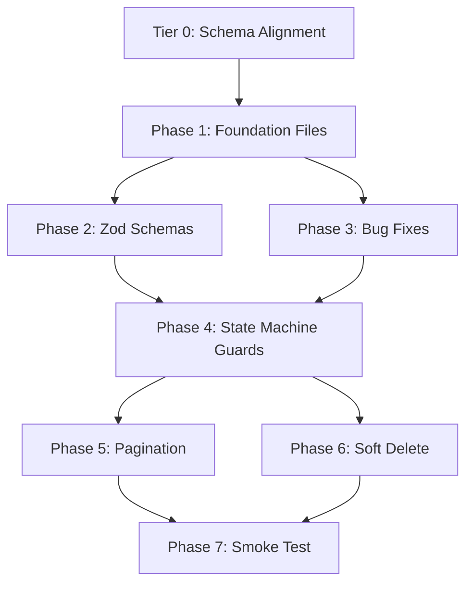

# TIER 1 — Service Layer Hardening Plan

> **Goal**: Make every service method bullet-proof — validated inputs, enforced state machines, paginated lists, consistent error handling, and zero silent failures.  
> **Depends on**: Tier 0 (schema alignment) must be completed first.  
> **Time**: ~3–4 hours  
> **Risk**: Low — all changes are additive guards, not schema changes.

---

## TABLE OF CONTENTS

1. [State Machines](#1-state-machines)
2. [Zod Validation Schemas](#2-zod-validation-schemas)
3. [Pagination](#3-pagination)
4. [Service Bugs](#4-service-bugs)
5. [Error Handling Standardization](#5-error-handling-standardization)
6. [Hard Delete Audit](#6-hard-delete-audit)
7. [Execution Checklist](#7-execution-checklist)

---

## 1. STATE MACHINES

### Current State: No Validation At All

The DB has CHECK constraints on status columns, but **the service layer never validates transitions before writing**. Any caller can set any status at any time.

### DB CHECK Constraints (verified live)

| Table | Allowed Statuses |
|---|---|
| `appointments` | `scheduled → confirmed → pre_check → in_consultation → completed`, `cancelled`, `no_show` |
| `consultations` | `pending → in_progress → completed`, `cancelled` |
| `referrals` | `pending → accepted → in_progress → completed`, `rejected` |
| `payments` | `pending → completed`, `failed`, `refunded` |
| `precheck_forms` | `draft → submitted → reviewed → completed` |

### What Needs To Be Built

#### A) `src/lib/stateMachines.js` — Shared Transition Map

```js
// Defines legal transitions for each entity type
export const STATE_MACHINES = {
  appointment: {
    scheduled:        ['confirmed', 'cancelled', 'no_show'],
    confirmed:        ['pre_check', 'cancelled', 'no_show'],
    pre_check:        ['in_consultation', 'cancelled'],
    in_consultation:  ['completed', 'cancelled'],
    completed:        [],               // terminal
    cancelled:        [],               // terminal
    no_show:          [],               // terminal
  },
  consultation: {
    pending:      ['in_progress', 'cancelled'],
    in_progress:  ['completed', 'cancelled'],
    completed:    [],
    cancelled:    [],
  },
  referral: {
    pending:      ['accepted', 'rejected'],
    accepted:     ['in_progress', 'completed'],
    in_progress:  ['completed'],
    completed:    [],
    rejected:     [],
  },
  payment: {
    pending:   ['completed', 'failed'],
    completed: ['refunded'],
    failed:    [],
    refunded:  [],
  },
  precheck: {
    draft:     ['submitted'],
    submitted: ['reviewed'],
    reviewed:  ['completed'],
    completed: [],
  },
};

export function canTransition(entity, from, to) {
  return STATE_MACHINES[entity]?.[from]?.includes(to) ?? false;
}

export function assertTransition(entity, from, to) {
  if (!canTransition(entity, from, to)) {
    throw new Error(
      `Invalid ${entity} transition: "${from}" → "${to}". ` +
      `Allowed: [${STATE_MACHINES[entity]?.[from]?.join(', ') || 'none'}]`
    );
  }
}
```

#### B) Services That Need Guards

| Service | Method | Current Behavior | Fix |
|---|---|---|---|
| `consultationService.create()` | L75 | Hardcodes `status: 'in_progress'` — OK, but no check that appointment is `in_consultation` | Add pre-check: fetch appointment, assert `appointment.status === 'in_consultation'` |
| `consultationService.complete()` | L91–98 | Sets `completed` without checking current status | Add: `assertTransition('consultation', current.status, 'completed')` |
| `consultationService.update()` | L81–88 | Accepts **any** data including `status` — no guard | If `data.status` present, fetch current row & validate transition |
| `referralService.accept()` | L74–82 | Sets `accepted` blindly | Add: fetch current, `assertTransition('referral', current.status, 'accepted')` |
| `referralService.reject()` | L84–91 | Sets `rejected` blindly | Same guard |
| `referralService.complete()` | L94–101 | Sets `completed` blindly | Same guard |
| `appointmentService.update()` | L182–190 | Accepts raw `data` with no validation | If `data.status` present, validate transition |
| `appointmentService.cancel()` | L192–203 | Sets `cancelled` without checking if already completed | Guard: `assertTransition('appointment', current.status, 'cancelled')` |
| `appointmentService.markCompleted()` | L205–213 | Sets `completed` without checking current | Guard: fetch current, validate |
| `paymentService.update()` | L289–304 | Raw update, no status guard | If `updates.status`, validate transition |

#### C) PreDoctorDashboardPage Unguarded Transition

```
File: src/pages/PreDoctorDashboardPage.jsx, Line 64
Code: await appointmentService.update(appt.id, { status: 'pre_check' });
```
This calls `update()` with a raw status. After Tier 1, the service will validate that the appointment is currently `confirmed` before allowing `pre_check`.

---

## 2. ZOD VALIDATION SCHEMAS

### Current Coverage

| Schema | File | Used By |
|---|---|---|
| `authSignInSchema` | `schemas/index.js` L40 | `authService.signIn` ✅ |
| `authSignUpSchema` | `schemas/index.js` L45 | `authService.signUp` ✅ |
| `forgotPasswordSchema` | `schemas/index.js` L52 | `authService.requestPasswordReset` ✅ |
| `resetPasswordSchema` | `schemas/index.js` L56 | Defined but **unused** ❌ |
| `appointmentBookingSchema` | `schemas/index.js` L67 | `appointmentService.bookFromSlot` ✅ |
| `patientProfileUpdateSchema` | `schemas/index.js` L84 | `patientService.updateOwnProfile` ✅ |
| `precheckDraftSchema` | `schemas/index.js` L98 | `precheckService.saveDraft/updateDraft` ✅ |
| `precheckSubmitSchema` | `schemas/index.js` L112 | `precheckService.submit` ✅ |

### Missing Schemas (7 needed)

| # | Schema Name | For Service Method | Fields to Validate |
|---|---|---|---|
| Z1 | `consultationCreateSchema` | `consultationService.create()` | `appointment_id` (uuid, required), `notes` (string), `diagnosis` (string), `medications` (jsonb array) |
| Z2 | `consultationCompleteSchema` | `consultationService.complete()` | `notes` (required string), `diagnosis` (required string), `medications` (array) |
| Z3 | `referralCreateSchema` | `referralService.create()` | `from_doctor_id` (uuid), `patient_id` (uuid), `reason` (required string), `to_doctor_name` (string), `priority` (enum), `clinical_findings` (string), `treatment_plan` (string) |
| Z4 | `certificateCreateSchema` | `certificateService.create()` | `doctor_id` (uuid), `patient_id` (uuid), `diagnosis` (required string), `treatment` (string), `recommendations` (string), `start_date` (date), `end_date` (date), `status` (enum) |
| Z5 | `reportCreateSchema` | `reportService.create()` | `patient_id` (uuid), `doctor_id` (uuid), `report_type` (required string), `title` (required string), `content` (string), `findings` (string) |
| Z6 | `paymentCreateSchema` | `paymentService.create()` | `patient_id` (uuid), `appointment_id` (uuid), `amount` (positive number), `method` (enum), `status` (enum) |
| Z7 | `resetPasswordSchema` | `authService.resetPassword()` | Already defined but not wired — wire it |

### Implementation Pattern

Every `.create()` and `.update()` method should follow the pattern already used by `precheckService`:

```js
async create(rawData) {
  const { data, error } = parseWithSchema(consultationCreateSchema, rawData);
  if (error) return { data: null, error };

  return apiCall(
    supabase.from('consultations')
      .insert([{ ...data, status: 'in_progress', session_start: new Date().toISOString() }])
      .select(CONSULTATION_SELECT_FIELDS)
  );
},
```

---

## 3. PAGINATION

### Current State: Every `getAll()` Fetches Unbounded

32 `getAll()` / `getByX()` calls across pages fetch **every row** with no `.range()` or `.limit()`. This will break as patient and appointment counts grow.

### Priority Pagination Targets

| Priority | Service Method | Page(s) Using It | Expected Growth |
|---|---|---|---|
| 🔴 P0 | `appointmentService.getAll()` | `AppointmentsPage`, `DoctorDashboardPage`, `DashboardPage` | 50-200+ daily |
| 🔴 P0 | `patientService.getAll()` | `PatientsPage`, 6 other pages | Thousands over time |
| 🟡 P1 | `paymentService.getAll()` | `BillingPage` | Grows with appointments |
| 🟡 P1 | `notificationService.getAll()` | `DashboardPage` (via context) | High volume |
| 🟢 P2 | `certificateService.getAll()` | `DoctorCertificatesPage` | Low volume |
| 🟢 P2 | `referralService.getAll()` | Not used by any page yet | Low volume |
| 🟢 P2 | `reportService.getAll()` | Not used by any page yet | Low volume |

### Implementation Strategy

Add a shared pagination helper and update services:

```js
// src/lib/pagination.js
export const DEFAULT_PAGE_SIZE = 25;

export function paginateQuery(query, { page = 0, pageSize = DEFAULT_PAGE_SIZE } = {}) {
  const from = page * pageSize;
  const to = from + pageSize - 1;
  return query.range(from, to);
}
```

Service pattern:
```js
async getAll({ page = 0, pageSize = 25 } = {}) {
  return apiCall(
    paginateQuery(
      supabase
        .from('appointments')
        .select(APPOINTMENT_SELECT_FIELDS, { count: 'exact' })
        .order('scheduled_at', { ascending: true }),
      { page, pageSize }
    )
  );
},
```

> The `apiCall` wrapper already extracts `count` — this is pre-wired.

### Pages That Need Pagination UI

| Page | Current Pattern | Needed |
|---|---|---|
| `AppointmentsPage` | Client-side date filter | Add page buttons, pass `page` to service |
| `PatientsPage` | Client-side search filter | Add "Load More" or page buttons |
| `BillingPage` | Fetches all payments | Add date-range filter + pagination |
| `DoctorCertificatesPage` | Fetches all certs | Add pagination (low priority) |

---

## 4. SERVICE BUGS

### Bug 1: `patientService.getPatientsByDoctor()` — Duplicate `.select()` Call

**File**: `src/services/patients.js` L229-230
```js
.select('patient_id')   // ← first select
.select('patient_id')   // ← DUPLICATE — overrides first, may cause unexpected behavior
```
**Fix**: Remove the duplicate line.

### Bug 2: `patientService.search()` — PostgREST Filter Injection

**File**: `src/services/patients.js` L155
```js
.or(`first_name.ilike.%${query}%,last_name.ilike.%${query}%,...`)
```
If `query` contains PostgREST special characters (`,`, `.`, `(`), it can break the filter or cause unintended matching. This isn't SQL injection (PostgREST is parameterized), but it's a **filter injection** that can return wrong results or errors.

**Fix**: Sanitize `query` before interpolation:
```js
const sanitized = query.replace(/[.,()]/g, '');
```

### Bug 3: `clinicService.getAvailableTimeSlots()` — Ignores `confirmed/pre_check/in_consultation`

**File**: `src/services/clinics.js` L114
```js
.eq('status', 'scheduled')  // ← Only checks scheduled, misses confirmed etc.
```
A slot with a `confirmed` appointment will still show as "available".

**Fix**: Use `.in('status', ['scheduled', 'confirmed', 'pre_check', 'in_consultation'])` or `.not('status', 'in', '(cancelled,no_show)')`.

### Bug 4: `appointmentService.update()` — Returns `*` Instead of `APPOINTMENT_SELECT_FIELDS`

**File**: `src/services/appointments.js` L188
```js
.select()  // ← Returns *, inconsistent with every other method
```
**Fix**: Change to `.select(APPOINTMENT_SELECT_FIELDS)`.

### Bug 5: `consultationService.addMedications()` — Overwrites Instead of Appending

**File**: `src/services/consultations.js` L101-108
```js
.update({ medications })  // ← REPLACES entire jsonb array
```
If a doctor adds medication in two separate saves, the second save destroys the first batch.

**Fix**: Fetch existing, merge, then write:
```js
async addMedications(consultationId, newMedications) {
  const { data: existing } = await this.getById(consultationId);
  const merged = [...(existing?.medications || []), ...newMedications];
  return apiCall(
    supabase.from('consultations')
      .update({ medications: merged })
      .eq('id', consultationId)
      .select(CONSULTATION_SELECT_FIELDS)
  );
},
```

### Bug 6: `paymentService` — Uses Manual try/catch Instead of `apiCall`

**File**: `src/services/payments.js` (entire file)

Every method uses hand-rolled `try/catch` instead of the standard `apiCall` wrapper. This means:
- Error shapes are inconsistent (`error` vs `error.message`)
- No `count` is ever returned
- 5 redundant `console.error` calls

**Fix**: Refactor all 5 methods to use `apiCall()`, matching every other service.

### Bug 7: `notifications.notifyRole()` — Inconsistent Error Shape

**File**: `src/services/notifications.js` L115-142

Uses manual try/catch and returns `error: error?.message` (string) instead of `error: error` (object). Callers checking `if (result.error)` would get unexpected behavior.

**Fix**: Normalize to `apiCall` pattern or ensure consistent shape.

---

## 5. ERROR HANDLING STANDARDIZATION

### Current Patterns (Mixed)

| Pattern | Used By | Problem |
|---|---|---|
| `apiCall()` wrapper | 10 services | ✅ Consistent `{ data, count, error }` |
| Manual `try/catch` | `paymentService` (5 methods) | ❌ Different error shape |
| Manual + `console.error` | `payments`, `patients.createWalkIn`, `notifications.notifyRole` | ❌ Leaks to console in production |
| Raw supabase call | `appointments.checkAvailability`, `patients.search` | ❌ No error normalization |

### Target: Universal `apiCall`

Every service method should use `apiCall()`. The only exceptions are multi-step operations (like `bookFromSlot` or `createWalkIn`) that need intermediate error handling — these should still normalize their final return shape.

### Files to Refactor

| File | Methods to Fix | Work |
|---|---|---|
| `payments.js` | `getAll`, `getBillableServices`, `create`, `update`, `delete` | Replace try/catch with `apiCall` |
| `appointments.js` | `checkAvailability` | Wrap in `apiCall` |
| `patients.js` | `search` (first query) | Wrap first supabase call |

---

## 6. HARD DELETE AUDIT

### Current Hard Deletes (Violate "Medical Data is Sacred" Rule)

| Service | Method | Table | Risk |
|---|---|---|---|
| `paymentService.delete()` | L306-318 | `payments` | 🔴 **Financial records permanently destroyed** — audit trail lost |
| `appointmentService.delete()` | L149-156 | `appointments` | 🔴 **Clinical history destroyed** — should soft-delete |
| `notificationService.delete()` | L70-77 | `notifications` | 🟡 Acceptable — notifications are ephemeral |
| `slotService.deleteSlot()` | L109-113 | `secretary_slots` | 🟡 Acceptable — scheduling config, not medical data |
| `slotService.deleteGroup()` | L116-120 | `secretary_slots` | 🟡 Acceptable — same reasoning |
| `clinicService.delete()` | L33-37 | `clinics` | 🟡 Acceptable — admin config |

### Required Changes

| Method | Fix |
|---|---|
| `paymentService.delete()` | Replace with `archive()` using soft-delete pattern |
| `appointmentService.delete()` | Replace with `archive()` — appointments already have `is_archived` columns? Verify; if not, add in migration |

---

## 7. EXECUTION CHECKLIST

### Phase 1: Foundation Files (create new)
```
- [ ] Create src/lib/stateMachines.js (transition maps + assertTransition)
- [ ] Create src/lib/pagination.js (paginateQuery helper)
```

### Phase 2: Schemas (extend existing)
```
- [ ] Add consultationCreateSchema to src/schemas/index.js
- [ ] Add consultationCompleteSchema
- [ ] Add referralCreateSchema
- [ ] Add certificateCreateSchema
- [ ] Add reportCreateSchema
- [ ] Add paymentCreateSchema
- [ ] Wire resetPasswordSchema to authService.resetPassword()
```

### Phase 3: Service Fixes (modify existing)
```
- [ ] Fix patientService.getPatientsByDoctor() — remove duplicate .select()
- [ ] Fix patientService.search() — sanitize query input
- [ ] Fix clinicService.getAvailableTimeSlots() — check all active statuses
- [ ] Fix appointmentService.update() — use APPOINTMENT_SELECT_FIELDS
- [ ] Fix consultationService.addMedications() — merge instead of overwrite
- [ ] Refactor paymentService — replace try/catch with apiCall
```

### Phase 4: State Machine Guards (modify services)
```
- [ ] consultationService.create() — validate appointment status
- [ ] consultationService.complete() — validate current status
- [ ] consultationService.update() — guard status changes
- [ ] referralService.accept/reject/complete() — validate transitions
- [ ] appointmentService.update() — guard status changes
- [ ] appointmentService.cancel() — validate current status
- [ ] appointmentService.markCompleted() — validate current status
```

### Phase 5: Pagination (modify services + pages)
```
- [ ] appointmentService.getAll() — add pagination params
- [ ] patientService.getAll() — add pagination params
- [ ] paymentService.getAll() — add pagination params
- [ ] notificationService.getAll() — add pagination params
- [ ] Update AppointmentsPage with pagination controls
- [ ] Update PatientsPage with pagination controls
```

### Phase 6: Hard Delete → Soft Delete
```
- [ ] paymentService.delete() → paymentService.archive()
- [ ] appointmentService.delete() → appointmentService.archive()
- [ ] Verify appointments table has is_archived column (add if missing)
```

### Phase 7: Smoke Test
```
- [ ] Book appointment → confirm → pre_check → consult → complete (full flow)
- [ ] Try illegal transition (completed → scheduled) — must reject
- [ ] Create consultation with Zod-invalid data — must reject with clear message
- [ ] Create referral with all clinical fields — must succeed
- [ ] paginated getAll returns correct page + total count
- [ ] Payment archive preserves record, delete is removed
- [ ] addMedications appends, not overwrites
```

---

## DEPENDENCY GRAPH



---

## IMPACT SUMMARY

| Before Tier 1 | After Tier 1 |
|---|---|
| Any status can be set on any entity | Enforced state machines with clear error messages |
| 6 service methods accept raw unvalidated input | All mutations validated by Zod schemas |
| Every list query fetches ALL rows | P0 queries paginated with `{ count }` support |
| Payment records can be permanently deleted | Financial records preserved via soft-delete |
| Medications overwritten on re-save | Medications appended correctly |
| Mixed error shapes across services | Consistent `{ data, count, error }` everywhere |
| PostgREST filter injection possible | Search input sanitized |
