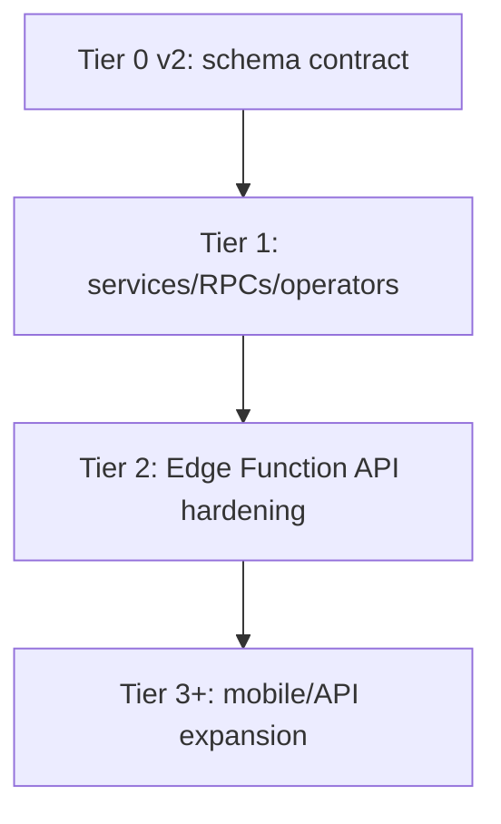

# TIER 1 - Executed Service, RPC, and Operations Hardening

> **Status**: Executed with post-review improvements folded in.
> **Date updated**: 2026-05-05.
> **Depends on**: Tier 0 v2 schema alignment.
> **Handoff**: Tier 2 starts after this baseline and hardens the Edge Function API layer.

---

## 1. Executive Summary

Tier 1 moved DoctoLeb from "the UI can call tables" toward "domain operations enforce rules." The important shift was not only adding validation. We made booking canonical, reduced identity ambiguity, protected audit data, scoped doctor views, and added an operations gate so changes can be verified before deploy.

This document records what was actually executed after multiple review passes from security, DBA, system design, data governance, and operations viewpoints.

---

## 2. Completed Baseline

| Area | Executed result |
|---|---|
| State machines | `src/lib/stateMachines.js` defines canonical transitions for appointments, consultations, referrals, payments, and prechecks. |
| Validation | `src/schemas/index.js` contains Zod schemas for auth, booking, patient profile, precheck, consultation, referral, certificate, report, and payment payloads. |
| Service return shape | Services consistently return `{ data, error }` or `{ data, count, error }`. |
| Pagination helper | `src/lib/pagination.js` supports bounded pagination without silently truncating legacy callers. |
| Booking flow | Patient and secretary booking now use `appointmentService.bookFromSlot()` and the `book_slot` RPC. |
| Booking RPC | `book_slot` owns initial lifecycle state, validates caller identity, locks the slot row, validates duration, and writes Beirut-local slot time as UTC `timestamptz`. |
| Consultation workflow | Doctor consultation save transitions the appointment to `in_consultation` before creating consultation notes. |
| Auth identity | Session profile resolution uses `users.auth_user_id`; email fallback is not allowed. |
| Sign-up | Frontend no longer creates domain patient records through a non-atomic client fallback after auth creation. |
| Walk-ins | Walk-in creation rolls back the domain `users` row if linked `patients` insert fails. |
| Doctor scoping | Doctor appointment/dashboard reads resolve the current `doctors.id` and use doctor-scoped appointment queries. |
| Audit governance | Direct `audit_log` reads are admin-only because rows contain full PHI snapshots. |
| Edge sync | All six live Edge Functions exist in `supabase/functions/` and were redeployed after shared CORS hardening. |
| CORS | Edge shared HTTP helper uses request-aware allowlisting, not `Access-Control-Allow-Origin: *`. |
| CI/release gate | `npm run verify` runs lint, build, and high-severity npm audit; GitHub Actions runs the same gate. |

---

## 3. Review Findings Closed

### 3.1 Security Review

| Finding | Resolution |
|---|---|
| `update_patient_profile` trusted caller-supplied ids | Hardened with caller authorization in Secure Web V1 migrations before Tier 1 handoff. |
| `book_slot` allowed impersonation through `p_booked_by` | RPC now requires `p_booked_by` to match the authenticated domain user. |
| Patient direct appointment writes bypassed slots | Patient write policies were tightened and app booking paths use `book_slot`. |
| Notification inserts were spoofable | Notification write access moved toward service/role-controlled paths; Edge Tier 2 will finish route-level RBAC. |
| Email fallback could bind sessions to wrong domain users | Removed email fallback from `src/lib/authIdentity.js`. |
| Non-atomic sign-up fallback left auth users without profiles | Removed client-side domain fallback from `src/services/auth.js`; auth provisioning must be server/database-backed. |

### 3.2 DBA/Data Governance Review

| Finding | Resolution |
|---|---|
| `book_slot` trusted caller-supplied initial status | RPC now forces initial appointment status to `scheduled`. |
| `book_slot` trusted caller-supplied duration | RPC validates duration bounds and derives from slot when not supplied. |
| Audit log exposed PHI snapshots to broad staff roles | `audit_log` select policy is admin-only; future staff views must be redacted. |
| Missing operational indexes caused policy/function performance warnings | Added Tier 1 indexes in `20260505_tier1_operator_hardening.sql`. |
| RLS helper policies were re-evaluating auth functions per row | Added policy-performance migration `20260505_tier1_rls_policy_performance.sql`. |

### 3.3 System Design Review

| Finding | Resolution |
|---|---|
| Legacy secretary scheduler bypassed canonical booking | `src/pages/AppointmentsPage.jsx` now routes booking through `appointmentService.bookFromSlot()`. |
| Doctor consultation save was blocked by its own guard | `src/pages/DoctorConsultationPage.jsx` now moves appointment into `in_consultation` first. |
| Doctor views were not scoped to logged-in doctor | Doctor appointment/dashboard pages use current doctor id and scoped service reads. |
| Service pagination could silently truncate legacy pages | Pagination helper only applies `.range()` when pagination options are provided. |
| Walk-in creation could orphan domain users | `patientService.createWalkIn()` deletes the created user if patient creation fails. |

### 3.4 Sysadmin/Ops Review

| Finding | Resolution |
|---|---|
| Edge CORS allowed any origin | `_shared/http.ts` now uses configured/local allowlist. |
| Edge repo sync was partial | All six deployed functions are present in repo source. |
| Release gate lacked CI/test entry point | Added `verify` and `test` scripts and `.github/workflows/ci.yml`. |
| Edge fixes require deploy to become live | All six functions were redeployed after CORS/shared-source sync in the previous hardening pass. |

---

## 4. Key Files Changed

| File | Purpose |
|---|---|
| `src/lib/stateMachines.js` | Shared lifecycle transition rules. |
| `src/lib/pagination.js` | Optional pagination helper with default/max size handling. |
| `src/schemas/index.js` | Zod validation for write payloads. |
| `src/services/appointments.js` | Canonical slot booking, transition guards, normalized returns. |
| `src/services/consultations.js` | Appointment-state precondition, validation, medication append behavior. |
| `src/services/referrals.js` | Required internal doctor referral model and transition guards. |
| `src/services/reports.js` | Live-schema-safe reports with validation and archive behavior. |
| `src/services/certificates.js` | Live-schema-safe doctor certificate contract. |
| `src/services/payments.js` | `apiCall` pattern, validation, state guard, archive behavior. |
| `src/services/patients.js` | Search sanitization, walk-in rollback, optional pagination. |
| `src/lib/authIdentity.js` | `auth_user_id` identity resolution only. |
| `src/services/auth.js` | No client-side domain fallback after Supabase Auth sign-up. |
| `supabase/migrations/20260505_tier1_operator_hardening.sql` | Hardened `book_slot`, audit policy, and operational indexes. |
| `supabase/migrations/20260505_tier1_rls_policy_performance.sql` | RLS policy performance cleanup. |
| `supabase/functions/_shared/http.ts` | Shared request-aware CORS/auth helper. |
| `.github/workflows/ci.yml` | CI release gate. |

---

## 5. Current Domain Rules After Tier 1

### Appointment Lifecycle

```text
scheduled -> confirmed -> pre_check -> in_consultation -> completed
scheduled -> cancelled | no_show
confirmed -> cancelled | no_show
pre_check -> cancelled
in_consultation -> cancelled
```

### Consultation Lifecycle

```text
pending -> in_progress -> completed
pending -> cancelled
in_progress -> cancelled
```

### Referral Lifecycle

```text
pending -> accepted -> in_progress -> completed
pending -> rejected
accepted -> completed
```

### Payment Lifecycle

```text
pending -> completed -> refunded
pending -> failed
```

---

## 6. Verification Record

Previously verified during the Tier 1 hardening pass:

- `npm run verify` passed.
- Edge CORS preflight accepted `http://localhost:5173`.
- Edge CORS preflight rejected `https://evil.example`.
- Supabase security advisor had no new error-level findings from these changes.
- Supabase performance advisor was reduced to non-blocking unused-index INFO notices.
- Six Edge Functions were redeployed from repo source after shared CORS changes.

Current local worktree may contain later uncommitted changes. Re-run `npm run verify` before push/deploy.

---

## 7. Accepted Residuals And Manual Items

| Item | Decision |
|---|---|
| Leaked password protection | Must be enabled manually in Supabase Auth dashboard before real production use. |
| Authenticated SECURITY DEFINER warnings | Accepted only where function bodies perform explicit authorization, such as booking/profile helpers. |
| Unused-index INFO notices | Monitor after realistic traffic before dropping indexes. |
| Full server-driven UI pagination | Services are safe; full page UX polish can be phased if data volume requires. |
| Admin UI | Out of V1 scope. |
| Mobile API expansion | Deferred to Tier 2+ after existing Edge Functions are hardened. |
| Stripe/payment gateway | Deferred; V1 billing remains CRUD/manual. |

---

## 8. Handoff To Tier 2

Tier 1 hardens frontend services and the most dangerous DB operators. Tier 2 now focuses on the Edge Function API layer.

Tier 2 should not repeat Tier 1 work. It should standardize:

- Edge response envelope.
- Edge RBAC and self-scoping.
- Edge validation helpers.
- Edge pagination.
- Edge status-transition parity.
- Function-by-function deployment and smoke testing.


