# Tier 1 Schema Design — DoctoLeb Doctor-Branded SaaS (v2)

> **Status**: revised after architecture review. No SQL applied yet.
> **Source**: 2 whiteboard ER sketches + approved `TIER1_DOCTOR_PIVOT_PLAN.md` + live schema audit on `gezmfmskhmjgnquoyosq` + architecture review feedback.
> **Method**: `database-schema-designer` skill, with v2 corrections from external review.

---

## Revision log (v1 → v2)

| # | Fix | Where applied |
|---|---|---|
| R1 | Add explicit **doctor branding** (`doctor_brand`, replacing the implicit "repurpose `clinic_settings`") | §5.5 (new), §6.5 (deprecate clinic_settings) |
| R2 | **Snapshot `clinic_id` on appointments** — booking captures the location, not just the slot | §6.6 (new column), §9 (book_slot RPC) |
| R3 | **`secretary_slots.schedule_template_id`** — link materialized slots back to their template | §6.7, §9 |
| R4 | **`ON DELETE RESTRICT`** instead of `CASCADE` on every PHI history FK to `patients` | §4.2–§4.5, §5.1 |
| R5 | **Defer `users.role` widening** — staff subtype lives only in `staff_members.role` until UI/RLS/auth catch up | §6.3 (now no-op in T1), §7.8 (no helper change in T1) |
| R6 | **Wrap RLS helpers in `(select …)`** for query-plan caching | §7 (all policies) |
| R7 | **Catalog permission split**: clinical catalogs (diseases, vaccines, surgery_types, specialties) doctor/admin only; ops catalogs (cities, occupations, insurance_providers) secretary/admin | §7.1 |
| R8 | **`medical_intake` workflow state**: add `status`, `completed_by`, `reopened_at`, `reopened_by`. `completed_at IS NULL` was too weak | §5.1 |
| R9 | **`visit_types` catalog** + `appointments.visit_type_id` for first-visit/follow-up/urgent/precheck rules, durations, fees, insurance handling | §3.9 (new), §6.6 |
| R10 | **Vaccination model fix**: `given_at` nullable, add `due_at`, status-aware CHECK | §4.2 |
| R11 | **`patient_family_history.condition_text`** for narrative when `disease_id` is null | §4.5 |
| R12 | **Don't drop `patients.medical_history` in T1** — keep as deprecated narrative until frontend + backfill complete | §11.4 (was §11.5) |
| R13 | **Catalog hardening**: `is_system`, `is_active`, stable `code` columns + `Other/Unknown` row in every catalog | §3 (all catalogs) |
| R14 | **`claim_form_templates` table** — separate from providers, supports a generic fallback + per-provider variants | §5.4 |

---

## 0. Why this design (one paragraph)

Whiteboards normalize patient history into proper relational tables (vaccinations, surgeries, diseases, family history) instead of jsonb blobs. The doctor side gets specialties, multi-location practice, and a doctor-insurance contract junction. Insurance becomes its own subsystem. The schema stays single-tenant per Supabase project (silo SaaS) — no `tenant_id` column anywhere. Everything is replicated identically across sibling tenant DBs from one set of migration files in Git.

---

## 1. Requirements → Entities (from whiteboards + plan + review)

**Doctor side** — DOCTOR has 1..N SPECIALTIES; 1..N PRACTICE LOCATIONS, each LOCATION belongs to 1 CITY; many INSURANCE PROVIDERS via a junction carrying the doctor's provider code; recurring weekly schedule templates that materialize concrete slots; a brand identity (logo, colors, display name, tagline) for white-label.

**Patient side** — PATIENT has 1..1 BLOOD GROUP; 1..1 OCCUPATION; smoking status; 0..N VACCINATIONS (date + status), 0..N SURGERIES (date), 0..N DISEASES (date + status), 0..N FAMILY HISTORY (relation + condition).

**Operations** — Hard intake gate (no 2nd booking until intake complete). Staff hierarchy under the doctor. Insurance claim generation. Visit-type taxonomy.

**Cross-cutting** — silo multi-tenancy; soft delete on PHI (`is_archived/archived_at/archived_by`); audit log via existing trigger; RLS via `is_staff() / has_role(text[]) / current_domain_user_id() / current_user_role()`. **No `version` column for optimistic locking** (low concurrent-write risk; reconsider in Phase 4).

---

## 2. Mermaid ERD

```mermaid
erDiagram
    USERS ||--o| DOCTORS              : "is doctor"
    USERS ||--o| PATIENTS             : "is patient"
    USERS ||--o| PREDOCTORS           : "is predoctor"
    USERS ||--o{ STAFF_MEMBERS        : "is staff for"
    DOCTORS ||--o| DOCTOR_BRAND       : "branding"
    DOCTORS ||--o{ APPOINTMENTS       : "treats"
    PATIENTS ||--o{ APPOINTMENTS      : "books"
    APPOINTMENTS }o--|| CLINICS       : "at location (snapshot)"
    APPOINTMENTS }o--|| VISIT_TYPES   : "as visit type"
    APPOINTMENTS ||--o| CONSULTATIONS : "yields"
    PATIENTS ||--o{ PRECHECK_FORMS    : "per-visit vitals"

    DOCTORS ||--o{ DOCTOR_SPECIALTIES         : "has"
    SPECIALTIES ||--o{ DOCTOR_SPECIALTIES     : "claimed by"
    DOCTORS ||--o{ DOCTOR_INSURANCE_CONTRACTS : "accepts"
    INSURANCE_PROVIDERS ||--o{ DOCTOR_INSURANCE_CONTRACTS : "contracted with"
    DOCTORS ||--o{ DOCTOR_SCHEDULE_TEMPLATES  : "schedules"
    CLINICS ||--o{ DOCTOR_SCHEDULE_TEMPLATES  : "hosts"
    CLINICS ||--o{ SECRETARY_SLOTS            : "occurs at"
    DOCTOR_SCHEDULE_TEMPLATES ||--o{ SECRETARY_SLOTS : "materializes"
    CITIES ||--o{ CLINICS                     : "located in"

    DOCTORS ||--o{ STAFF_MEMBERS    : "employs"
    STAFF_MEMBERS ||--o| STAFF_MEMBERS : "reports to"

    PATIENTS ||--o| MEDICAL_INTAKE          : "one-time history"
    PATIENTS }o--|| BLOOD_GROUPS            : "via intake"
    PATIENTS }o--|| OCCUPATIONS             : "via intake"
    PATIENTS ||--o{ PATIENT_VACCINATIONS    : "received"
    VACCINES ||--o{ PATIENT_VACCINATIONS    : "given as"
    PATIENTS ||--o{ PATIENT_SURGERIES       : "underwent"
    SURGERY_TYPES ||--o{ PATIENT_SURGERIES  : "as"
    PATIENTS ||--o{ PATIENT_DISEASES        : "diagnosed with"
    DISEASES ||--o{ PATIENT_DISEASES        : "as"
    PATIENTS ||--o{ PATIENT_FAMILY_HISTORY  : "reports"
    FAMILY_RELATIONS ||--o{ PATIENT_FAMILY_HISTORY : "as relation"
    DISEASES ||--o{ PATIENT_FAMILY_HISTORY  : "as condition"

    PATIENTS ||--o{ PATIENT_INSURANCE_POLICIES : "covered by"
    INSURANCE_PROVIDERS ||--o{ PATIENT_INSURANCE_POLICIES : "issued"
    CONSULTATIONS ||--o{ INSURANCE_CLAIMS : "billed via"
    PATIENT_INSURANCE_POLICIES ||--o{ INSURANCE_CLAIMS : "under"
    DOCTORS ||--o{ INSURANCE_CLAIMS : "submitted by"
    INSURANCE_PROVIDERS ||--o{ CLAIM_FORM_TEMPLATES : "uses (or fallback)"
    INSURANCE_CLAIMS }o--|| CLAIM_FORM_TEMPLATES : "rendered with"
```



---

## 3. Catalog (lookup) tables

**Common columns on every catalog**:
- `id` (uuid PK or smallint PK for tiny fixed catalogs)
- `code` text NOT NULL UNIQUE — stable cross-tenant identifier (e.g. `'BG_O_NEG'`, `'VAC_HEPB'`)
- `name` text NOT NULL — display label
- `is_system` boolean DEFAULT false — `true` = seeded by migration, cannot be deleted, cannot be deactivated by users
- `is_active` boolean DEFAULT true — soft-disable for outdated entries
- `created_at` / `updated_at` timestamptz

Every catalog seeds an `Other / Unknown` row with `code = '*_OTHER'` and `is_system = true`.

### 3.1 `cities` *(ops; secretary editable)*
Extra: `country` text NOT NULL DEFAULT `'Lebanon'`. `unique (name, country)`.

### 3.2 `blood_groups` *(static; system only)*
smallint PK; 9 rows (8 ABO/Rh + Unknown).

### 3.3 `occupations` *(ops; secretary editable)*
Extra: `category` text (medical / education / labor / office / unemployed / retired / other).

### 3.4 `specialties` *(clinical; doctor/admin editable)*
Extra: `description` text.

### 3.5 `vaccines` *(clinical; doctor/admin editable)*
Extra: `description` text, `typical_doses` smallint.

### 3.6 `diseases` *(clinical; doctor/admin editable)*
Extra: `icd10_code` text. `unique (icd10_code) where icd10_code is not null`.

### 3.7 `surgery_types` *(clinical; doctor/admin editable)*
Extra: `body_system` text.

### 3.8 `family_relations` *(static; system only)*
smallint PK; 10 rows.

### 3.9 `visit_types` *(NEW — clinical; doctor/admin editable)*
| col | type | notes |
|---|---|---|
| id | uuid PK | |
| code | text NOT NULL UNIQUE | `'first_visit','follow_up','urgent','precheck','telemedicine','procedure'` |
| name | text NOT NULL | display |
| default_duration_minutes | int NOT NULL DEFAULT 30 | drives slot picking |
| default_fee | numeric(10,2) | nullable; per doctor override later |
| requires_intake | boolean DEFAULT false | first_visit = false (gate fires AFTER); follow_up = true |
| billable_service_id | uuid FK billable_services(id) | nullable; links to existing fee table |
| is_system / is_active / code / created_at / updated_at | … | |

Seeded: `first_visit`, `follow_up`, `urgent`, `precheck`, `procedure`. Used by `appointments.visit_type_id` (§6.6) to enforce intake gate, default duration, and fee.

---

## 4. PHI junction / timeline tables

**All have**: `is_archived/archived_at/archived_by`, `recorded_by` (user who entered the data), `created_at/updated_at`. **`patient_id` FK uses `ON DELETE RESTRICT`** — patients cannot be hard-deleted while history exists; archive only.

### 4.1 `doctor_specialties`
```
id uuid PK
doctor_id uuid NOT NULL FK doctors(id) ON DELETE RESTRICT
specialty_id uuid NOT NULL FK specialties(id) ON DELETE RESTRICT
is_primary boolean DEFAULT false
created_at timestamptz, updated_at timestamptz
unique (doctor_id, specialty_id)
unique (doctor_id) where is_primary = true   -- max one primary
```

### 4.2 `patient_vaccinations` *(R10: nullable given_at + due_at + status-aware CHECK)*
```
id uuid PK
patient_id uuid NOT NULL FK patients(id) ON DELETE RESTRICT
vaccine_id uuid NOT NULL FK vaccines(id) ON DELETE RESTRICT
status text NOT NULL CHECK (status IN ('received','scheduled','overdue','declined','unknown'))
given_at date,                    -- NULL if not yet received
due_at date,                      -- NULL if no scheduled date
dose_number smallint
lot_number text
administered_by text
notes text
recorded_by uuid FK users(id)
is_archived/archived_at/archived_by, created_at, updated_at
CHECK (
  (status = 'received'  AND given_at IS NOT NULL) OR
  (status = 'scheduled' AND due_at IS NOT NULL  AND given_at IS NULL) OR
  (status IN ('overdue','declined','unknown'))
)
```

### 4.3 `patient_surgeries`
```
id uuid PK
patient_id uuid NOT NULL FK patients(id) ON DELETE RESTRICT
surgery_type_id uuid NOT NULL FK surgery_types(id) ON DELETE RESTRICT
performed_at date
hospital_name text, surgeon_name text, notes text
recorded_by uuid FK users(id)
is_archived/archived_at/archived_by, created_at, updated_at
```

### 4.4 `patient_diseases`
```
id uuid PK
patient_id uuid NOT NULL FK patients(id) ON DELETE RESTRICT
disease_id uuid NOT NULL FK diseases(id) ON DELETE RESTRICT
status text NOT NULL CHECK (status IN ('active','resolved','chronic','in_remission','suspected'))
severity text CHECK (severity IN ('mild','moderate','severe') OR severity IS NULL)
diagnosed_at date
notes text
recorded_by uuid FK users(id)
is_archived/archived_at/archived_by, created_at, updated_at
unique (patient_id, disease_id) where is_archived = false
```

### 4.5 `patient_family_history` *(R11: condition_text fallback)*
```
id uuid PK
patient_id uuid NOT NULL FK patients(id) ON DELETE RESTRICT
relation_id smallint NOT NULL FK family_relations(id) ON DELETE RESTRICT
disease_id uuid FK diseases(id) ON DELETE RESTRICT          -- nullable
condition_text text                                          -- narrative when disease_id NULL
age_at_onset smallint
is_deceased boolean DEFAULT false
death_cause_disease_id uuid FK diseases(id) ON DELETE RESTRICT
death_cause_text text                                        -- narrative when death_cause_disease_id NULL
notes text
recorded_by uuid FK users(id)
is_archived boolean DEFAULT false
archived_at timestamptz
archived_by uuid FK users(id)
created_at, updated_at
CHECK (disease_id IS NOT NULL OR condition_text IS NOT NULL) -- can't be empty
```

---

## 5. Domain tables

### 5.1 `medical_intake` *(R8: status enum + reopen audit)*
```
id uuid PK
patient_id uuid UNIQUE NOT NULL FK patients(id) ON DELETE RESTRICT
status text NOT NULL DEFAULT 'draft' CHECK (status IN ('draft','completed','reopened'))
collected_by uuid FK users(id)        -- who started it
completed_by uuid FK users(id)        -- who marked complete
completed_at timestamptz
reopened_by uuid FK users(id)         -- who unlocked it (admin/secretary)
reopened_at timestamptz
reopen_reason text

occupation_id uuid FK occupations(id)
occupation_other text
blood_group_id smallint FK blood_groups(id)
marital_status text CHECK (marital_status IN ('single','married','divorced','widowed','other'))
living_with text
smoking_status text CHECK (smoking_status IN ('never','former','current_light','current_heavy','unknown'))
alcohol_use text CHECK (alcohol_use IN ('none','occasional','moderate','heavy'))
exercise_frequency text CHECK (exercise_frequency IN ('none','rare','weekly','daily'))
allergies_text text
current_medications_text text
notes text

is_archived/archived_at/archived_by, created_at, updated_at
CHECK ((status = 'completed' AND completed_at IS NOT NULL AND completed_by IS NOT NULL) OR status <> 'completed')
CHECK ((status = 'reopened'  AND reopened_at IS NOT NULL AND reopened_by IS NOT NULL) OR status <> 'reopened')
```
**Trigger** (`trg_intake_completion_propagate`): on UPDATE when `status` transitions to `completed`, set `patients.intake_completed_at = NEW.completed_at` and `patients.established_at = NOW()` if null. The booking gate (§9) reads `patients.intake_completed_at`.
**Reopen workflow**: setting status to `reopened` sets `patients.intake_completed_at = NULL`, blocking new bookings until re-completed.

### 5.2 `staff_members`
```
id uuid PK
user_id uuid UNIQUE FK users(id) ON DELETE RESTRICT          -- nullable until login is provisioned
doctor_id uuid NOT NULL FK doctors(id) ON DELETE RESTRICT
role text NOT NULL CHECK (role IN ('secretary','predoctor','nurse','assistant','junior_doctor'))
display_name text NOT NULL                                   -- works before staff has auth account
phone text
email text
invite_status text NOT NULL DEFAULT 'none'
  CHECK (invite_status IN ('none','invited','accepted','disabled'))
reports_to uuid FK staff_members(id)
hire_date date
is_active boolean DEFAULT true
created_at, updated_at
```
**R5 note**: this is where nurse/assistant/junior_doctor live. `users.role` does NOT widen yet — see §6.3.

### 5.3 `doctor_schedule_templates`
```
id uuid PK
doctor_id uuid NOT NULL FK doctors(id) ON DELETE RESTRICT
clinic_id uuid NOT NULL FK clinics(id) ON DELETE RESTRICT
weekday smallint NOT NULL CHECK (weekday BETWEEN 0 AND 6)
start_time time NOT NULL
end_time time NOT NULL CHECK (end_time > start_time)
slot_duration_minutes int DEFAULT 30
is_active boolean DEFAULT true
effective_from date, effective_to date
created_at, updated_at
unique (doctor_id, clinic_id, weekday, start_time)
```

### 5.4 Insurance subsystem (4 tables — refined)

**`insurance_providers`** — provider master (BUPA, Allianz, Bankers). `is_active` for soft-disable.

**`doctor_insurance_contracts`** — junction: `(doctor_id, provider_id)` unique, `doctor_provider_code` text, `is_active`.

**`patient_insurance_policies`** — `(patient_id, provider_id)`, `policy_number`, `policyholder_name`, `valid_from/valid_to`, `is_primary` (partial unique: one primary per patient).

**`insurance_claims`**
```
id uuid PK
consultation_id uuid FK consultations(id) ON DELETE RESTRICT
patient_id uuid NOT NULL FK patients(id) ON DELETE RESTRICT
doctor_id uuid NOT NULL FK doctors(id) ON DELETE RESTRICT
policy_id uuid NOT NULL FK patient_insurance_policies(id) ON DELETE RESTRICT
template_id uuid FK claim_form_templates(id)         -- nullable; falls back to provider's default
amount numeric(10,2) NOT NULL
amount_paid_by_insurer numeric(10,2)
amount_paid_by_patient numeric(10,2)
diagnosis_code text
claim_form_pdf_url text
status text NOT NULL DEFAULT 'draft' CHECK (status IN ('draft','printed','submitted','paid','rejected'))
printed_at timestamptz, submitted_at timestamptz, paid_at timestamptz
created_by uuid FK users(id)
created_at, updated_at
-- DELETE admin-only via RLS (§7.7)
```

**`claim_form_templates`** *(R14 — new)*
```
id uuid PK
provider_id uuid FK insurance_providers(id) ON DELETE RESTRICT  -- nullable = generic fallback
name text NOT NULL
description text
template_format text NOT NULL CHECK (template_format IN ('html','handlebars'))
template_body text NOT NULL                          -- inline template
preview_image_url text
is_active boolean DEFAULT true
is_system boolean DEFAULT false
created_at, updated_at
-- uniqueness is enforced by partial unique indexes:
-- unique (provider_id, name) where provider_id is not null
-- unique (name) where provider_id is null
```
Seed: one row with `provider_id = NULL`, `name = 'Generic Lebanese Claim'`, `is_system = true` — the fallback. Per-provider templates added later.

### 5.5 `doctor_brand` *(R1 — new)*
The white-label identity. Replaces the implicit "extend `clinic_settings`" in v1.
```
id uuid PK
doctor_id uuid UNIQUE NOT NULL FK doctors(id) ON DELETE RESTRICT
display_name text NOT NULL                  -- "Dr. Ahmad Khoury — Cardiology"
tagline text
logo_url text                                -- Supabase Storage path
favicon_url text
primary_color text CHECK (primary_color ~ '^#[0-9A-Fa-f]{6}$')
secondary_color text CHECK (secondary_color ~ '^#[0-9A-Fa-f]{6}$')
custom_domain text                           -- "drkhoury.doctoleb.app" or owned domain
contact_phone text, contact_email text
website_url text
about_md text                                -- markdown-rendered "about doctor" section
languages text[]                             -- {'ar','en','fr'}
created_at, updated_at
```
**Why a new table, not just `clinic_settings`**: branding is doctor-centric (single row). `clinic_settings` was clinic-scoped and contained mixed concerns (working hours, address). With multi-location, working_hours move to `clinics.working_hours` (per location). `clinic_settings` becomes deprecated (§6.5).

---

## 6. Modifications to existing tables

### 6.1 `clinics` — semantic repurpose
```sql
alter table clinics
  add column if not exists location_type text NOT NULL DEFAULT 'private_clinic'
    check (location_type in ('hospital','medical_group','private_clinic','other')),
  add column if not exists city_id uuid references cities(id) on delete restrict,
  add column if not exists phone text,
  add column if not exists working_hours jsonb,
  add column if not exists is_primary boolean default false,
  add column if not exists notes text,
  add column if not exists latitude numeric(10,7),         -- future map-ready
  add column if not exists longitude numeric(10,7),
  add column if not exists map_url text,
  add column if not exists floor text,
  add column if not exists room text;
```
`address` text column kept as-is — full-address field, structured fields layered on top.

### 6.2 `patients` — intake gate
```sql
alter table patients
  add column if not exists intake_completed_at timestamptz,
  add column if not exists established_at timestamptz;
-- patients.medical_history: kept (deprecated). Drop in T1.5 after data migration. (R12)
```

### 6.3 `users.role` — **no change in T1** *(R5)*
Existing CHECK keeps `('doctor','secretary','patient','predoctor','admin')`. Nurse/assistant/junior_doctor live ONLY in `staff_members.role` for now. **`is_staff()` helper is unchanged** (no nurse/assistant/junior_doctor in staff RLS yet). When the UI/auth flow is ready (a later sub-phase, T1.6 or T2), a small migration widens `users.role` and `is_staff()` together.

### 6.4 `doctors` — no schema change
`doctor_specialties` junction supersedes `specialization` (which becomes a one-line summary text for display).

### 6.5 `clinic_settings` — deprecated
Not dropped. Mark as deprecated in `CLAUDE.md`. New code reads from `doctor_brand` (branding) and `clinics` (per-location data). Drop in T1.5.

### 6.6 `appointments` — location & visit-type snapshot *(R2 + R9)*
```sql
alter table appointments
  add column if not exists clinic_id uuid references clinics(id) on delete restrict,
  add column if not exists visit_type_id uuid references visit_types(id) on delete restrict;
-- backfill via slot_id → secretary_slots.clinic_id; default visit_type 'follow_up' for old rows.
```
Booking RPC writes both at insert time. UI reads location from `appointments.clinic_id`, never from the slot.

**Direct insert hardening**: Tier 1 also removes all client-side `appointments` INSERT policies. Appointment creation is only allowed through the `book_slot` SECURITY DEFINER RPC, so every new appointment consumes a slot, snapshots `clinic_id`, sets `visit_type_id`, and passes the intake gate. Admin/data-repair inserts stay manual/service-role only, not browser-callable.

### 6.7 `secretary_slots` — template lineage *(R3)*
```sql
alter table secretary_slots
  add column if not exists schedule_template_id uuid references doctor_schedule_templates(id) on delete set null;
```
`SET NULL` instead of CASCADE — deleting a template should not delete already-booked slots; it just orphans them (still queryable, just no template linkage).

---

## 7. RLS policies *(R6 — every helper wrapped in `(select …)`)*

**Pattern** (apply to every policy):
```sql
USING (
  (select public.is_staff())
  OR (patient_id IN (select p.id from patients p
                     where p.user_id = (select public.current_domain_user_id())))
)
```
The `(select …)` causes Postgres to evaluate the helper once per query, not once per row. Real measured win on tables with thousands of rows.

### 7.1 Catalog permissions split *(R7)*
| Catalog | SELECT | INSERT/UPDATE | DELETE |
|---|---|---|---|
| **Clinical** (`specialties`, `vaccines`, `diseases`, `surgery_types`, `visit_types`) | any authenticated | `(select public.has_role(ARRAY['doctor','admin']))` | `(select public.has_role(ARRAY['admin']))` |
| **Ops** (`cities`, `occupations`, `insurance_providers`, `claim_form_templates`) | any authenticated | `(select public.has_role(ARRAY['secretary','admin']))` | `(select public.has_role(ARRAY['admin']))` |
| **Static** (`blood_groups`, `family_relations`) | any authenticated | nobody (system seed only); admin via direct SQL if needed | nobody |

`is_system = true` rows additionally protected by trigger: UPDATE/DELETE on system rows raises an exception.

### 7.2 Junction tables (`doctor_specialties`, `doctor_insurance_contracts`)
- SELECT: any authenticated.
- INSERT/UPDATE: `doctor_specialties` → doctor/admin; `doctor_insurance_contracts` → secretary/admin.
- DELETE: admin-only.

### 7.3 PHI junction tables (`patient_vaccinations`, `patient_surgeries`, `patient_diseases`, `patient_family_history`)
Mirroring existing `consultations`/`medical_reports` patterns:
- **SELECT**: `(select public.is_staff()) OR patient_id IN (select p.id from patients p where p.user_id = (select public.current_domain_user_id()))`
- **INSERT**: `(select public.has_role(ARRAY['doctor','predoctor','secretary','admin']))` *(nurse not yet — see R5)*
- **UPDATE**: same as INSERT
- **DELETE**: `(select public.has_role(ARRAY['admin']))`

### 7.4 `medical_intake`
- SELECT: own + staff
- INSERT/UPDATE: `(select public.has_role(ARRAY['secretary','predoctor','admin']))`
- Reopen (status → 'reopened'): admin only via app logic + check (RLS allows the UPDATE for secretary/admin, but a trigger enforces "only admin can set status='reopened'")
- DELETE: admin

### 7.5 `staff_members`
- SELECT: `(select public.has_role(ARRAY['doctor','admin'])) OR user_id = (select public.current_domain_user_id())`
- INSERT/UPDATE: doctor/admin
- DELETE: none — soft-deactivate via `is_active = false`

### 7.6 `doctor_schedule_templates`
- SELECT: any authenticated (patients query indirectly via materialized slots, but template-level visibility is fine for staff dashboards)
- INSERT/UPDATE/DELETE: secretary/admin

### 7.7 Insurance
- `patient_insurance_policies`: SELECT own + staff; INSERT/UPDATE secretary/admin; DELETE admin
- `insurance_claims`: SELECT own + staff; INSERT/UPDATE doctor/secretary/admin; **DELETE admin only**
- `claim_form_templates`: SELECT any authenticated; INSERT/UPDATE secretary/admin; DELETE admin

### 7.8 `doctor_brand`
- SELECT on table: any authenticated (internal app reads the full brand row)
- Public landing/signup: anon reads a safe `public_doctor_brand` view/RPC exposing only display fields (`display_name`, `tagline`, logo/favicon URLs, colors, custom domain, contact fields, website, about text, languages)
- INSERT/UPDATE: doctor/admin only
- DELETE: admin

### 7.9 `is_staff()` helper — **unchanged in T1** *(R5)*
Stays at `('doctor','predoctor','secretary','admin')`. Widens in the future T1.6 sub-phase together with `users.role`.

### 7.10 `appointments` insert hardening
- Drop existing browser-callable INSERT policies such as `appointments_staff_only_insert`.
- Do not create a replacement INSERT policy. `book_slot` is the only browser-callable appointment creation path.
- Keep scoped SELECT/UPDATE policies for lifecycle changes, but app/services must treat `slot_id`, `clinic_id`, `visit_type_id`, `patient_id`, `doctor_id`, `booked_by`, and `scheduled_at` as immutable after booking.

---

## 8. Index plan

Every FK gets an index. Composite/partial for known query shapes:

| Table | Index | Why |
|---|---|---|
| patient_vaccinations | `(patient_id, given_at desc nulls last)` | timeline |
| patient_vaccinations | `(vaccine_id, status)` | "all overdue tetanus" |
| patient_vaccinations | `(patient_id) where is_archived = false` | default lists |
| patient_surgeries | `(patient_id, performed_at desc)` | timeline |
| patient_surgeries | `(surgery_type_id)` | reverse lookup |
| patient_diseases | `(patient_id, status)` | active diagnoses |
| patient_diseases | `(disease_id, status)` | "patients with active diabetes" |
| patient_family_history | `(patient_id)` | patient profile load |
| patient_family_history | `(disease_id)` | family-history analytics |
| patient_family_history | `(patient_id) where is_archived = false` | default active family-history list |
| medical_intake | `(patient_id) unique` | one row per patient |
| medical_intake | `(status, completed_at)` | dashboards |
| staff_members | `(doctor_id) where is_active = true` | active staff |
| staff_members | `(doctor_id, email) where email is not null` | prevent duplicate staff contacts per doctor |
| staff_members | `(user_id) where user_id is not null` | auth-linked staff lookup |
| staff_members | `(reports_to)` | hierarchy traversal |
| doctor_schedule_templates | `(doctor_id, weekday, is_active)` | "what's the schedule on Tuesday?" |
| secretary_slots | `(schedule_template_id)` | re-materialization queries |
| appointments | `(clinic_id, scheduled_at)` | "today at hospital X" |
| appointments | `(visit_type_id)` | analytics |
| insurance_claims | `(consultation_id)` | claim for this visit |
| insurance_claims | `(status, created_at desc)` | drafts to print |
| insurance_claims | `(patient_id, created_at desc)` | claim history |
| patient_insurance_policies | `(patient_id) where is_primary = true` | primary policy |
| doctor_insurance_contracts | `(doctor_id) where is_active = true` | accepted providers |
| clinics | `(city_id)` | locations in city |
| doctor_specialties | `(doctor_id) where is_primary = true` | unique partial |
| claim_form_templates | `(provider_id, is_active)` | template picker |
| claim_form_templates | unique `(provider_id, name) where provider_id is not null` | one provider-specific template name |
| claim_form_templates | unique `(name) where provider_id is null` | one generic fallback template name despite NULL provider |
| doctor_brand | `(doctor_id) unique` | one brand per doctor |

Plus **expression index** `lower(users.email)` if it doesn't already exist (auth lookup hot path — verify before adding).

---

## 9. Migration ordering

Three migration files:

**`20260506_tier1_doctor_pivot.sql`** (the schema)
1. Catalogs (cities, blood_groups, occupations, specialties, vaccines, diseases, surgery_types, family_relations, **visit_types**)
2. Modify existing tables: `clinics` (location columns + city_id), `patients` (intake gate cols), `appointments` (clinic_id + visit_type_id). **Skip `users.role` widening (R5).**
3. Junction tables: `doctor_specialties`, `patient_vaccinations`, `patient_surgeries`, `patient_diseases`, `patient_family_history`
4. Domain tables: `medical_intake`, `staff_members`, `doctor_schedule_templates`, `doctor_brand`
5. Now that `doctor_schedule_templates` exists: add nullable `secretary_slots.schedule_template_id` FK (`ON DELETE SET NULL`)
6. Insurance: `insurance_providers`, `claim_form_templates`, `doctor_insurance_contracts`, `patient_insurance_policies`, `insurance_claims`
7. RLS enable + policies (with `(select …)` wrappers), including dropping browser-callable `appointments` INSERT policies
8. Indexes
9. Views/triggers: public-safe doctor brand view/RPC, intake status propagation, system-row protection, audit logging on new tables
10. Backfill: existing `secretary_slots.schedule_template_id` left NULL (nothing to link); `appointments.clinic_id` backfilled from `slot_id → secretary_slots.clinic_id`; `appointments.visit_type_id` set to `follow_up` for old rows (heuristic — first visit is rare in 2 patient db, override during review)

**`20260506_tier1_book_slot_intake_gate.sql`** (the RPC change)
- `CREATE OR REPLACE FUNCTION book_slot(...)`:
  1. Look up `slot_id → clinic_id`. SET appointment.clinic_id from slot.
  2. Look up incoming `visit_type_id` (default `follow_up` if null).
  3. **Intake gate**: if `visit_type.requires_intake = true` AND patient has any prior `appointments.status = 'completed'` AND `patients.intake_completed_at IS NULL` → `RAISE EXCEPTION 'INTAKE_REQUIRED'`.
  4. Insert appointment with `clinic_id` + `visit_type_id` + `slot_id`.
  5. Mark slot as taken.
- Drop direct client INSERT policies on `appointments`; only this RPC creates appointments from the browser.
- Frontend translates `INTAKE_REQUIRED` → friendly message + secretary CTA.

**`20260506_tier1_seed_catalogs.sql`** (idempotent seeds)
- Static (R-Q1): `blood_groups` (9), `family_relations` (10), `cities` Lebanese starter (~30), `visit_types` (5)
- **Conservative starter** (R-Q1): `specialties` (~10 most common), `vaccines` (~10 common Lebanese), `diseases` (~30 common), `surgery_types` (~15 common), `occupations` (~25 common)
- Each catalog: `Other / Unknown` row with `is_system = true`
- One `claim_form_templates` row: generic fallback, `provider_id = NULL`, `is_system = true`
- All inserts: `INSERT … ON CONFLICT (code) DO NOTHING`

**Idempotency**: every `CREATE TABLE` uses `IF NOT EXISTS`; every `ALTER TABLE … ADD COLUMN` uses `IF NOT EXISTS`; every `INSERT` uses `ON CONFLICT DO NOTHING`. Re-runnable.

---

## 10. Multi-tenant readiness review

| Table | Tenant-safe? | Notes |
|---|---|---|
| All catalogs | ✅ | Same seed every tenant; per-tenant adds are local. |
| `doctor_brand` | ✅ | One row per (single) tenant doctor. |
| `doctor_specialties`, `doctor_insurance_contracts`, `doctor_schedule_templates` | ✅ | All FKs local. |
| `staff_members` | ✅ | Doctor's team only. |
| `patient_*` junctions | ✅ | All scoped by patient_id. |
| `medical_intake` | ✅ | One row per patient. |
| `visit_types` | ✅ | Catalog; identical seed across tenants. |
| `insurance_*` | ✅ | Local UUIDs; doctor's contracts reference tenant's local provider rows. |
| `claim_form_templates` | ✅ | Per-tenant copies; generic fallback seeded identically. |

**No tenant_id column needed anywhere.** Silo model honored.

---

## 11. Trade-offs (revised)

### 11.1 Junction tables vs jsonb
**Chose**: junctions. Queryability, mobile pagination, Zod schemas. Cost: 5 extra tables.

### 11.2 Catalog FK vs CHECK enum vs free text
**Chose**: FK to small catalog tables for everything in §3. Localization-ready, analytics-ready, admin-UI-consistent.

### 11.3 `blood_group_id` placement
**Chose**: only on `medical_intake`, not on `patients`. Single source of truth: missing blood group ≡ "intake not done."

### 11.4 `patients.medical_history` lifecycle *(R12)*
**Chose**: keep in T1 as deprecated narrative column. Drop in T1.5 after frontend backfills structured `patient_diseases`. Avoids a destructive migration in the same change as the structural one.

### 11.5 `users.role` widening timing *(R5)*
**Chose**: defer. Adding new role values without UI/auth/RLS coverage creates dormant accounts that can't be administered correctly. Stage it: T1.6 will widen once nurse/assistant/junior_doctor dashboards are ready.

### 11.6 `ON DELETE` policy on PHI *(R4)*
**Chose**: `ON DELETE RESTRICT` everywhere on `patient_id` FKs. Matches the existing soft-delete philosophy. The only path to remove a patient row is admin-manual after explicit data export, never accidental cascade.

### 11.7 Snapshot vs derived `clinic_id` on appointments *(R2)*
**Chose**: snapshot. Slots can be edited or deactivated; the appointment must remember where the patient was seen for billing and reporting forever.

### 11.8 Optimistic locking
**Chose**: skip in T1. Reconsider in Phase 4.

### 11.9 RLS perf style *(R6)*
**Chose**: `(select public.<helper>())` everywhere. Cheap micro-optimization with measurable benefit on large tables; standard Supabase guidance.

### 11.10 `is_system` system-row protection *(R13)*
**Chose**: enforce via trigger. Catalog rows with `is_system = true` raise on UPDATE/DELETE. Prevents accidental seed corruption.

---

## 12. Resolved decisions (was "open questions")

| Q | Resolution |
|---|---|
| Seed scope | Static catalogs + conservative starter set (~150 rows total). Each catalog includes `Other/Unknown`, `is_system`, `is_active`, `code`. Doctor/admin extend clinical catalogs from UI; secretary/admin extend ops catalogs. |
| `clinics.address` | Keep as text. Add `city_id` + `latitude/longitude/map_url/floor/room/phone`. No structured-address split in T1. |
| `patients.medical_history` | Keep as deprecated narrative. Drop in T1.5. |
| Insurance form templating | Per-provider templates supported via `claim_form_templates(provider_id, …)`. Ship one generic fallback (`provider_id = NULL`) first. |

---

## 13. Final decision — staff role widening

**Decision**: defer `users.role` widening to T1.6. In T1, nurse/assistant/junior-doctor records are managed in `staff_members` with their own display/contact/invite fields, but they do not receive elevated login permissions yet. T1.6 widens `users.role`, updates `is_staff()`, and adds read-only dashboards/invite flows in one coordinated slice.

---

## 14. What's NEXT

Once you say "approved":

1. `supabase/migrations/20260506_tier1_doctor_pivot.sql` — DDL per §9
2. `supabase/migrations/20260506_tier1_book_slot_intake_gate.sql` — booking RPC with intake gate + clinic_id snapshot + visit_type
3. `supabase/migrations/20260506_tier1_seed_catalogs.sql` — seeds per §9 (3rd file)
4. `src/lib/selects.js` — new SELECT constants
5. New service files: `intakes.js`, `staff.js`, `insurance.js`, `schedules.js`, `catalogs.js`, `brand.js`
6. Updated `src/lib/authIdentity.js` — compute `doctor_id`
7. Removal of `clinicService.getMainDoctor()` + caller fixes
8. Updated `CLAUDE.md` — new domain model, deprecation notes for `clinic_settings` and `patients.medical_history`

I will **not** apply migrations to the live DB until you've reviewed the SQL files and explicitly say "apply".
