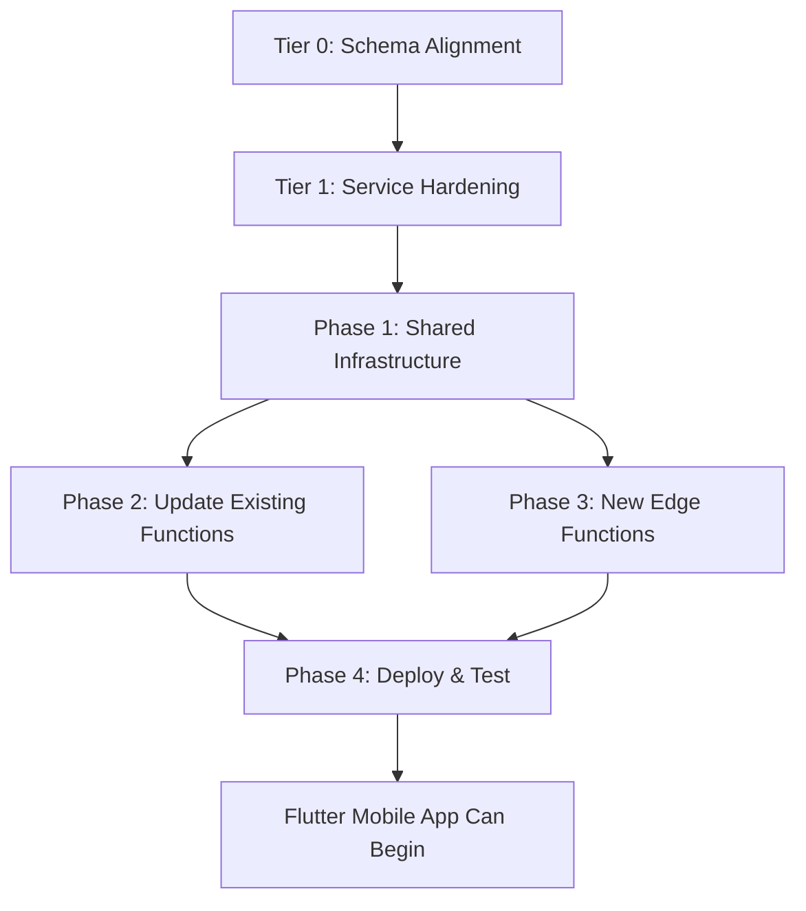

# TIER 2 — Edge Function & Mobile API Standardization Plan

> **Goal**: Transform the 6 skeletal Edge Functions into a production-grade REST API that a Flutter mobile app (and any external client) can consume safely.  
> **Depends on**: Tier 0 (schema) + Tier 1 (state machines & validation) must be done first.  
> **Time**: ~4–5 hours  
> **Risk**: Medium — requires redeploying all 6 functions + creating shared middleware.

---

## TABLE OF CONTENTS

1. [Current State Audit](#1-current-state-audit)
2. [Standard API Response Envelope](#2-standard-api-response-envelope)
3. [RBAC Middleware](#3-rbac-middleware)
4. [Edge Function Gap Analysis](#4-edge-function-gap-analysis)
5. [Missing Endpoints for Flutter](#5-missing-endpoints-for-flutter)
6. [Request Validation](#6-request-validation)
7. [Pagination in Edge Functions](#7-pagination-in-edge-functions)
8. [CORS Hardening](#8-cors-hardening)
9. [Rate Limiting](#9-rate-limiting)
10. [Execution Checklist](#10-execution-checklist)

---

## 1. CURRENT STATE AUDIT

### 6 Deployed Edge Functions

| Function | Routes | Auth | RBAC | Validation | Pagination | Issues |
|---|---|---|---|---|---|---|
| `auth` | `GET /profile`, `POST /register` (410), `GET /health` | ✅ JWT | ❌ None | ❌ None | N/A | Register correctly retired. Profile works. |
| `appointments` | `GET /`, `POST /`, `PUT /:id`, `DELETE /:id` | ✅ JWT | ❌ None | ⚠️ Minimal typeof checks | ❌ None | Any authenticated user can see ALL appointments. No role check. |
| `consultations` | `GET /`, `POST /`, `PUT /:id`, `GET /medical-reports`, `POST /medical-reports` | ✅ JWT | ❌ None | ⚠️ Minimal typeof checks | ❌ None | Missing `notes` field. No state machine. Reports bundled in wrong function. |
| `patients` | `GET /patients`, `GET /doctors`, `POST /patients` (410), `PUT /patients/:id` (410), `POST /doctors` (410), `PUT /doctors/:id` (410) | ✅ JWT | ❌ None | ❌ None | ❌ None | Read-only. Mutations correctly blocked. |
| `referrals` | `GET /referrals`, `POST /`, `PUT /:id`, `GET /notifications`, `PUT /notifications/:id/read` | ✅ JWT | ❌ None | ⚠️ Minimal | ❌ None | Notifications bundled in wrong function. No state transition validation. |
| `process-payment` | `POST /` | ✅ JWT | ❌ None | ⚠️ Amount+method check | N/A | Returns 501 — not implemented. Uses deprecated `serve` import. |

### Shared Module: `_shared/http.ts`

| Helper | Status | Issues |
|---|---|---|
| `corsHeaders` | ✅ Exists | 🔴 `Access-Control-Allow-Origin: *` — too permissive for production |
| `handleCors()` | ✅ Works | Fine |
| `json()` | ✅ Works | No standard envelope (just wraps raw data) |
| `errorResponse()` | ✅ Works | Returns `{ error: string }` — inconsistent with `json({ data })` |
| `createRequestClient()` | ✅ Works | Fine |
| `requireAuth()` | ✅ Works | Returns JWT user. No role check. |
| `getDomainUser()` | ✅ Works | Fetches `users` row by `auth_user_id`. Used only by `auth` and `appointments`. |
| `parseJson()` | ✅ Works | No schema validation, just raw parse |

### Critical Finding: Zero RBAC

Every edge function calls `requireAuth()` which only checks "is there a valid JWT?" It never checks **what role** the user has. This means:
- A **patient** can `GET /consultations` and see **all** consultations for **all** patients
- A **patient** can `POST /referrals` and create referrals as if they were a doctor
- A **patient** can `PUT /consultations/:id` and modify any consultation

This is the #1 security gap in the API layer.

---

## 2. STANDARD API RESPONSE ENVELOPE

### Current: Inconsistent

```js
// Success in appointments:
{ data: [...] }

// Success in consultations:
{ data: {...} }

// Error:
{ error: "message" }

// Appointment cancellation:
{ success: true }
```

### Target: Unified `ApiResponse<T>`

Every endpoint should return:

```typescript
interface ApiResponse<T> {
  ok: boolean;              // Quick check for Flutter
  data: T | null;           // The payload (null on error)
  error: string | null;     // Human-readable error (null on success)
  meta?: {                  // Optional pagination/debug info
    page: number;
    pageSize: number;
    total: number;
    requestId: string;
  };
}
```

### Implementation: New `_shared/response.ts`

```typescript
export function success<T>(data: T, status = 200, meta?: Record<string, unknown>) {
  return json({ ok: true, data, error: null, ...(meta ? { meta } : {}) }, status);
}

export function fail(message: string, status = 400) {
  return json({ ok: false, data: null, error: message }, status);
}

export function paginated<T>(data: T[], total: number, page: number, pageSize: number) {
  return json({
    ok: true,
    data,
    error: null,
    meta: { page, pageSize, total },
  }, 200);
}
```

---

## 3. RBAC MIDDLEWARE

### New File: `_shared/rbac.ts`

```typescript
import { getDomainUser } from "./http.ts";
import type { SupabaseClient, User } from "jsr:@supabase/supabase-js@2";

export type Role = "admin" | "doctor" | "secretary" | "predoctor" | "patient";

export interface AuthContext {
  client: SupabaseClient;
  authUser: User;
  domainUser: {
    id: string;
    auth_user_id: string;
    email: string;
    role: Role;
    first_name: string;
    last_name: string;
  };
}

export async function requireRole(
  req: Request,
  allowedRoles: Role[],
): Promise<{ ctx: AuthContext; response: null } | { ctx: null; response: Response }> {

  // 1. Validate JWT
  const authResult = await requireAuth(req);
  if (authResult.response) {
    return { ctx: null, response: authResult.response };
  }

  // 2. Fetch domain user (with role)
  const domainUser = await getDomainUser(authResult.client, authResult.authUser.id);
  if (!domainUser) {
    return { ctx: null, response: fail("No user profile found", 403) };
  }

  // 3. Check role
  if (!allowedRoles.includes(domainUser.role as Role)) {
    return {
      ctx: null,
      response: fail(
        `Access denied. Required role: [${allowedRoles.join(", ")}]. Your role: ${domainUser.role}`,
        403,
      ),
    };
  }

  return {
    ctx: {
      client: authResult.client,
      authUser: authResult.authUser,
      domainUser,
    },
    response: null,
  };
}
```

### Per-Endpoint Role Matrix

| Endpoint | Method | Allowed Roles | Reason |
|---|---|---|---|
| `GET /appointments` | GET | `admin`, `doctor`, `secretary`, `predoctor` | Staff see all; patients use filtered endpoint |
| `POST /appointments` | POST | `admin`, `secretary`, `patient` | Patients book their own; staff books for anyone |
| `PUT /appointments/:id` | PUT | `admin`, `secretary`, `doctor` | Only staff can modify |
| `GET /patients` | GET | `admin`, `doctor`, `secretary`, `predoctor` | Staff-only |
| `GET /patients/me` | GET | `patient` | Patient sees own profile only |
| `GET /consultations` | GET | `admin`, `doctor` | Only doctors see consultations |
| `POST /consultations` | POST | `admin`, `doctor` | Only doctors create |
| `PUT /consultations/:id` | PUT | `admin`, `doctor` | Only doctors modify |
| `GET /referrals` | GET | `admin`, `doctor` | Only doctors see referrals |
| `POST /referrals` | POST | `admin`, `doctor` | Only doctors create |
| `GET /notifications` | GET | ALL | Users see their own |
| `GET /medical-reports` | GET | `admin`, `doctor`, `patient` | Patient sees own only |
| `POST /process-payment` | POST | `admin`, `secretary` | Only billing staff |

### Patient-Scoped Endpoints (Data Isolation)

For patient-role requests, queries must be filtered:
```typescript
if (ctx.domainUser.role === "patient") {
  // Find the patient record for this user
  const { data: patientRecord } = await ctx.client
    .from("patients")
    .select("id")
    .eq("user_id", ctx.domainUser.id)
    .single();

  // Scope all queries to this patient
  query = query.eq("patient_id", patientRecord.id);
}
```

---

## 4. EDGE FUNCTION GAP ANALYSIS

### Function: `appointments/index.ts`

| # | Issue | Severity | Fix |
|---|---|---|---|
| A1 | No RBAC — any user sees all appointments | 🔴 Critical | Add `requireRole()` |
| A2 | `GET /` returns all appointments without date filter | 🟡 Medium | Add `?date=`, `?patient_id=`, `?doctor_id=` query params |
| A3 | `POST /` — no patient-self check (patient could book as another patient) | 🔴 Critical | If role=patient, enforce `patient_id === own patient record` |
| A4 | `PUT /:id` — only allows cancellation (correct restriction) | ✅ OK | Already locked down |
| A5 | No `GET /:id` — can't fetch single appointment | 🟡 Medium | Add single-record endpoint |
| A6 | SELECT missing `patients(...)` and `doctors(...)` joins | 🟡 Medium | Flutter needs patient/doctor names inline |

### Function: `consultations/index.ts`

| # | Issue | Severity | Fix |
|---|---|---|---|
| C1 | No RBAC — any user can read/write consultations | 🔴 Critical | Add `requireRole(['doctor', 'admin'])` |
| C2 | `PUT /:id` — no state machine validation | 🔴 Critical | Add transition check before update |
| C3 | SELECT missing `notes` column | 🟡 Medium | Add to CONSULTATION_SELECT |
| C4 | SELECT missing `symptoms`, `follow_up_date` (after Tier 0 migration) | 🟡 Medium | Update SELECT after Tier 0 |
| C5 | Medical reports mixed into consultations function | 🟡 Architectural | Move to own function or keep but document |
| C6 | `POST /consultations` — doesn't validate appointment exists or is `in_consultation` | 🔴 Critical | Add pre-check |

### Function: `patients/index.ts`

| # | Issue | Severity | Fix |
|---|---|---|---|
| P1 | No RBAC — any user sees all patient records | 🔴 Critical | Staff-only for `GET /patients`; patients get `GET /patients/me` |
| P2 | No `GET /patients/:id` — can't fetch single patient | 🟡 Medium | Add with role check |
| P3 | `GET /doctors` bundled into patients function | 🟡 Architectural | Acceptable for now |
| P4 | No patient profile update via edge function | 🟡 Medium | Add `PUT /patients/me` calling `update_patient_profile` RPC |

### Function: `referrals/index.ts`

| # | Issue | Severity | Fix |
|---|---|---|---|
| R1 | No RBAC — any user can create/modify referrals | 🔴 Critical | Doctors only |
| R2 | `POST /` requires `to_doctor_id` but frontend sends `to_doctor_name` | 🔴 Blocker | Accept `to_doctor_name` as alternative (after Tier 0 migration) |
| R3 | SELECT missing new columns: `priority`, `clinical_findings`, `treatment_plan`, `ref_number`, `to_doctor_name` | 🟡 Medium | Update after Tier 0 |
| R4 | `PUT /:id` — no state machine validation | 🔴 Critical | Add transition check |
| R5 | Notifications bundled in referrals function | 🟡 Architectural | Move to own function |

### Function: `process-payment/index.ts`

| # | Issue | Severity | Fix |
|---|---|---|---|
| PM1 | Returns 501 — completely non-functional | 🟡 Known | Intentional placeholder until gateway integration |
| PM2 | Uses deprecated `serve` import from `deno.land/std` | 🟡 Technical debt | Switch to `Deno.serve()` |
| PM3 | No `deno.json` (only function without one) | 🟡 Config gap | Add `deno.json` |

### Function: `auth/index.ts`

| # | Issue | Severity | Fix |
|---|---|---|---|
| AU1 | `GET /auth/profile` works but returns minimal data | 🟡 Medium | Include patient/doctor record if applicable |
| AU2 | No token refresh endpoint | 🟡 Medium | Supabase SDK handles this, but Flutter may need explicit endpoint |

---

## 5. MISSING ENDPOINTS FOR FLUTTER

The Flutter mobile app will need these endpoints that don't exist yet:

### Priority 0 — Day-1 Flutter Launch

| Endpoint | Method | Function | What It Does |
|---|---|---|---|
| `GET /patients/me` | GET | `patients` | Patient fetches own profile (user + patient record) |
| `PUT /patients/me` | PUT | `patients` | Patient updates own profile via RPC |
| `GET /appointments/mine` | GET | `appointments` | Patient fetches own appointments only |
| `GET /appointments/:id` | GET | `appointments` | Fetch single appointment with patient/doctor details |
| `GET /available-slots` | GET | `appointments` | `?doctor_id=&date=` — wraps `get_available_slots` RPC |
| `GET /consultations/mine` | GET | `consultations` | Patient fetches own consultation history |
| `GET /medical-reports/mine` | GET | `consultations` | Patient fetches own reports |
| `GET /certificates/mine` | GET | NEW `certificates` | Patient fetches own certificates |
| `GET /notifications/mine` | GET | `referrals` or NEW | Patient fetches own notifications |
| `PUT /notifications/read-all` | PUT | `referrals` or NEW | Mark all as read |

### Priority 1 — Doctor Mobile Access

| Endpoint | Method | Function | What It Does |
|---|---|---|---|
| `GET /appointments/today` | GET | `appointments` | Doctor's today queue |
| `GET /consultations/:id` | GET | `consultations` | Single consultation detail |
| `GET /patients/:id` | GET | `patients` | Single patient detail (doctor access) |
| `GET /referrals/sent` | GET | `referrals` | Doctor's sent referrals |
| `GET /referrals/received` | GET | `referrals` | Doctor's received referrals |

### Priority 2 — New Edge Functions Needed

| Function | Why |
|---|---|
| `certificates` | Currently no edge function for certificates at all |
| `notifications` | Currently bundled inside `referrals` — needs own function |
| `precheck-forms` | Pre-doctor workflow not exposed via API |
| `billing` | Payment CRUD not exposed (only `process-payment` stub) |
| `slots` | Schedule management not exposed via API |

---

## 6. REQUEST VALIDATION

### Current: Manual `typeof` Checks

Every edge function does this:
```typescript
const slotId = typeof body?.slot_id === "string" ? body.slot_id : null;
```

This is verbose, inconsistent, and doesn't validate UUIDs, lengths, or enums.

### Target: Shared Zod-Like Validation

Create `_shared/validate.ts` with lightweight runtime validation:

```typescript
export function validateBody<T>(
  body: unknown,
  rules: Record<string, { type: string; required?: boolean; enum?: string[] }>,
): { data: T; error: null } | { data: null; error: string } {
  // Validate each field against rules
  // Return typed result or first error
}
```

Example usage:
```typescript
const { data, error } = validateBody(body, {
  from_doctor_id: { type: "uuid", required: true },
  patient_id:     { type: "uuid", required: true },
  reason:         { type: "string", required: true },
  priority:       { type: "string", enum: ["routine", "urgent", "emergency"] },
  to_doctor_name: { type: "string" },
});
if (error) return fail(error, 422);
```

---

## 7. PAGINATION IN EDGE FUNCTIONS

### Standard Query Params

All `GET` list endpoints should accept:
```
?page=0&pageSize=25
```

### Implementation in `_shared/pagination.ts`

```typescript
export function getPaginationParams(url: URL) {
  const page = Math.max(0, parseInt(url.searchParams.get("page") || "0", 10));
  const pageSize = Math.min(100, Math.max(1, parseInt(url.searchParams.get("pageSize") || "25", 10)));
  const from = page * pageSize;
  const to = from + pageSize - 1;
  return { page, pageSize, from, to };
}
```

Usage:
```typescript
const { page, pageSize, from, to } = getPaginationParams(url);
const { data, error, count } = await client
  .from("appointments")
  .select(APPOINTMENT_SELECT, { count: "exact" })
  .range(from, to)
  .order("scheduled_at", { ascending: true });

return paginated(data, count ?? 0, page, pageSize);
```

---

## 8. CORS HARDENING

### Current: Wide Open

```typescript
"Access-Control-Allow-Origin": "*"
```

### Target: Environment-Specific

```typescript
const ALLOWED_ORIGINS = (Deno.env.get("ALLOWED_ORIGINS") || "*").split(",");

export function getCorsHeaders(req: Request) {
  const origin = req.headers.get("Origin") || "";
  const allowed = ALLOWED_ORIGINS.includes("*") || ALLOWED_ORIGINS.includes(origin);
  return {
    "Access-Control-Allow-Origin": allowed ? origin : ALLOWED_ORIGINS[0],
    "Access-Control-Allow-Methods": "GET, POST, PUT, DELETE, OPTIONS",
    "Access-Control-Allow-Headers": "Content-Type, Authorization, X-Request-ID",
    "Access-Control-Max-Age": "86400",
  };
}
```

Set `ALLOWED_ORIGINS` in Supabase Dashboard → Edge Functions → Secrets:
- Dev: `http://localhost:5173,http://localhost:3000`
- Prod: `https://doctoleb.com,https://app.doctoleb.com`

---

## 9. RATE LIMITING

Edge Functions don't have built-in rate limiting. Options:

| Approach | Complexity | Recommendation |
|---|---|---|
| Supabase built-in (API gateway limits) | Zero | ✅ Use default — sufficient for V1 |
| Custom Redis-based | High | ❌ Overkill for single-clinic |
| In-memory per-function | Medium | 🟡 Consider for `POST /appointments` (booking spam) |

For V1, rely on Supabase's default rate limits + JWT requirement. Add custom limits in V2 if needed.

---

## 10. EXECUTION CHECKLIST

### Phase 1: Shared Infrastructure (new files)
```
- [ ] Create _shared/response.ts (success, fail, paginated helpers)
- [ ] Create _shared/rbac.ts (requireRole middleware)
- [ ] Create _shared/validate.ts (body validation)
- [ ] Create _shared/pagination.ts (query param parser)
- [ ] Update _shared/http.ts (CORS hardening, keep backward compat)
```

### Phase 2: Update Existing Functions
```
- [ ] auth/index.ts — enrich /profile with patient/doctor record
- [ ] appointments/index.ts — add RBAC, pagination, /mine, /:id, /available-slots
- [ ] consultations/index.ts — add RBAC, state machine, update SELECT fields
- [ ] patients/index.ts — add RBAC, /me, /patients/:id
- [ ] referrals/index.ts — add RBAC, state machine, update SELECT, extract notifications
- [ ] process-payment/index.ts — fix deprecated import, add deno.json
```

### Phase 3: New Edge Functions
```
- [ ] Create certificates/index.ts (GET /, GET /mine, POST /, PUT /:id)
- [ ] Create notifications/index.ts (GET /mine, PUT /:id/read, PUT /read-all)
- [ ] Create precheck-forms/index.ts (GET /by-patient/:id, POST /, PUT /:id)
```

### Phase 4: Deploy & Test
```
- [ ] Deploy all functions via mcp_supabase_deploy_edge_function
- [ ] Test patient role: can only see own data
- [ ] Test doctor role: can see patients, create consultations
- [ ] Test secretary role: can book appointments, manage billing
- [ ] Test unauthorized: gets 401
- [ ] Test wrong role: gets 403 with clear message
- [ ] Test pagination: page=0 returns 25, page=1 returns next 25
- [ ] Test invalid body: gets 422 with field-level error
```

---

## DEPENDENCY GRAPH



---

## IMPACT SUMMARY

| Before Tier 2 | After Tier 2 |
|---|---|
| Any authenticated user sees ALL data via API | RBAC enforces role-based data isolation |
| Patients can read all consultations/referrals | Patients can only see their own records |
| No standard response format | Unified `ApiResponse<T>` envelope for Flutter |
| No pagination in API | All list endpoints paginated |
| `Access-Control-Allow-Origin: *` | Environment-specific CORS |
| 6 edge functions, no certificates/precheck API | 9 edge functions covering full Flutter needs |
| Manual typeof validation | Shared validation module with clear 422 errors |
| No state machine in API layer | Transition validation before every status change |
| Notifications buried in referrals function | Dedicated notifications endpoint |

---

## FLUTTER CLIENT INTEGRATION NOTES

After Tier 2, a Flutter app can consume:

```
Base URL: https://gezmfmskhmjgnquoyosq.supabase.co/functions/v1

Auth:
  GET  /auth/profile          → Get current user + role
  GET  /auth/health            → Health check

Patient Flow:
  GET  /patients/me            → Own profile
  PUT  /patients/me            → Update profile
  GET  /appointments/mine      → Own appointments
  POST /appointments           → Book appointment
  PUT  /appointments/:id       → Cancel appointment
  GET  /available-slots?doctor_id=&date=  → Available slots
  GET  /consultations/mine     → Own consultation history
  GET  /medical-reports/mine   → Own reports
  GET  /certificates/mine      → Own certificates
  GET  /notifications/mine     → Own notifications
  PUT  /notifications/read-all → Mark all read

Doctor Flow (mobile):
  GET  /appointments/today     → Today's queue
  GET  /patients/:id           → Patient detail
  GET  /consultations/:id      → Consultation detail
  POST /consultations          → Start consultation
  PUT  /consultations/:id      → Update/complete consultation
  POST /referrals              → Create referral
  GET  /referrals/sent         → Sent referrals
```
