# DoctoLeb Tier 2 Product Architecture Plan

> Status: foundation implemented locally and applied to live Supabase.
> Scope: doctor-branded medical practice core for one doctor tenant database.
> Current tenant model: one Supabase project/database per doctor. No `tenant_id` inside the tenant DB.
> Control-plane model: future separate SaaS owner project, no PHI.
> Live Supabase project: `gezmfmskhmjgnquoyosq` (`clinic-website`).
> Live migration applied: `20260506150820_tier2_product_core_foundation`.
> Last verified: 2026-05-06.
> Architecture review: Claude senior review completed after implementation; no P0 findings, but Tier 2.5 hardening is required before large UI work.
> Next gate: complete `TIER2_5_HARDENING_PLAN.md` Block A before doctor encounter UI.

## 0. What Was Implemented

Tier 2 is now a real foundation, not just a proposal. This plan was implemented as an additive, non-destructive product-core layer on top of Tier 0/1.

### Repo artifacts

| Artifact | Status | Purpose |
|---|---|---|
| `TIER2_PRODUCT_ARCHITECTURE_PLAN.md` | Done | Canonical product/DB/API architecture plan for the doctor-branded practice platform. |
| `supabase/migrations/20260506150820_tier2_product_core_foundation.sql` | Done and live | Adds Tier 2 tables, RLS, indexes, audit triggers, helper functions, and public config RPC. |
| `src/lib/selects.js` | Updated | Explicit select contracts for Tier 2 tables. |
| `src/schemas/index.js` | Updated | Zod schemas for encounter, clinical, messaging, notification, and tenant config writes. |
| `src/services/clinical.js` | Added | Service layer for encounters, notes, diagnoses, prescriptions, orders, documents, attachments, and care tasks. |
| `src/services/messaging.js` | Added | Service layer for conversations, participants, messages, attachments, and read receipts. |
| `src/services/notificationCore.js` | Added | Service layer for patient devices, notification events, deliveries, and reminder rules. |
| `src/services/tenantConfig.js` | Added | Service layer for tenant profile, mobile/web app config, feature flags, content pages, and consents. |

### Live DB verification

| Check | Result |
|---|---|
| Migration history | `20260506150820 / tier2_product_core_foundation` exists live. |
| New tables | 24 Tier 2 tables exist. |
| RLS | All 24 Tier 2 tables have RLS enabled. |
| Policies | 72 Tier 2 RLS policies were created. |
| Public config | `get_public_tenant_app_config()` returns safe doctor/app config for pre-login clients. |
| Validation | `npm run lint` passed. |
| Build | `npm run build` passed. |

### Important relation to `TIER2_PLAN.md`

`TIER2_PLAN.md` is the older Tier 2 Edge Function API hardening plan. This file is the newer Tier 2 product/database architecture plan created after the product pivot from generic clinic management to doctor-branded medical practice management. Treat both as relevant:

- `TIER2_PLAN.md` explains Edge Function hardening.
- `TIER2_PRODUCT_ARCHITECTURE_PLAN.md` explains the new medical-practice product core and live DB foundation.

### Post-implementation architecture review

A senior Claude review validated the live foundation and found no P0 PHI leak or blocker findings. The review did identify high-priority gaps that should be closed before building large UI:

- Atomic lifecycle RPCs are missing for encounters and clinical documents.
- Tier 2 direct table mutations need stronger state-machine enforcement.
- Tier 2 PHI tables default-deny DELETE but need an explicit admin purge path or service-role purge plan.
- New services still mostly return the legacy `{ data, count, error }` shape, while the architecture contract calls for `{ data, meta, error }`.
- Mobile/offline retry writes need `client_request_id` idempotency support.
- A few Tier 2 service write methods still need Zod validation.

The hardening plan for these findings is now tracked in `TIER2_5_HARDENING_PLAN.md`.

## 1. Executive Decision

Tier 2 moves DoctoLeb from "secure scheduling plus intake" into a durable medical-practice core. We should not build more UI screens until the DB/API contracts below are stable because the next UI work depends on the same shared domain objects across web and mobile.

The product is a doctor-branded practice platform, not generic clinic management. A tenant represents one doctor's branded practice, including multiple locations, staff, schedules, patients, encounters, documents, insurance workflows, messaging, notifications, and mobile app configuration.

## 2. Architecture Shape

```txt
Supabase DB / RPC / Edge Functions
  -> src/services/*
  -> src/schemas + src/lib/selects + normalizers + state machines
  -> src/hooks/features/*
  -> pages/components
```

Rules:

- DB owns identity, authorization, lifecycle gates, and integrity.
- RPCs own atomic workflows such as booking, encounter start/complete, document finalization, and notification fan-out.
- Services own DB-to-UI normalization and stable return shapes.
- Pages must not contain business rules, raw Supabase query fragments, status transitions, or record mapping logic.
- Mobile uses the same Edge Function/service contracts as web. The DB schema must be pagination-safe and offline-retry-safe from day one.

## 3. FHIR-Inspired Mapping

This is FHIR-inspired, not a FHIR implementation. We borrow the domain boundaries because they are proven in healthcare systems.

| FHIR-like concept | DoctoLeb table/contract | Tier |
|---|---|---|
| Patient | `patients`, `medical_intake`, patient history tables | Tier 1 |
| Practitioner | `doctors`, `staff_members` | Tier 1 |
| Location | `clinics` as practice locations | Tier 1 |
| Schedule | `doctor_schedule_templates` | Tier 1 |
| Slot | `secretary_slots` | Tier 0/1 |
| Appointment | `appointments` via `book_slot` only | Tier 0/1 |
| Encounter | `encounters` | Tier 2 |
| Condition | `patient_diseases`, `diagnoses` | Tier 1/2 |
| Procedure | `patient_surgeries`, future procedure records | Tier 1 |
| Immunization | `patient_vaccinations` | Tier 1 |
| Observation | `precheck_forms`, future structured observations | Tier 0/1 |
| DocumentReference | `clinical_documents`, `document_attachments` | Tier 2 |
| Communication | `conversations`, `messages` | Tier 2 |
| MedicationRequest | `prescriptions` | Tier 2 |
| ServiceRequest | `lab_orders`, `imaging_orders`, `care_tasks` | Tier 2 |

## 4. Role Use-Case Matrix

| Role | Core jobs | Tier 2 impact |
|---|---|---|
| Patient | Register, view doctor brand/location schedule, book slot, submit/update own data, consent, message practice, receive reminders, view documents | Needs public safe config, own-scoped PHI, device registration, conversations, consent records |
| Secretary | Manage locations/schedules/slots, book patient, collect/reopen intake, insurance policy and claim paperwork, appointment lifecycle, reminders | Needs canonical booking, intake gate controls, insurance documents, care tasks |
| Predoctor | Pre-check queue, vitals, first-visit intake support, escalate urgent symptoms, prepare doctor handoff | Needs encounters/precheck linkage, care tasks, scoped read/write |
| Nurse/assistant | Execute care tasks, collect vitals, follow up with patient, upload results | Needs staff profile without mandatory auth account at first, care tasks, document attachments |
| Doctor | Own schedule, review patient history, start/complete encounter, write diagnosis/prescription/orders/notes, finalize documents, supervise staff | Needs encounter timeline and clinical document model |
| Future SaaS owner | Provision tenants, manage branding/app versions/features without PHI, monitor drift and health | Belongs in separate control-plane DB, not tenant DB |

## 5. Use-Case And Edge-Case Matrix

| Scenario | Expected system behavior | DB/API contract |
|---|---|---|
| First visit | Patient can book first slot before intake; secretary/predoctor completes intake before follow-up booking | `visit_types.requires_intake`, `patients.intake_completed_at`, `book_slot` gate |
| Follow-up | Patient can only book intake-gated visit when intake is complete | `book_slot` rejects missing intake |
| Urgent visit | Staff can book urgent visit with explicit urgent visit type and audit trail | `book_slot` permits non-intake urgent type; reason required |
| Cancellation | Appointment identity remains immutable; status changes through state machine; notes preserve reason | Status RPC/state machine, audit trigger |
| No-show | Doctor/secretary marks no-show; slot is not silently reopened | Appointment status only, no direct slot mutation |
| Reopened intake | Existing intake remains historical/audited; reopened state blocks selected future workflows if configured | `medical_intake.status`, audit log |
| Wrong patient booking | Staff cancellation/rebook creates auditable correction, never edits `patient_id` directly | Immutable appointment identity policy/trigger |
| Expired insurance | Claim can be draft but warns/blocks submit depending provider rule | `patient_insurance_policies.valid_to`, `insurance_claims.status` |
| Multi-location conflict | Schedule materialization rejects overlapping location slots for same doctor | schedule/slot overlap check RPC |
| Staff deactivation | User loses staff capabilities; historical records keep author identity | `staff_members.is_active`, RLS helpers |
| Mobile offline retry | Idempotent create requests use server-generated records and conflict keys where needed | Edge contracts include idempotency key later |
| Failed notification | Business record succeeds; notification send-attempt records failure for retry | `notification_events`, `notification_deliveries` |
| Tenant migration drift | Tenant profile tracks schema/app version; control plane later compares versions | `tenant_profile.schema_version`, future control plane |

## 6. Tier 2 ERD Additions

```mermaid
erDiagram
    PATIENTS ||--o{ ENCOUNTERS : "has visits"
    DOCTORS ||--o{ ENCOUNTERS : "conducts"
    APPOINTMENTS ||--o| ENCOUNTERS : "becomes"
    ENCOUNTERS ||--o{ CLINICAL_NOTES : "contains"
    ENCOUNTERS ||--o{ DIAGNOSES : "records"
    ENCOUNTERS ||--o{ PRESCRIPTIONS : "orders"
    ENCOUNTERS ||--o{ LAB_ORDERS : "requests"
    ENCOUNTERS ||--o{ IMAGING_ORDERS : "requests"
    ENCOUNTERS ||--o{ CLINICAL_DOCUMENTS : "produces"
    CLINICAL_DOCUMENTS ||--o{ DOCUMENT_ATTACHMENTS : "has files"
    PATIENTS ||--o{ CARE_TASKS : "needs"
    USERS ||--o{ CARE_TASKS : "assigned"

    PATIENTS ||--o{ CONVERSATIONS : "opens"
    CONVERSATIONS ||--o{ CONVERSATION_PARTICIPANTS : "includes"
    CONVERSATIONS ||--o{ MESSAGES : "has"
    MESSAGES ||--o{ MESSAGE_ATTACHMENTS : "has files"
    MESSAGES ||--o{ MESSAGE_READ_RECEIPTS : "read by"

    PATIENTS ||--o{ PATIENT_DEVICES : "registers"
    USERS ||--o{ NOTIFICATION_EVENTS : "receives"
    NOTIFICATION_EVENTS ||--o{ NOTIFICATION_DELIVERIES : "delivers"
    PATIENT_DEVICES ||--o{ NOTIFICATION_DELIVERIES : "targeted by"

    DOCTORS ||--o| TENANT_PROFILE : "brands"
    TENANT_PROFILE ||--o| TENANT_APP_CONFIG : "configures"
    TENANT_PROFILE ||--o{ FEATURE_FLAGS : "enables"
    TENANT_PROFILE ||--o{ CONTENT_PAGES : "publishes"
    CONSENT_DOCUMENTS ||--o{ PATIENT_CONSENTS : "accepted as"
    PATIENTS ||--o{ PATIENT_CONSENTS : "accepts"
```



## 7. New Domain Tables

### 7.1 Clinical workflow

- `encounters`: the visit timeline record created from an appointment.
- `clinical_notes`: structured free-text notes attached to an encounter.
- `diagnoses`: encounter-level diagnoses, optionally linked to the Tier 1 `diseases` catalog.
- `prescriptions`: doctor medication orders.
- `lab_orders`: lab service requests and result summaries.
- `imaging_orders`: imaging requests and result summaries.
- `clinical_documents`: printable/official documents such as reports, certificates, insurance forms, prescriptions, and uploaded results.
- `document_attachments`: storage metadata for files linked to documents.
- `care_tasks`: follow-up work for staff/doctor.

### 7.2 Messaging/chat

- `conversations`: patient-staff or internal staff thread.
- `conversation_participants`: scoped membership and read boundary.
- `messages`: message body and sender metadata.
- `message_attachments`: storage metadata for message files.
- `message_read_receipts`: per-user read tracking.

### 7.3 Notifications/mobile

- `patient_devices`: mobile/web push token registry for a patient.
- `notification_events`: business notification intent.
- `notification_deliveries`: channel/device notification send attempt and failure state.
- `reminder_rules`: configurable reminder offsets by related workflow.

### 7.4 Tenant/mobile config

- `tenant_profile`: doctor tenant metadata for provisioning, status, schema version, and public slug.
- `tenant_app_config`: public-safe web/mobile branding and app gate settings.
- `feature_flags`: role/platform scoped features.
- `content_pages`: public/patient/staff content controlled by the tenant.
- `consent_documents`: versioned legal/medical consent text.
- `patient_consents`: immutable-ish consent acceptance and revocation records.

## 8. Security And RLS Decisions

| Area | Decision |
|---|---|
| Tenant isolation | Silo model. No `tenant_id` inside tenant DB. |
| PHI deletes | Use archive fields or status values; no client hard delete on medical/legal records. |
| Foreign keys | PHI references use `ON DELETE RESTRICT`; catalog references use `RESTRICT`; participant rows may cascade from conversations/messages. |
| Appointment bypass | Direct appointment inserts stay disabled; booking remains RPC-only. |
| Encounter writes | Doctor/admin owns clinical write operations; predoctor/secretary/nurse can support only through allowed tables/tasks. |
| Messaging | Only active participants can read/send in a conversation. |
| Notifications | Recipients read own deliveries/events; staff/service creates events. |
| Tenant public config | Anonymous clients may read only redacted safe config via RPC/view, not raw tables. |
| Audit | Medical, legal, tenant-config, and workflow records are audited. Chat content is not duplicated into `audit_log` to avoid unnecessary PHI replication. |

## 9. Catalog Permission Tightening

Tier 1 initially made catalogs broadly editable by staff. Tier 2 tightens that split:

- Static/system catalogs: `blood_groups`, `family_relations`. Select authenticated; writes admin-only.
- Clinical catalogs: `specialties`, `vaccines`, `diseases`, `surgery_types`, `visit_types`. Select authenticated; doctor/admin writes.
- Operational catalogs: `cities`, `occupations`, `insurance_providers`, `claim_form_templates`. Select authenticated; secretary/admin writes.

## 10. API Contracts

Every web/mobile endpoint should use this envelope:

```js
{
  data: objectOrArrayOrNull,
  meta: {
    pagination: {
      page: 1,
      pageSize: 20,
      totalItems: 0,
      totalPages: 0
    }
  },
  error: null
}
```

Error shape:

```js
{
  data: null,
  meta: null,
  error: {
    code: 'VALIDATION_ERROR',
    message: 'Human-readable message',
    details: {}
  }
}
```

Service modules to expose:

- `clinicalService`: encounters, notes, diagnoses, prescriptions, orders, documents, care tasks.
- `messagingService`: conversations, participants, messages, receipts.
- `notificationCoreService`: devices, notification events, deliveries, reminder rules.
- `tenantConfigService`: safe public config, feature flags, content pages, consents.

## 11. Frontend Layering Plan

No large UI rewrite belongs in this phase. The UI work should start only after these contracts exist.

Next frontend slices:

1. Add feature hooks that consume the new services.
2. Add page-level loading/error/empty states around domain hooks.
3. Move duplicated business rules out of pages.
4. Build doctor encounter page from `clinicalService`.
5. Build patient document/message/mobile-consent views from the same contracts.

## 12. Implementation Ledger

| Step | Status | Notes |
|---|---|---|
| Add Tier 2 architecture doc | Done | This file now records the implemented foundation and future direction. |
| Add non-destructive DB migration | Done | Migration added and applied live as `20260506150820_tier2_product_core_foundation`. |
| Add RLS, indexes, audit, public config RPC | Done | All 24 new tables have RLS; live query confirmed. |
| Add frontend selects/services only | Done | Contract scaffolding added without starting large UI work. |
| Run lint/build | Done | Both passed after implementation. |
| Start UI slices | Not started | Must be planned and reviewed before implementation. |

## 13. What Is Still Missing

Tier 2 foundation is ready, but the product is not complete. The next agent must review and plan these gaps before building UI.

| Gap | Why it matters | Suggested next step |
|---|---|---|
| Encounter workflow UI | Doctor still needs a professional visit flow backed by `encounters`, notes, diagnoses, prescriptions, and orders. | Build feature hooks, then doctor encounter page. |
| Patient-facing documents | Patients need to view prescriptions, reports, insurance forms, lab/imaging results. | Build documents hook and patient document list/detail. |
| Messaging UX | Tables and services exist, but no chat UI or notification coupling yet. | Design patient-staff conversation flow with unread counts. |
| Notification send worker | DB tracks notification events/send attempts, but no push/email/SMS send function is implemented. | Add Edge Function worker later, with retry and provider abstraction. |
| Consent onboarding | Consent tables exist but no UI flow. | Add pre-login/public consent display and patient acceptance flow. |
| Tenant/mobile config management | Config tables/RPC exist, but no doctor/staff config UI. | Build safe settings screen after product copy is approved. |
| Control-plane SaaS owner app | Explicitly deferred. No PHI should leave tenant DB. | Design separate project later. |
| Deeper DB test automation | Manual live checks passed, but automated DB/RLS tests are still needed. | Add SQL/edge smoke tests for RLS and workflow gates. |
| Tier 2.5 hardening | Review found P1 gaps in lifecycle RPCs, idempotency, service envelopes, and validation. | Complete `TIER2_5_HARDENING_PLAN.md` before large UI work. |

## 14. Test Plan

### DB tests

- Direct `appointments` insert is denied.
- `book_slot` still gates intake where required.
- Patient cannot read another patient's encounter, notes, messages, documents, devices, or consents.
- Secretary cannot create diagnosis/prescription records.
- Doctor can create encounter and clinical records for own appointment.
- Staff cannot spoof message sender or notification recipient.
- Audit rows are created for clinical/legal/tenant config changes.
- Anonymous can only read safe public brand/config RPC output.

### Flow tests

- Patient books first visit.
- Secretary completes intake.
- Doctor starts encounter.
- Doctor records diagnosis and prescription.
- Doctor creates clinical document.
- Secretary creates insurance claim document.
- Notification event creates notification send-attempt records.

### Edge-case tests

- Cancelled first visit does not mark intake complete.
- Urgent visit works without intake only for urgent visit type.
- Expired insurance blocks claim submit or marks warning.
- Duplicate schedule slot is rejected.
- Reopened intake is auditable.
- Deactivated staff cannot access staff-only flows.
- Mobile push-token retry upserts safely.

## 15. Deferred To Future Control Plane

These do not belong in the doctor tenant DB:

- SaaS owner users and permissions.
- Tenant provisioning registry across doctors.
- Tenant billing/subscription for the SaaS business.
- Cross-tenant analytics.
- Cross-tenant migration orchestrator.
- App-store build/release management.

The control plane may later store tenant project references, app config deployment state, and schema version health, but it must not store patient PHI.
