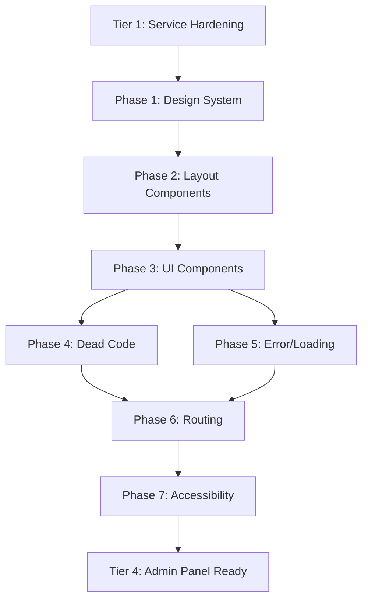

# TIER 3 — Frontend Cleanup & Standardization Plan

> **Goal**: Clean the UI codebase so every page follows the same layout shell, error/loading patterns, color tokens, and component architecture — making future feature development (admin panel, clinic flow, AI agents) trivially composable.  
> **Depends on**: Tier 0 (schema) + Tier 1 (services) must be done. Tier 2 (edge functions) is independent.  
> **Time**: ~5–6 hours  
> **Risk**: Low — purely frontend refactoring, no DB changes.

---

## TABLE OF CONTENTS

1. [Architecture Inventory](#1-architecture-inventory)
2. [Layout Shell Duplication](#2-layout-shell-duplication)
3. [Design Token Inconsistencies](#3-design-token-inconsistencies)
4. [Dead Code & Mock Data](#4-dead-code--mock-data)
5. [Console Leak Cleanup](#5-console-leak-cleanup)
6. [Error & Loading State Standardization](#6-error--loading-state-standardization)
7. [Component Extraction](#7-component-extraction)
8. [Routing Cleanup](#8-routing-cleanup)
9. [Accessibility Gaps](#9-accessibility-gaps)
10. [Execution Checklist](#10-execution-checklist)

---

## 1. ARCHITECTURE INVENTORY

### Current Structure

```
src/
├── App.jsx              (37 route declarations, all inline)
├── assets/              (3 files: hero.png, react.svg, vite.svg)
├── components/          (10 items — 3 sidebars, 3 visual effects, 1 error boundary, 1 route guard)
├── contexts/            (4 contexts: Auth, Sidebar, Theme, Toast)
├── hooks/               (1 hook: useSignaturePad)
├── lib/                 (9 utility files)
├── pages/               (32 page components)
├── schemas/             (1 Zod schema barrel)
├── services/            (14 service modules)
└── index.css + App.css
```

### Page Count by Role

| Role | Pages | Layout Component |
|---|---|---|
| Secretary | 7 | `<Sidebar />` |
| Doctor | 10 | `<DoctorSidebar />` |
| PreDoctor | 7 | `<PreDoctorSidebar />` |
| Patient | 5 | No sidebar — standalone layouts |
| Public | 5 | No sidebar — standalone layouts |
| **Total** | **34** | **3 different sidebars** |

---

## 2. LAYOUT SHELL DUPLICATION

### The Problem: Every Doctor Page Repeats the Same 6 Lines

Every doctor page (10 pages) opens with:
```jsx
<div className="flex h-screen w-full bg-[#f5f7f8] text-[#0f172a] overflow-hidden font-['Inter']">
  <DoctorSidebar />
  <main className="flex-1 overflow-y-auto p-8">
    <MobileTopBar />
    {/* actual page content */}
  </main>
</div>
```

**Same pattern repeated in**:
- `DoctorDashboardPage.jsx`
- `DoctorAppointmentsPage.jsx`
- `DoctorConsultationPage.jsx`
- `DoctorCertificatesPage.jsx`
- `DoctorReferralsPage.jsx`
- `DoctorReportsPage.jsx`
- `DoctorLabRequestPage.jsx`
- `DoctorPatientsPage.jsx`
- `DoctorPatientProfilePage.jsx`
- `DoctorMedicalHistoryPage.jsx`

PreDoctor pages (7 pages) have a similar pattern with `<PreDoctorSidebar />`.  
Secretary pages (7 pages) use `<Sidebar />`.

### Fix: Create `<DashboardLayout>` Component

```jsx
// src/components/layouts/DashboardLayout.jsx
export default function DashboardLayout({ sidebar, children }) {
  return (
    <div className="flex h-screen w-full bg-[var(--bg-base)] text-[var(--text-base)] overflow-hidden font-['Inter']">
      {sidebar}
      <main className="flex-1 overflow-y-auto p-8">
        <MobileTopBar />
        {children}
      </main>
    </div>
  );
}
```

**Impact**: Eliminates ~60 lines of duplicated layout code and centralizes responsive behavior.

---

## 3. DESIGN TOKEN INCONSISTENCIES

### 3.1 Hardcoded Colors (Not Using CSS Variables)

| Pattern | Count | Pages |
|---|---|---|
| `bg-[#f5f7f8]` (page background) | 10 | All doctor pages |
| `text-[#0f172a]` (base text) | 10 | All doctor pages |
| `font-['Inter']` (inline font) | 11 | All doctor pages + 1 secretary |
| `bg-[#0d6cf2]` / hardcoded blue | 0 | ✅ Already using `bg-primary` |
| `text-slate-900` / `text-slate-700` | ~100+ | Mixed with `text-[#0f172a]` |

### Fix: CSS Variable System

Add to `index.css`:
```css
:root {
  --bg-base: #f5f7f8;
  --bg-card: #ffffff;
  --text-base: #0f172a;
  --text-muted: #64748b;
  --border-default: #e2e8f0;
}

[data-theme="dark"] {
  --bg-base: #0f172a;
  --bg-card: #1e293b;
  --text-base: #f1f5f9;
  --text-muted: #94a3b8;
  --border-default: #334155;
}
```

Replace all `bg-[#f5f7f8]` → `bg-[var(--bg-base)]` and `text-[#0f172a]` → `text-[var(--text-base)]`.  
This also makes dark mode trivially implementable.

### 3.2 Font Declaration

`font-['Inter']` is declared inline on 11 pages. Should be set **once** in `index.css`:
```css
body { font-family: 'Inter', system-ui, sans-serif; }
```
Then remove all inline `font-['Inter']` declarations.

### 3.3 Input Styles

Three different input style constants exist:

| Location | Value |
|---|---|
| `SecretarySlotsPage.jsx` L13 | `focus:ring-blue-500/20 focus:border-blue-500` |
| `SecretaryBookingPage.jsx` L20 | `focus:ring-blue-500/20 focus:border-blue-500` |
| `PatientsPage.jsx` L43 | `focus:ring-primary/20 focus:border-primary` |

**Fix**: Extract to a shared constant:
```js
// src/lib/styles.js
export const INPUT_CLASS = 'w-full px-4 py-2.5 border border-slate-200 rounded-xl text-sm bg-white focus:outline-none focus:ring-2 focus:ring-primary/20 focus:border-primary transition-all placeholder:text-slate-300';
```

---

## 4. DEAD CODE & MOCK DATA

### 4.1 Dead/Unused Assets

| File | Status | Action |
|---|---|---|
| `src/assets/react.svg` | ❌ Unused — Vite scaffold leftover | Delete |
| `src/assets/vite.svg` | ❌ Unused — Vite scaffold leftover | Delete |
| `src/components/ui` | ❓ Listed as "file" not "directory" — likely empty or broken | Investigate, delete if empty |

### 4.2 `PreDoctorNotificationsPage` — Settings Panel is Fake

**File**: `PreDoctorNotificationsPage.jsx` L13–28

The entire notification settings panel (`criticalVitals`, `browserPush`, `emailSummary`, `sms`, etc.) is **client-side state only** — nothing is persisted to the database. The settings modal renders toggles for features that don't exist:
- "Browser Push" — no push notification system exists
- "Email Summary" — no email service exists
- "SMS Alerts" — no SMS gateway exists
- Sound settings ("High Alert Siren", "Standard Ping") — no audio system exists

**Fix**: Remove the entire settings panel or replace with a "Coming Soon" placeholder that doesn't mislead users. The core notification fetching (L41-86) is real and correct.

### 4.3 `alert()` Calls — 4 Instances

| Page | Line | Context | Fix |
|---|---|---|---|
| `PreDoctorNotificationsPage` | L352 | "Settings saved!" | Replace with `showToast()` |
| `PreDoctorCheckPage` | L266 | File upload feedback | Replace with `showToast()` |
| `PatientsPage` | L206 | "Opening full record" | Replace with navigation |
| `CreateBillPage` | L131 | "Receipt PDF downloaded" | Replace with `showToast()` |

### 4.4 Duplicate `useNavigate` in Sidebars

All 3 sidebar components import `useNavigate` from react-router-dom independently. This is fine architecturally but worth noting for future extraction.

### 4.5 `authService` Legacy Methods

**File**: `src/services/auth.js` L264–280

Three methods exist that are documented as "no-op" or "return empty":
- `setUserSession()` — No-op comment says "session handled by Supabase"
- `getUserSession()` — Returns `{ email: null, role: null, patientId: null }`
- `isAuthenticated()` — Returns `false` always

**Fix**: Grep for callers. If none exist, delete these 3 dead methods.

---

## 5. CONSOLE LEAK CLEANUP

### 24 `console.error()` Calls Across Pages

Every page catches errors and logs them via `console.error()`. In production, these:
- Leak internal error details to the browser console
- Provide no user-facing feedback in some cases
- Are not caught by any monitoring service

### Current Distribution

| Category | Count | Pages |
|---|---|---|
| `console.error('Error fetching X:', err)` | 12 | Patient*, PreDoctor*, Doctor* pages |
| `console.error('Failed to save X:', error)` | 8 | DoctorReports, Referrals, Certs, etc. |
| `console.error(err)` (bare) | 4 | PreDoctorDashboard, PatientOwnProfile, etc. |

### Fix: Replace All with `showToast()` + Optional Logger

```jsx
// BEFORE (scattered across pages)
} catch (err) {
  console.error('Error fetching patients:', err);
}

// AFTER (standardized pattern)
} catch (err) {
  showToast(err?.message || 'Failed to load patients', 'error');
}
```

For production monitoring, add an optional error reporter in `src/lib/logger.js`:
```js
export function logError(context, error) {
  if (import.meta.env.DEV) {
    console.error(`[${context}]`, error);
  }
  // Future: send to Sentry, LogRocket, etc.
}
```

---

## 6. ERROR & LOADING STATE STANDARDIZATION

### Current: 5 Different Loading Patterns

| Pattern | Pages Using It |
|---|---|
| `<p className="text-slate-500">Loading...</p>` | PatientDashboardPage |
| Framer Motion skeleton with gradient | PreDoctorDashboard, PreDoctorPatients |
| Empty render (no loading indicator) | DoctorPatientsPage, DoctorReportsPage |
| Full-page spinner | None — missing |
| Conditional shimmer cards | AppointmentsPage |

### Fix: Create Shared Components

```jsx
// src/components/ui/LoadingSpinner.jsx
export function LoadingSpinner({ message = 'Loading...' }) { ... }

// src/components/ui/EmptyState.jsx
export function EmptyState({ icon, title, subtitle, action }) { ... }

// src/components/ui/ErrorState.jsx
export function ErrorState({ message, onRetry }) { ... }

// src/components/ui/PageHeader.jsx
export function PageHeader({ title, subtitle, actions }) { ... }
```

### Pages That Need Loading States Added

| Page | Currently | Needed |
|---|---|---|
| `DoctorPatientsPage` | Renders empty table immediately | Add `<LoadingSpinner />` |
| `DoctorReportsPage` | No loading state | Add `<LoadingSpinner />` |
| `DoctorReferralsPage` | No loading state | Add `<LoadingSpinner />` |
| `DoctorCertificatesPage` | No loading state | Add `<LoadingSpinner />` |
| `DoctorMedicalHistoryPage` | No loading state | Add `<LoadingSpinner />` |
| `PatientMedicalHistoryPage` | No loading state | Add `<LoadingSpinner />` |
| `BillingPage` | No loading state | Add `<LoadingSpinner />` |

---

## 7. COMPONENT EXTRACTION

### 7.1 Notification Badge — Duplicated in 5+ Pages

Every PreDoctor page has:
```jsx
<button className="w-10 h-10 flex items-center justify-center rounded-xl bg-slate-100 text-slate-600 hover:bg-primary/10 hover:text-primary transition-all relative">
  <span className="material-symbols-outlined">notifications</span>
  {unreadCount > 0 && <span className="absolute -top-1 -right-1 w-5 h-5 bg-red-500 text-white text-[10px] font-bold rounded-full flex items-center justify-center">{unreadCount}</span>}
</button>
```

**Fix**: Extract to `<NotificationBell count={unreadCount} />`.

### 7.2 Search Bar — Duplicated in 7+ Pages

```jsx
<div className="relative">
  <span className="material-symbols-outlined absolute left-3 top-1/2 -translate-y-1/2 text-slate-400">search</span>
  <input placeholder="Search patients, records, or files..." className="w-full bg-slate-100 border-none rounded-xl pl-10 pr-4 py-2 text-sm" />
</div>
```

**Fix**: Extract to `<SearchInput value={} onChange={} placeholder={} />`.

### 7.3 Page Header — Duplicated Everywhere

Every page has its own header with title, subtitle, and optional action buttons.

**Fix**: Use the `<PageHeader>` component from section 6.

### 7.4 Stat Cards — Duplicated in Dashboard Pages

Both `DashboardPage`, `DoctorDashboardPage`, `PreDoctorDashboardPage`, and `PatientDashboardPage` render stat cards with:
- Icon container
- Label
- Value
- Optional trend indicator

**Fix**: Extract to `<StatCard icon={} label={} value={} trend={} />`.

### 7.5 Confirmation Dialog — Missing

The app uses `window.confirm()` for deletion confirmations and `alert()` for feedback. Both should be replaced with a custom `<ConfirmDialog>` component.

---

## 8. ROUTING CLEANUP

### 8.1 Flat Route Structure — 37 Routes in One File

Every route is declared inline in `App.jsx`. This makes the file long and hard to maintain.

**Fix**: Group routes by role into layout routes:

```jsx
// App.jsx (after refactor)
<Routes>
  {/* Public */}
  <Route path="/" element={<LandingPage />} />
  <Route path="/login" element={<LoginPage />} />
  <Route path="/signup" element={<SignUpPage />} />

  {/* Secretary Layout */}
  <Route element={<ProtectedRoute requiredRole="secretary"><DashboardLayout sidebar={<Sidebar />} /></ProtectedRoute>}>
    <Route path="/dashboard" element={<DashboardPage />} />
    <Route path="/patients" element={<PatientsPage />} />
    <Route path="/appointments" element={<AppointmentsPage />} />
    <Route path="/billing" element={<BillingPage />} />
    {/* ... */}
  </Route>

  {/* Doctor Layout */}
  <Route element={<ProtectedRoute requiredRole="doctor"><DashboardLayout sidebar={<DoctorSidebar />} /></ProtectedRoute>}>
    <Route path="/doctor-dashboard" element={<DoctorDashboardPage />} />
    {/* ... */}
  </Route>
</Routes>
```

**Impact**: Eliminates repeating `<ProtectedRoute requiredRole="...">` on every single route.

### 8.2 No 404 Page

The router has no catch-all route. If a user navigates to `/invalid-path`, they see a blank page.

**Fix**: Add `<Route path="*" element={<NotFoundPage />} />`.

### 8.3 No Admin Routes

`ROLE_HOME_ROUTES` in `routes.js` maps `admin` → `/dashboard`, but there's no `admin` ProtectedRoute or admin-specific pages. This role is partially implemented.

**Action**: Document as known gap for Tier 4 (Admin Panel).

---

## 9. ACCESSIBILITY GAPS

### 9.1 Missing `aria-label` on Icon Buttons

Every icon-only button (notification bell, settings gear, search toggle) uses:
```jsx
<button className="...">
  <span className="material-symbols-outlined">notifications</span>
</button>
```
No `aria-label` — screen readers announce nothing useful.

**Fix**: Add `aria-label` to all icon-only buttons:
```jsx
<button aria-label="View notifications" className="...">
```

### 9.2 No Skip Navigation

No "Skip to main content" link for keyboard users.

### 9.3 Form Labels

Several forms use `placeholder` instead of proper `<label>` elements. Placeholders disappear when the user starts typing, making the form confusing.

### 9.4 Focus Management

After form submissions (booking, precheck), focus is not moved to the success message or next logical element.

---

## 10. EXECUTION CHECKLIST

### Phase 1: Design System Foundation
```
- [ ] Add CSS custom properties to index.css (--bg-base, --text-base, etc.)
- [ ] Set font-family once in body, remove all inline font-['Inter']
- [ ] Create src/lib/styles.js with shared INPUT_CLASS constant
- [ ] Replace bg-[#f5f7f8] → bg-[var(--bg-base)] in 10 doctor pages
- [ ] Replace text-[#0f172a] → text-[var(--text-base)] in 10 doctor pages
- [ ] Fix SecretarySlotsPage + SecretaryBookingPage input focus colors (blue → primary)
```

### Phase 2: Layout Components
```
- [ ] Create src/components/layouts/DashboardLayout.jsx
- [ ] Refactor all 10 doctor pages to use <DashboardLayout>
- [ ] Refactor all 7 predoctor pages to use <DashboardLayout>
- [ ] Refactor all 7 secretary pages to use <DashboardLayout>
```

### Phase 3: Shared UI Components
```
- [ ] Create src/components/ui/LoadingSpinner.jsx
- [ ] Create src/components/ui/EmptyState.jsx
- [ ] Create src/components/ui/ErrorState.jsx
- [ ] Create src/components/ui/PageHeader.jsx
- [ ] Create src/components/ui/SearchInput.jsx
- [ ] Create src/components/ui/NotificationBell.jsx
- [ ] Create src/components/ui/StatCard.jsx
- [ ] Create src/components/ui/ConfirmDialog.jsx
```

### Phase 4: Dead Code Removal
```
- [ ] Delete src/assets/react.svg
- [ ] Delete src/assets/vite.svg
- [ ] Investigate + clean src/components/ui (empty file?)
- [ ] Remove PreDoctorNotificationsPage settings panel (or mark "Coming Soon")
- [ ] Remove authService.setUserSession/getUserSession/isAuthenticated dead methods
- [ ] Replace 4 alert() calls with showToast()
```

### Phase 5: Error/Loading Cleanup
```
- [ ] Replace 24 console.error() calls with showToast + logError
- [ ] Create src/lib/logger.js (dev-only console, future Sentry hook)
- [ ] Add <LoadingSpinner /> to 7 pages missing loading states
- [ ] Add <EmptyState /> to pages that render empty tables
```

### Phase 6: Routing
```
- [ ] Create NotFoundPage.jsx (404)
- [ ] Add catch-all route: <Route path="*" element={<NotFoundPage />} />
- [ ] Group routes by role using layout routes (optional, medium effort)
```

### Phase 7: Accessibility
```
- [ ] Add aria-label to all icon-only buttons (~30 instances)
- [ ] Add skip-to-content link in layout
- [ ] Ensure all form inputs have associated <label> elements
```

---

## IMPACT SUMMARY

| Before Tier 3 | After Tier 3 |
|---|---|
| 60+ lines of duplicated layout code | Single `<DashboardLayout>` component |
| 10 pages with hardcoded `bg-[#f5f7f8]` | CSS variables, dark-mode ready |
| 11 pages with inline `font-['Inter']` | Set once in `body` CSS |
| 5 different loading patterns | Unified `<LoadingSpinner />` |
| 24 `console.error()` leaks in production | `logError()` + `showToast()` |
| 4 `alert()` calls | All replaced with `showToast()` |
| 7 pages with no loading indicator | All pages show loading state |
| No 404 page | Clean `<NotFoundPage />` |
| 3 different input style constants | Single `INPUT_CLASS` |
| No shared search/stat/header components | Reusable component library |
| No `aria-label` on icon buttons | Accessible icon buttons |
| Fake notification settings panel | Removed or marked "Coming Soon" |

---

## DEPENDENCY GRAPH



---

## FILE CREATION SUMMARY

| New File | Purpose |
|---|---|
| `src/components/layouts/DashboardLayout.jsx` | Shared page shell (sidebar + main + mobile bar) |
| `src/components/ui/LoadingSpinner.jsx` | Unified loading indicator |
| `src/components/ui/EmptyState.jsx` | "No results" pattern |
| `src/components/ui/ErrorState.jsx` | Error with retry button |
| `src/components/ui/PageHeader.jsx` | Title + subtitle + actions bar |
| `src/components/ui/SearchInput.jsx` | Shared search input |
| `src/components/ui/NotificationBell.jsx` | Badge-enabled notification icon |
| `src/components/ui/StatCard.jsx` | Dashboard metric card |
| `src/components/ui/ConfirmDialog.jsx` | Modal confirmation (replaces `window.confirm`) |
| `src/lib/styles.js` | Shared CSS class constants |
| `src/lib/logger.js` | Dev-only console + future monitoring hook |
| `src/pages/NotFoundPage.jsx` | 404 catch-all |
