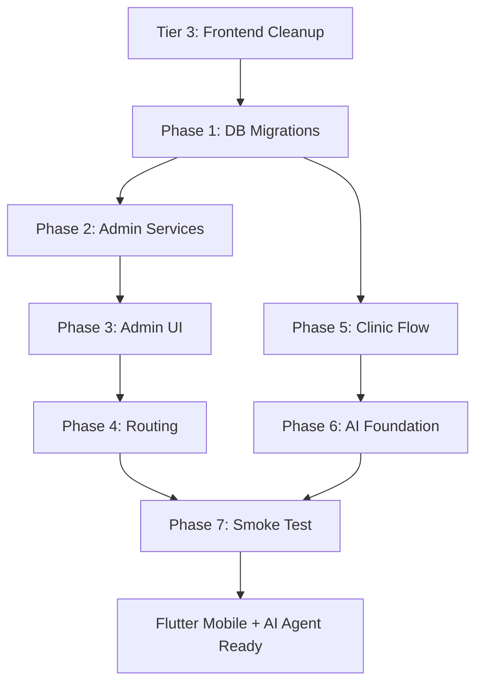

# TIER 4 — Admin Panel, Clinic Flow & AI Pre-Doctor Foundation

> **Goal**: Build the admin control plane, harden the clinical workflow pipeline, and lay the DB/API groundwork for AI-assisted pre-doctor triage.  
> **Depends on**: Tiers 0–3 must be complete.  
> **Time**: ~8–10 hours across 3 workstreams.

---

## TABLE OF CONTENTS

1. [Current Admin Gaps](#1-current-admin-gaps)
2. [Admin Panel — Pages & Features](#2-admin-panel--pages--features)
3. [Clinic Flow Hardening](#3-clinic-flow-hardening)
4. [AI Pre-Doctor Foundation](#4-ai-pre-doctor-foundation)
5. [Database Changes Required](#5-database-changes-required)
6. [Execution Checklist](#6-execution-checklist)

---

## 1. CURRENT ADMIN GAPS

### What Exists

| Capability | Status | Where |
|---|---|---|
| `admin` role in `ROLE_HOME_ROUTES` | ✅ Defined | `lib/routes.js` → maps to `/dashboard` |
| `admin` in RLS policies | ✅ 18 policies include admin | All core tables |
| Admin-specific pages | ❌ **Zero** | No admin routes in `App.jsx` |
| Admin sidebar | ❌ **Missing** | Only Secretary, Doctor, PreDoctor sidebars exist |
| User management UI | ❌ **Missing** | No way to create/edit/deactivate staff accounts |
| Audit log viewer | ❌ **Missing** | `audit_log` table exists but no UI reads it |
| Clinic settings UI | ⚠️ Partial | `clinicService.getClinicSettings()` exists, no dedicated admin page |
| Role assignment | ❌ **Missing** | No UI to change user roles |
| Billable services management | ❌ **Missing** | Table + RLS exist, no admin UI |

### What the DB Already Supports (Ready for Admin)

| Table | RLS | Admin Capability |
|---|---|---|
| `audit_log` | Staff SELECT | Admin can view all system audit events |
| `clinic_settings` | Staff CRUD | Admin can manage clinic config |
| `billable_services` | Secretary/Admin ALL | Admin can manage service catalog |
| `users` | Staff SELECT, Admin UPDATE | Admin can view/edit all users |
| `doctors` | Staff INSERT/UPDATE | Admin can onboard new doctors |
| `predoctors` | Staff INSERT/UPDATE | Admin can onboard pre-doctors |
| `certificates` | Admin DELETE | Only admin can delete certificates |
| `consultations` | Admin DELETE | Only admin can delete consultations |
| `medical_reports` | Admin DELETE | Only admin can delete reports |
| `payments` | Admin DELETE | Only admin can delete payments |
| `referrals` | Admin DELETE | Only admin can delete referrals |

---

## 2. ADMIN PANEL — PAGES & FEATURES

### 2.1 New Pages Required

| # | Page | Route | Purpose |
|---|---|---|---|
| A1 | `AdminDashboardPage` | `/admin` | System overview: user counts, appointment volume, revenue summary, audit trail |
| A2 | `AdminUsersPage` | `/admin/users` | Full CRUD for users + role assignment + activate/deactivate |
| A3 | `AdminDoctorsPage` | `/admin/doctors` | Onboard doctors, edit specialization, set consultation fees |
| A4 | `AdminClinicSettingsPage` | `/admin/settings` | Clinic name, address, phone, logo, working hours, timezone |
| A5 | `AdminBillableServicesPage` | `/admin/services` | Manage billable service catalog (name, price, category, active flag) |
| A6 | `AdminAuditLogPage` | `/admin/audit` | Searchable, filterable audit trail viewer |
| A7 | `AdminReportsPage` | `/admin/reports` | Financial summaries, appointment analytics, patient growth charts |

### 2.2 `AdminSidebar` Component

```
Admin Panel
├── Dashboard          (admin)
├── Staff Management
│   ├── Users          (admin/users)
│   └── Doctors        (admin/doctors)
├── Clinic
│   ├── Settings       (admin/settings)
│   └── Services       (admin/services)
├── Reports            (admin/reports)
├── Audit Log          (admin/audit)
└── Sign Out
```

### 2.3 Admin Dashboard — KPIs

| KPI | Data Source | Query |
|---|---|---|
| Total Active Users | `users` WHERE `is_active = true` | `COUNT(*)` grouped by role |
| Today's Appointments | `appointments` WHERE `scheduled_at` = today | Count by status |
| Revenue (Today/Week/Month) | `payments` WHERE `status = 'completed'` | `SUM(amount)` with date filters |
| Average Consultation Duration | `consultations` | `AVG(session_end - session_start)` |
| Patient Growth | `patients` | Count by `created_at` month |
| Pending Referrals | `referrals` WHERE `status = 'pending'` | `COUNT(*)` |

**Implementation**: Create a Postgres VIEW `admin_dashboard_summary` for efficient single-query fetch:

```sql
CREATE VIEW admin_dashboard_summary AS
SELECT
  (SELECT count(*) FROM users WHERE is_active = true) AS active_users,
  (SELECT count(*) FROM users WHERE is_active = true AND role = 'doctor') AS active_doctors,
  (SELECT count(*) FROM users WHERE is_active = true AND role = 'patient') AS active_patients,
  (SELECT count(*) FROM appointments WHERE scheduled_at::date = CURRENT_DATE) AS today_appointments,
  (SELECT count(*) FROM appointments WHERE status = 'completed' AND scheduled_at::date = CURRENT_DATE) AS completed_today,
  (SELECT coalesce(sum(amount), 0) FROM payments WHERE status = 'completed' AND created_at::date = CURRENT_DATE) AS revenue_today,
  (SELECT coalesce(sum(amount), 0) FROM payments WHERE status = 'completed' AND created_at >= date_trunc('month', CURRENT_DATE)) AS revenue_month,
  (SELECT count(*) FROM referrals WHERE status = 'pending') AS pending_referrals;
```

### 2.4 User Management Features

| Feature | Implementation |
|---|---|
| **List all users** | `SELECT * FROM users ORDER BY created_at` with role filter + search |
| **Change role** | `UPDATE users SET role = $1 WHERE id = $2` (admin only) |
| **Deactivate user** | `UPDATE users SET is_active = false WHERE id = $1` |
| **Reactivate user** | `UPDATE users SET is_active = true WHERE id = $1` |
| **Create staff account** | Supabase Auth `admin.createUser()` + insert into `users` + role table |
| **Reset password** | Supabase Auth `admin.generateLink()` for password reset |
| **View login history** | Query Supabase Auth audit log (if available) or `audit_log` |

**Critical RLS Gap**: Currently, `users` table has no admin-specific INSERT policy. The existing `users_patient_signup_insert` only allows `role = 'patient'`. Admin needs a new policy:

```sql
CREATE POLICY users_admin_insert ON users FOR INSERT
  WITH CHECK (has_role(ARRAY['admin']));
```

### 2.5 Audit Log Viewer

The `audit_log` table schema:

| Column | Type | Purpose |
|---|---|---|
| `id` | uuid | Primary key |
| `user_id` | uuid | Who performed the action |
| `action` | text | What happened (e.g., `appointment.created`) |
| `entity_type` | text | Table name |
| `entity_id` | uuid | Record ID |
| `metadata` | jsonb | Additional context |
| `created_at` | timestamptz | When |

**UI Features**: Date range filter, action type filter, user filter, entity search, CSV export.

**Gap**: The `write_audit_log` function exists but is not called from most service operations. Need to add audit triggers or service-layer calls.

---

## 3. CLINIC FLOW HARDENING

### 3.1 The Complete Patient Journey (Current vs Target)

```
CURRENT (broken at steps marked ❌):

Patient arrives → Secretary books appointment (✅ atomic via book_slot RPC)
  → Appointment status: scheduled
  → PreDoctor marks "pre_check" (⚠️ no validation that status was "confirmed")
  → PreDoctor fills precheck form (✅ Zod validated)
  → Doctor starts consultation (❌ no check that precheck exists)
  → Doctor saves diagnosis + meds (❌ medications overwrite bug)
  → Doctor completes consultation (❌ no state validation)
  → Appointment → completed (❌ no automatic status sync)
  → Payment created (❌ no link to consultation)
  → Certificate/Referral issued (❌ broken schema)

TARGET (after Tier 4):

Patient arrives → Secretary books (✅ atomic)
  → status: scheduled → confirmed (secretary confirms)
  → PreDoctor starts precheck → status: pre_check (✅ validated transition)
  → PreDoctor submits precheck (✅ Zod + required vitals)
  → Doctor sees patient in queue with precheck data (✅ joined query)
  → Doctor starts consultation → status: in_consultation (✅ validated, precheck required)
  → Consultation created with appointment link (✅ FK enforced)
  → Doctor saves incrementally (✅ meds append, not overwrite)
  → Doctor completes → consultation: completed, appointment: completed (✅ atomic)
  → Payment auto-linked to consultation (✅ FK to consultation_id)
  → Certificate/Referral linked to consultation (✅ FK optional)
```

### 3.2 Missing Workflow Automations

| # | Automation | Implementation |
|---|---|---|
| W1 | When consultation completes → auto-set appointment to `completed` | DB trigger on `consultations` UPDATE |
| W2 | When precheck submitted → auto-set appointment to `pre_check` | DB trigger on `precheck_forms` INSERT WHERE status='submitted' |
| W3 | When appointment cancelled → cancel linked consultation | DB trigger or service-layer cascade |
| W4 | When referral accepted → create notification for patient | Service-layer notification in `referralService.accept()` |
| W5 | When payment completed → create notification for patient | Service-layer in `paymentService.create()` |

### 3.3 Trigger: Auto-Complete Appointment on Consultation Completion

```sql
CREATE OR REPLACE FUNCTION sync_appointment_on_consultation_complete()
RETURNS trigger AS $$
BEGIN
  IF NEW.status = 'completed' AND OLD.status != 'completed' THEN
    UPDATE appointments SET status = 'completed'
    WHERE id = NEW.appointment_id AND status != 'completed';
  END IF;
  RETURN NEW;
END;
$$ LANGUAGE plpgsql SECURITY DEFINER;

CREATE TRIGGER trg_consultation_complete
  AFTER UPDATE ON consultations
  FOR EACH ROW
  WHEN (NEW.status = 'completed')
  EXECUTE FUNCTION sync_appointment_on_consultation_complete();
```

### 3.4 Consultation-Payment Link

Currently, `payments` has `appointment_id` but no `consultation_id`. This means you can't directly link a payment to the clinical work performed.

**Fix**: Add `consultation_id` FK to `payments` (nullable — not all payments require a consultation).

### 3.5 Queue Management Improvements

The PreDoctor dashboard shows today's appointments as a queue. Missing features:

| Feature | Current | Needed |
|---|---|---|
| Queue position | ❌ Not tracked | Add `queue_position` or order by `scheduled_at` |
| Wait time estimate | ❌ Not shown | Calculate from avg consultation duration |
| Priority escalation | ❌ Only `is_urgent` on precheck | Surface urgent flag in doctor queue |
| Patient status badge | ⚠️ Basic | Show: Waiting → In Precheck → Ready → With Doctor → Done |

---

## 4. AI PRE-DOCTOR FOUNDATION

### 4.1 Vision

An AI agent that assists the pre-doctor by:
1. **Auto-triaging** patients based on symptoms + vitals
2. **Suggesting** preliminary diagnoses for doctor review
3. **Flagging** critical vital signs automatically
4. **Pre-filling** precheck forms from patient history

### 4.2 Database Schema for AI

#### New Table: `ai_triage_results`

```sql
CREATE TABLE ai_triage_results (
  id uuid PRIMARY KEY DEFAULT gen_random_uuid(),
  precheck_id uuid REFERENCES precheck_forms(id) ON DELETE CASCADE,
  patient_id uuid NOT NULL REFERENCES patients(id),
  appointment_id uuid REFERENCES appointments(id),

  -- AI outputs
  urgency_score integer CHECK (urgency_score BETWEEN 1 AND 10),
  urgency_label text CHECK (urgency_label IN ('routine', 'elevated', 'urgent', 'critical')),
  suggested_diagnoses jsonb DEFAULT '[]',
  risk_flags jsonb DEFAULT '[]',
  recommended_tests jsonb DEFAULT '[]',
  ai_notes text,

  -- Metadata
  model_version text NOT NULL,
  confidence_score numeric(4,3) CHECK (confidence_score BETWEEN 0 AND 1),
  processing_time_ms integer,
  reviewed_by uuid REFERENCES users(id),
  reviewed_at timestamptz,
  is_accepted boolean,

  created_at timestamptz NOT NULL DEFAULT now(),
  updated_at timestamptz NOT NULL DEFAULT now()
);

CREATE INDEX idx_ai_triage_patient ON ai_triage_results(patient_id);
CREATE INDEX idx_ai_triage_precheck ON ai_triage_results(precheck_id);
```

#### New Table: `ai_prompt_templates`

```sql
CREATE TABLE ai_prompt_templates (
  id uuid PRIMARY KEY DEFAULT gen_random_uuid(),
  name text NOT NULL UNIQUE,
  category text NOT NULL CHECK (category IN ('triage', 'diagnosis', 'summary', 'report')),
  template text NOT NULL,
  variables jsonb DEFAULT '[]',
  is_active boolean DEFAULT true,
  version integer DEFAULT 1,
  created_at timestamptz NOT NULL DEFAULT now()
);
```

### 4.3 AI Edge Function: `ai-triage`

```
POST /ai-triage
Authorization: Bearer <jwt>
Body: { precheck_id: uuid }

Flow:
1. Fetch precheck_forms record (vitals, symptoms, allergies)
2. Fetch patient history (past consultations, medications, conditions)
3. Build prompt from ai_prompt_templates
4. Call LLM API (OpenAI/Claude/Gemini)
5. Parse structured response (urgency, suggestions, flags)
6. Insert into ai_triage_results
7. If urgency_score >= 8 → auto-set precheck.is_urgent = true
8. Return result to pre-doctor UI
```

### 4.4 Pre-Doctor UI Integration

| UI Element | Where | What It Shows |
|---|---|---|
| **Triage Badge** | PreDoctor queue list | Color-coded urgency (green/yellow/orange/red) |
| **AI Suggestions Panel** | PreDoctor check page | Collapsible panel with AI-generated notes |
| **Risk Flag Alerts** | Doctor consultation page | "⚠️ AI flagged: elevated blood pressure + family history of stroke" |
| **Accept/Reject Buttons** | Doctor view | Doctor marks AI triage as accepted/rejected for training feedback |

### 4.5 Critical Vitals Auto-Detection (No AI Required)

Before full AI integration, implement rule-based flagging:

```js
// src/lib/vitalRules.js
export const VITAL_THRESHOLDS = {
  heart_rate:   { low: 50, high: 120, critical_low: 40, critical_high: 150 },
  temperature:  { low: 35, high: 38.5, critical_low: 34, critical_high: 40 },
  systolic_bp:  { low: 90, high: 140, critical_low: 80, critical_high: 180 },
  diastolic_bp: { low: 60, high: 90, critical_low: 50, critical_high: 120 },
};

export function analyzeVitals(vitals) {
  const flags = [];
  // Parse blood pressure "120/80" → systolic=120, diastolic=80
  // Check each vital against thresholds
  // Return { flags: [...], urgencyScore: 1-10 }
}
```

This gives immediate value without any LLM dependency.

---

## 5. DATABASE CHANGES REQUIRED

### Migration 1: Admin Infrastructure

```sql
-- Admin dashboard summary view
CREATE OR REPLACE VIEW admin_dashboard_summary AS ...;

-- Admin user creation policy
CREATE POLICY users_admin_insert ON users FOR INSERT
  WITH CHECK (has_role(ARRAY['admin']));

-- Admin can update any user's role
CREATE POLICY users_admin_update_role ON users FOR UPDATE
  USING (has_role(ARRAY['admin']))
  WITH CHECK (has_role(ARRAY['admin']));
```

### Migration 2: Workflow Automation

```sql
-- consultation_id FK on payments
ALTER TABLE payments ADD COLUMN consultation_id uuid REFERENCES consultations(id);

-- Auto-complete appointment trigger
CREATE OR REPLACE FUNCTION sync_appointment_on_consultation_complete() ...;
CREATE TRIGGER trg_consultation_complete ...;

-- Auto-set precheck status trigger
CREATE OR REPLACE FUNCTION sync_appointment_on_precheck_submit() ...;
CREATE TRIGGER trg_precheck_submitted ...;
```

### Migration 3: AI Foundation

```sql
CREATE TABLE ai_triage_results (...);
CREATE TABLE ai_prompt_templates (...);

-- RLS
ALTER TABLE ai_triage_results ENABLE ROW LEVEL SECURITY;
CREATE POLICY ai_triage_staff_select ON ai_triage_results FOR SELECT USING (is_staff());
CREATE POLICY ai_triage_staff_insert ON ai_triage_results FOR INSERT WITH CHECK (is_staff());
CREATE POLICY ai_triage_staff_update ON ai_triage_results FOR UPDATE USING (has_role(ARRAY['doctor', 'admin']));

ALTER TABLE ai_prompt_templates ENABLE ROW LEVEL SECURITY;
CREATE POLICY ai_prompts_admin ON ai_prompt_templates FOR ALL USING (has_role(ARRAY['admin']));
CREATE POLICY ai_prompts_staff_select ON ai_prompt_templates FOR SELECT USING (is_staff());
```

### Migration 4: Audit Trail Expansion

```sql
-- Trigger to auto-audit all critical table changes
CREATE OR REPLACE FUNCTION auto_audit_trigger()
RETURNS trigger AS $$
BEGIN
  INSERT INTO audit_log (user_id, action, entity_type, entity_id, metadata)
  VALUES (
    current_domain_user_id(),
    TG_OP,
    TG_TABLE_NAME,
    COALESCE(NEW.id, OLD.id),
    jsonb_build_object('old', to_jsonb(OLD), 'new', to_jsonb(NEW))
  );
  RETURN COALESCE(NEW, OLD);
END;
$$ LANGUAGE plpgsql SECURITY DEFINER;

-- Attach to critical tables
CREATE TRIGGER audit_users AFTER INSERT OR UPDATE OR DELETE ON users
  FOR EACH ROW EXECUTE FUNCTION auto_audit_trigger();
CREATE TRIGGER audit_appointments AFTER INSERT OR UPDATE ON appointments
  FOR EACH ROW EXECUTE FUNCTION auto_audit_trigger();
CREATE TRIGGER audit_consultations AFTER INSERT OR UPDATE ON consultations
  FOR EACH ROW EXECUTE FUNCTION auto_audit_trigger();
CREATE TRIGGER audit_payments AFTER INSERT OR UPDATE ON payments
  FOR EACH ROW EXECUTE FUNCTION auto_audit_trigger();
```

---

## 6. EXECUTION CHECKLIST

### Phase 1: Database (migrations)
```
- [ ] Migration: admin_dashboard_summary view
- [ ] Migration: admin user INSERT/UPDATE policies
- [ ] Migration: payments.consultation_id FK
- [ ] Migration: consultation→appointment auto-complete trigger
- [ ] Migration: precheck→appointment auto-status trigger
- [ ] Migration: ai_triage_results + ai_prompt_templates tables
- [ ] Migration: auto_audit_trigger on critical tables
```

### Phase 2: Admin Services (new)
```
- [ ] Create src/services/admin.js (getUsers, updateRole, deactivate, getDashboard, getAuditLog)
- [ ] Create src/services/billableServices.js (CRUD for service catalog)
- [ ] Add admin methods to existing clinicService (getClinicSettings, updateClinicSettings)
```

### Phase 3: Admin UI (new pages)
```
- [ ] Create AdminSidebar component
- [ ] Create AdminDashboardPage (KPIs + charts)
- [ ] Create AdminUsersPage (list + role change + activate/deactivate)
- [ ] Create AdminDoctorsPage (onboard + edit)
- [ ] Create AdminClinicSettingsPage (clinic config)
- [ ] Create AdminBillableServicesPage (service catalog CRUD)
- [ ] Create AdminAuditLogPage (searchable log viewer)
- [ ] Create AdminReportsPage (financial + analytics charts)
```

### Phase 4: Admin Routing
```
- [ ] Add AdminSidebar to DashboardLayout
- [ ] Add 7 admin routes to App.jsx with ProtectedRoute requiredRole="admin"
- [ ] Update ROLE_HOME_ROUTES: admin → '/admin'
```

### Phase 5: Clinic Flow Automations
```
- [ ] Verify consultation→appointment trigger works end-to-end
- [ ] Verify precheck→appointment trigger works
- [ ] Add consultation_id to payment creation flow
- [ ] Add notifications on referral accept + payment complete
- [ ] Surface is_urgent flag in doctor queue view
```

### Phase 6: AI Foundation (no LLM yet)
```
- [ ] Create src/lib/vitalRules.js (rule-based vital analysis)
- [ ] Integrate vital analysis into PreDoctorCheckPage (auto-flag critical)
- [ ] Create src/services/aiTriage.js (CRUD for ai_triage_results)
- [ ] Add triage badge to PreDoctor queue UI
- [ ] Create ai-triage edge function (stub — returns rule-based results for now)
```

### Phase 7: Smoke Test
```
- [ ] Create admin user in Supabase Auth → verify dashboard loads
- [ ] Change user role from admin panel → verify role change persists
- [ ] Deactivate user → verify they can't log in
- [ ] Complete consultation → verify appointment auto-completes
- [ ] Submit precheck with critical vitals → verify urgent flag fires
- [ ] View audit log → verify entries from all operations
- [ ] Create billable service → verify it appears in billing flow
```

---

## DEPENDENCY GRAPH



---

## IMPACT SUMMARY

| Before Tier 4 | After Tier 4 |
|---|---|
| Admin role exists in DB but has no UI | Full admin panel with 7 pages |
| No way to manage staff accounts | Create/edit/deactivate users with role assignment |
| Audit log table exists, never queried | Searchable audit trail with auto-logging triggers |
| Consultation completion doesn't update appointment | DB trigger auto-syncs status |
| Payments not linked to consultations | `consultation_id` FK on payments |
| No billable services management UI | Full CRUD admin page |
| No vital sign analysis | Rule-based auto-flagging (critical/urgent) |
| No AI infrastructure | Tables + edge function stub ready for LLM integration |
| No clinic analytics | Admin dashboard with revenue, growth, utilization KPIs |
