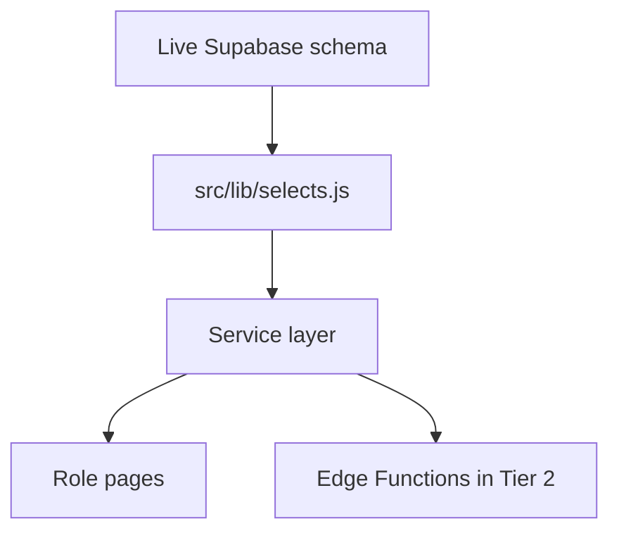

# TIER 0 v2 - Executed Foundation: Code and DB Alignment

> **Status**: Archived historical plan. The current execution roadmap is `NEXT_STEPS_PLAN.md`.

> **Status**: Executed and accepted as the Secure Web V1 foundation.
> **Date updated**: 2026-05-05.
> **Source of truth**: Live Supabase schema for project `gezmfmskhmjgnquoyosq`.
> **Decision**: Match code to the live schema. Do not inflate the DB to satisfy stale frontend fields.

---

## 1. Executive Summary

Tier 0 v2 replaced the first schema-expansion idea with a safer foundation: the database contract remains canonical, and the app stops asking PostgREST for columns that do not exist.

This was not only a code cleanup. It was a product and data-model correction. Several old UI fields represented unapproved product concepts, not missing database columns. The fix was to remove ghost fields from selectors and services, then defer new product concepts to later milestones.

---

## 2. Decisions Made

| Decision | Outcome |
|---|---|
| Live DB wins over stale frontend assumptions | Select constants and services were aligned to hosted schema. |
| No schema expansion for ghost UI fields | The first Tier 0 migration is superseded by a revert migration. |
| Explicit selectors only | Shared field constants now define safe DB-to-UI contracts. |
| No sensitive wildcard joins | Joined user fields are explicit and do not expose password/auth internals. |
| Patient-facing certificates deferred | Current `certificates` schema is doctor/credential-oriented, not patient medical certificates. |
| External referrals deferred | `referrals.to_doctor_id` remains required for internal doctor referrals in V1. |

---

## 3. Cross-Discipline Review Incorporated

| Viewpoint | Finding | Tier 0 v2 response |
|---|---|---|
| DBA | Adding columns just because code queries them creates schema drift. | Reverted schema-expansion columns and aligned code to live schema. |
| Security | Wildcard joins can leak fields later, especially identity/auth data. | Added explicit shared select constants and safe joined user field lists. |
| Data engineer | Ghost columns cause 400s and make downstream services unreliable. | Removed ghost fields from all service selectors. |
| System design | Certificates and referrals were mixing product concepts. | Deferred new concepts instead of merging unrelated workflows into current tables. |
| Business analyst | V1 is one clinic with current roles, not a full SaaS/marketplace model. | Kept internal clinic workflow as the immediate domain model. |

---

## 4. Executed Changes

### 4.1 Legacy Expansion Was Superseded

Historical migration:

- `supabase/migrations/20260505_tier0_schema_alignment.sql`

Corrective migration:

- `supabase/migrations/20260505_tier0_v2_revert_schema_expansion.sql`

The corrective migration removes accidental expansion columns such as:

- `consultations.symptoms`
- `consultations.follow_up_date`
- `certificates.patient_id`
- `certificates.content`
- `certificates.diagnosis`
- `certificates.treatment`
- `certificates.recommendations`
- `certificates.start_date`
- `certificates.end_date`
- `certificates.status`
- `referrals.notes`
- `referrals.priority`
- `referrals.clinical_findings`
- `referrals.treatment_plan`
- `referrals.ref_number`
- `referrals.to_doctor_name`
- `medical_reports.findings`

### 4.2 Select Constants Are Canonical

Updated file:

- `src/lib/selects.js`

Current constants cover the live DB contract:

- `USER_PUBLIC_FIELDS`
- `USER_CONTACT_FIELDS`
- `DOCTOR_SELECT_FIELDS`
- `PATIENT_SELECT_FIELDS`
- `APPOINTMENT_BASE_FIELDS`
- `APPOINTMENT_SELECT_FIELDS`
- `CONSULTATION_SELECT_FIELDS`
- `CONSULTATION_WITH_RELATIONS`
- `REPORT_SELECT_FIELDS`
- `CERTIFICATE_SELECT_FIELDS`
- `REFERRAL_SELECT_FIELDS`
- `NOTIFICATION_SELECT_FIELDS`
- `PRECHECK_SELECT_FIELDS`
- `PAYMENT_SELECT_FIELDS`
- `BILLABLE_SERVICE_FIELDS`
- `CLINIC_SELECT_FIELDS`
- `CLINIC_SETTINGS_SELECT_FIELDS`
- `DOCTOR_DASHBOARD_SUMMARY_FIELDS`
- `SECRETARY_SLOT_SELECT_FIELDS`

### 4.3 Ghost Fields Removed From Runtime Selectors

| Area | Removed from runtime DB selectors |
|---|---|
| Consultations | `symptoms`, `follow_up_date` |
| Medical reports | `findings` |
| Certificates | `patient_id`, `content`, `diagnosis`, `treatment`, `recommendations`, `start_date`, `end_date`, `status` |
| Referrals | `notes`, `priority`, `clinical_findings`, `treatment_plan`, `ref_number`, `to_doctor_name` |

### 4.4 Safe Relation Joins

Selectors now use explicit relationship paths where needed, for example:

- `users!patients_user_id_fkey(...)`
- `users!doctors_user_id_fkey(...)`

This avoids ambiguous joins and keeps DB-to-UI payloads predictable.

---

## 5. Acceptance Criteria Status

| Criterion | Status |
|---|---|
| No service selector references known ghost columns | Done |
| Runtime selectors avoid `password_hash` and sensitive wildcard identity fields | Done |
| First schema-expansion approach is documented as superseded | Done |
| Revert migration exists for accidental expansion columns | Done |
| Downstream service hardening can build on stable selectors | Done |

---

## 6. Deferred Product Decisions

These are intentionally not Tier 0 fixes:

| Product question | Why deferred |
|---|---|
| Patient-facing medical certificates | Needs schema, permissions, print/export, and patient visibility design. |
| External referrals by doctor name | Needs internal vs external referral model and audit rules. |
| Report findings as structured data | Current live table has `content` and `file_url`; structured findings should be designed deliberately. |
| Consultation symptoms/follow-up fields | Symptoms currently belong to precheck data; follow-up needs workflow design. |

---

## 7. Handoff To Tier 1

Tier 0 v2 makes the database contract clean enough for service hardening:

Tier 1 then adds validation, transitions, canonical booking, identity hardening, and database operator guardrails.
