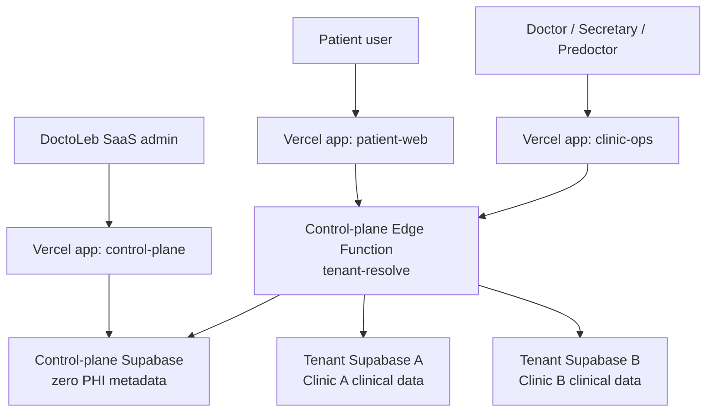
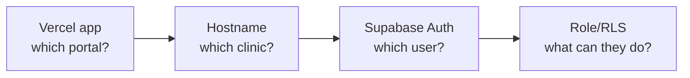
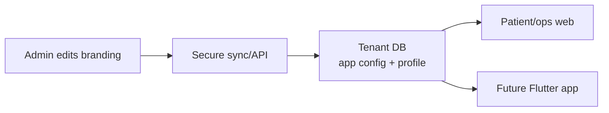

# 00 - Visual System Overview

## Big Idea
DoctoLeb uses shared apps on Vercel and separate Supabase tenant databases for clinics.



## Three Decisions
| Question | Answer |
|---|---|
| One Vercel project per doctor? | No. One shared Vercel app per surface. |
| One database for all clinics? | No. Each clinic gets its own tenant Supabase project. |
| How does the app know the clinic? | The hostname or future path is resolved by the control plane. |

## Routing Example
```txt
User opens URL
  ↓
Shared Vercel app loads
  ↓
TenantBootstrap reads hostname
  ↓
tenant-resolve(host, surface)
  ↓
Control plane returns tenant Supabase URL + anon key
  ↓
App loads branding, auth, features, and clinic data from that tenant
```

## Example Domain Map
| URL | Vercel App | Surface | Tenant |
|---|---|---|---|
| `doctoleb-patient-web.vercel.app` | patient-web | patient | dev tenant |
| `doctoleb-clinic-ops.vercel.app` | clinic-ops | ops | dev tenant |
| `dr-hassan.doctoleb.com` | patient-web | patient | dr-hassan |
| `dr-hassan.ops.doctoleb.com` | clinic-ops | ops | dr-hassan |
| `hassanclinic.com` | patient-web | patient | dr-hassan |
| `ops.hassanclinic.com` | clinic-ops | ops | dr-hassan |

## Identity Layers


| Layer | Decides |
|---|---|
| Vercel app | Patient portal, staff portal, or SaaS console. |
| Hostname | Which clinic tenant should load. |
| Supabase Auth | Which user is logged in. |
| Tenant RLS/RPCs | What data and actions the user can access. |

## Runtime Branding


Branding is data, not code. Changing clinic name, logo, colors, tagline, or support contact should not require a new deployment.
