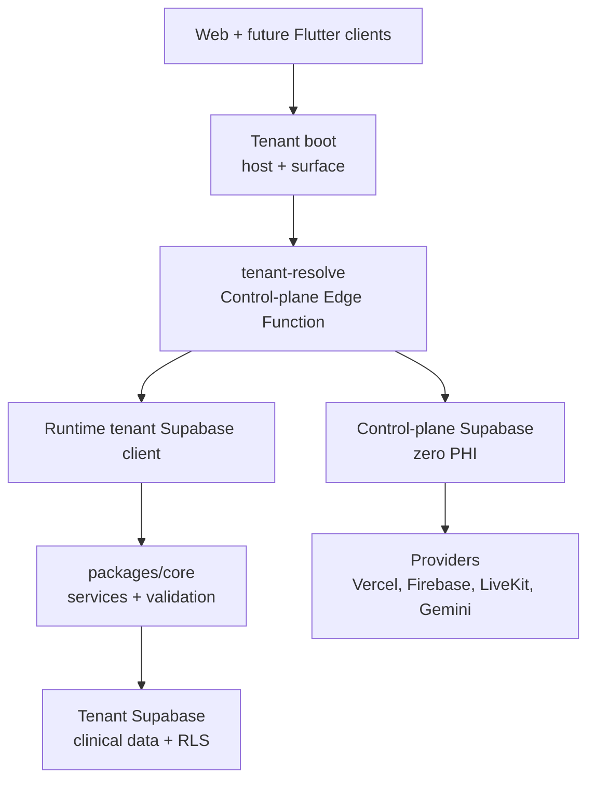

# 01 - System Design And Stack

## System Purpose
DoctoLeb is a SaaS clinic platform. A clinic gets a branded patient portal, staff operations portal, and later a Flutter mobile app. Clinical data stays inside the clinic tenant project.

## Main Surfaces
| Surface | Status | Users | Purpose |
|---|---|---|---|
| Patient web | Current | Patients | Clinic landing, login, booking, records, messages. |
| Clinic operations web | Current | Doctor, secretary, predoctor | Scheduling, patients, encounters, billing, staff work. |
| SaaS control plane | Current | DoctoLeb admins | Tenants, domains, branding, plans, features, provisioning. |
| Marketing site | Planned | Doctors/clinic owners | Explain the product, pricing, demo booking, subscription entry. |
| Flutter mobile app | Planned | Patients first | Mobile access to the same tenant backend. |
| AI agent layer | Planned | Staff/admin | LangGraph workflows with Gemini behind server APIs. |
| Video visits | Planned | Doctor and patient | LiveKit rooms with server-generated tokens. |

## Layer Diagram

## Technology Stack
| Area | Technology | Status |
|---|---|---|
| Frontend | React, Vite, Tailwind CSS | Current |
| Shared logic | `packages/core` | Current |
| Shared UI | `packages/ui` | Current |
| Database/auth/storage | Supabase Postgres, Auth, RLS, Storage | Current |
| Server APIs | Supabase Edge Functions | Current |
| Hosting | Vercel | Current |
| CI/CD | GitHub Actions | Current |
| Realtime chat | Supabase Realtime over Postgres changes | Current foundation |
| Mobile | Flutter + Supabase Dart client | Planned |
| Push notifications | Firebase Cloud Messaging | Planned |
| Video calls | LiveKit | Planned |
| AI | LangGraph + Gemini API | Planned |

## Tooling
| Tool | Use |
|---|---|
| GitHub | Source control and CI/CD history. |
| Vercel CLI/API | App deployment and aliases. |
| Supabase CLI | Migrations, functions, local/disposable DB checks. |
| Playwright | Browser verification. |
| MCP/agent tooling | Code navigation, provider inspection, browser checks, design review. |

## Component Ownership
| Component | Responsibility |
|---|---|
| `apps/patient-web` | Patient-facing web app. |
| `apps/clinic-ops` | Doctor/staff operations app. |
| `apps/control-plane` | SaaS admin console. |
| `packages/core/services` | Business/API service contracts. |
| `packages/ui/contexts/TenantBootstrap.jsx` | Runtime tenant resolution. |
| `packages/ui/contexts/BrandContext.jsx` | Runtime branding. |
| `supabase/migrations` | Tenant clinical DB schema and RLS. |
| `supabase-control-plane/migrations` | SaaS metadata schema. |
| `supabase-control-plane/functions` | Resolver and privileged admin APIs. |

## Design Rules
| Rule | Reason |
|---|---|
| Control plane is zero-PHI. | SaaS admin must not see clinical data. |
| Tenant data is database-per-clinic. | Strong isolation between clinics. |
| Browser gets anon keys only. | Service-role and provider secrets stay server-side. |
| Branding/features are runtime data. | No deploy needed per doctor. |
| UI hiding is not security. | RLS/RPC/Edge Functions enforce permissions. |
| Mutations are reversible. | Create, disable, archive, cancel, or compensate instead of unsafe deletion. |
