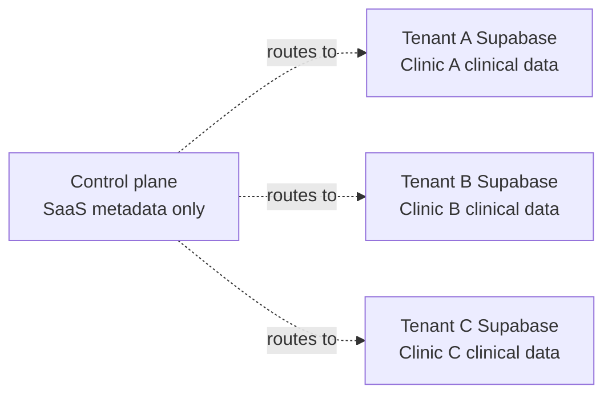
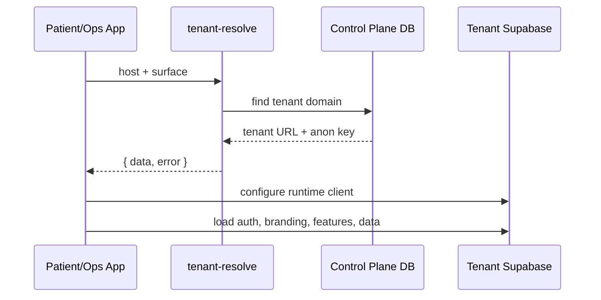
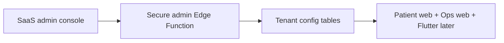
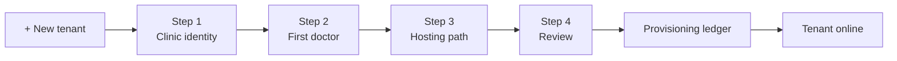

# 02 - SaaS Tenancy And Data Design

## Tenancy Model
DoctoLeb separates SaaS metadata from clinical data.

| Plane | Stores | Does Not Store |
|---|---|---|
| Control plane | Tenants, domains, plans, features, provisioning, audit events. | PHI, diagnoses, messages, documents, appointments. |
| Tenant project | Patients, staff, appointments, encounters, messages, files, tenant config. | Other tenants' data, SaaS provider tokens. |

## Routing Data
The control plane maps hostnames to tenants.

| Column | Example | Meaning |
|---|---|---|
| `hostname` | `dr-hassan.doctoleb.com` | Incoming URL host. |
| `surface` | `patient` | Patient portal or staff portal. |
| `tenant_id` | `dr-hassan` tenant UUID | Which clinic to load. |
| `status` | `active` | Whether routing is allowed. |
| `dns_status` / `ssl_status` | `verified` / `issued` | Domain readiness. |

## Tenant Boot

## Example Resolution
| Input Host | Surface | Result |
|---|---|---|
| `doctoleb-patient-web.vercel.app` | `patient` | Load dev tenant patient app. |
| `doctoleb-clinic-ops.vercel.app` | `ops` | Load dev tenant staff app. |
| `dr-hassan.doctoleb.com` | `patient` | Load Dr. Hassan patient portal. |
| `dr-hassan.doctoleb.com` | `ops` | Return `SURFACE_MISMATCH`. |
| Unknown host | `patient` | Return `TENANT_NOT_FOUND`. |
| Maintenance tenant | `patient` | Return `TENANT_INACTIVE`. |

## Control-Plane Tables
| Table | Purpose |
|---|---|
| `tenants` | Clinic tenant identity, status, plan, Supabase public runtime config. |
| `tenant_domains` | Hostname to tenant/surface mapping. |
| `plans` | Subscription plan definitions. |
| `plan_entitlements` | Default features per plan. |
| `tenant_entitlements` | Manual feature overrides/add-ons. |
| `tenant_provisioning_jobs` | Step-by-step tenant creation ledger. |
| `super_admins` | SaaS admin RBAC. |
| `tenant_events` | Zero-PHI audit trail. |

## Tenant Project Data
| Area | Examples |
|---|---|
| Identity | Auth users, doctors, staff, patient accounts. |
| Clinical | Patient profiles, medical history, encounters, documents. |
| Operations | Slots, bookings, billing, claims-ready data. |
| Communication | Conversations, messages, attachments, read receipts. |
| Runtime config | `tenant_profile`, `tenant_app_config`, `feature_flags`. |

## Branding And Feature Control

| Setting | Runtime Effect |
|---|---|
| Clinic/doctor name | Titles, headers, landing copy. |
| Logo/favicon | App logo and browser icon. |
| Primary/secondary colors | CSS variables and Flutter theme later. |
| Feature flags | Hide/show UI and block backend actions. |
| Maintenance/min version | App access and upgrade messaging. |

## New Tenant Creation

Creation is separate from editing an existing tenant. The selected tenant cannot be changed by accident during the creation wizard.
