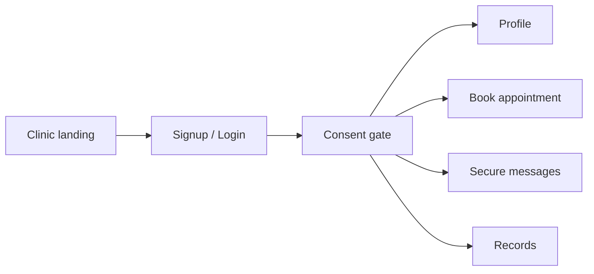
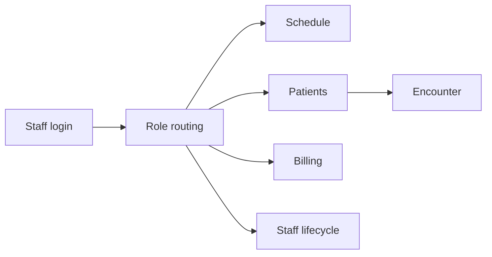
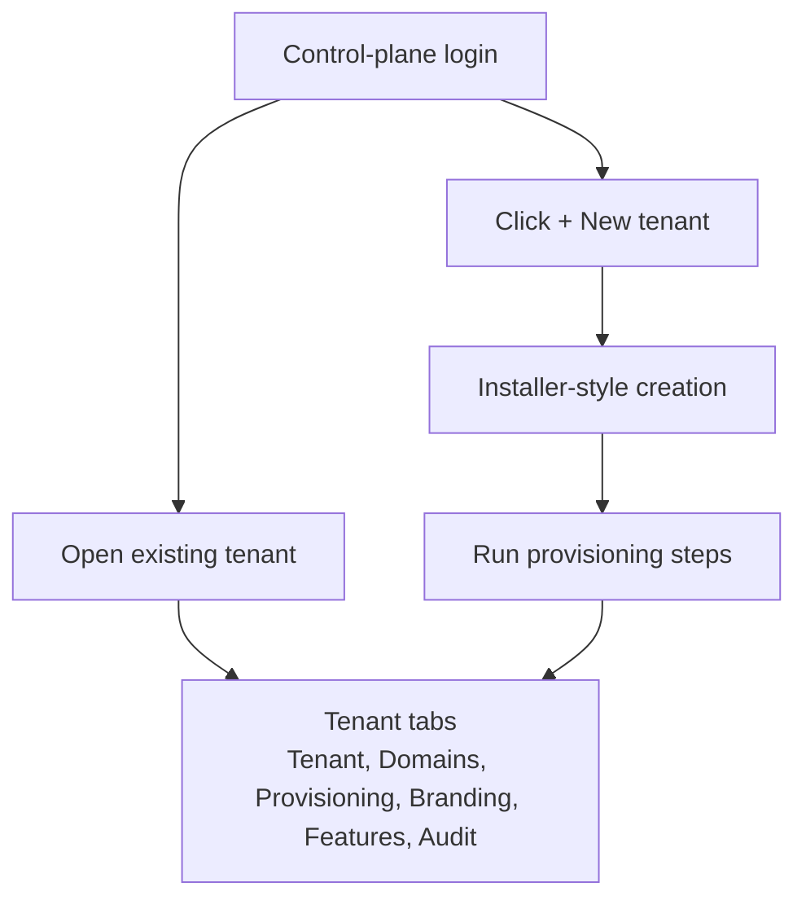
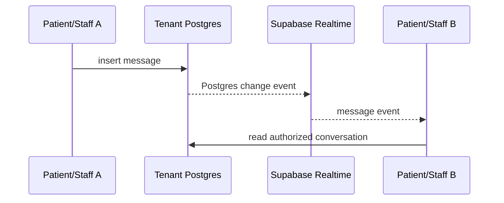
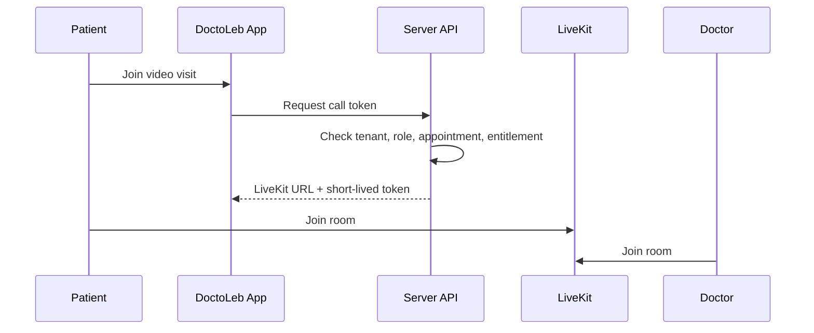

# 03 - Core Workflows

## Patient Workflow

| Action | Precondition | Result |
|---|---|---|
| Open landing page | Tenant resolves. | Clinic branding appears. |
| Login/signup | Tenant Auth is available. | Patient session is created. |
| Accept consent | Required consent exists. | Consent record saved; revoked state cleared. |
| Book slot | Slot is active and available. | Appointment is created. |
| Cancel booking | User owns appointment or staff is authorized. | Appointment is cancelled and slot is released. |
| Send message | Messaging is enabled and user is participant. | Message is saved; retry uses same `client_request_id`. |

## Staff Workflow

| Role | Current Work |
|---|---|
| Doctor | Dashboard, encounters, reports, staff management. |
| Secretary | Front desk, registration, booking, billing support. |
| Predoctor | Intake, preparation, precheck support. |
| Junior doctor | Deferred until role/RLS/sign-off model is designed. |

## SaaS Admin Workflow

| SaaS Action | Safety Rule |
|---|---|
| Open tenant | Reads zero-PHI SaaS metadata only. |
| Create draft | Does not mutate selected tenant. |
| Run step | Uses RBAC, idempotency key, and step ledger. |
| Cancel job | Marks job cancelled instead of deleting history. |
| Compensate step | Runs explicit undo when available. |
| Activate tenant | Requires resolver/domain readiness. |

## Realtime Chat

| Part | Design |
|---|---|
| Storage | Messages are persisted in tenant Postgres. |
| Authorization | RLS/RPC checks participant access. |
| Realtime | Subscribes to message changes. |
| Attachments | Private storage and signed URLs. |
| Mobile push | Planned through Firebase FCM. |

## Future Video Visit

| Rule | Reason |
|---|---|
| Room name uses appointment UUID. | Avoid PHI in provider metadata. |
| Token generated server-side. | Client never sees LiveKit secret. |
| Appointment authorization required. | Only real participants can join. |
| Recording is deferred. | Needs consent, retention, storage, and legal design. |
