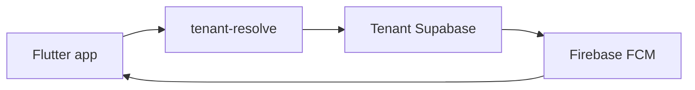
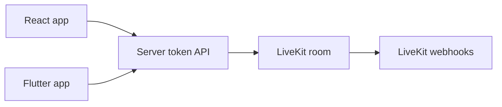

# 04 - Mobile, AI, And Realtime Roadmap

## Mobile App Direction
The Flutter app should reuse the same tenant resolver and tenant Supabase backend as the web apps.



| Mobile Area | Status | Design |
|---|---|---|
| Tenant boot | Planned | Clinic code/domain calls the same resolver. |
| Auth | Planned | Supabase Auth inside the tenant project. |
| Branding | Planned | Reads tenant app config and applies Flutter theme. |
| Patient features | Planned | Appointments, profile, records, messages. |
| Staff features | Deferred | Only after mobile staff scope is approved. |
| Offline cache | Planned | Safe UI config only; PHI needs encrypted-storage policy. |

## Firebase FCM
| Item | Design |
|---|---|
| Device token | Stored in the tenant DB per user/device. |
| Sender | Server-side function/worker only. |
| Payload | Generic text and IDs only; no PHI. |
| Events | Appointment updates, messages, reminders, video-call prompts. |
| Logout | Deactivate/remove device token. |

## Supabase Realtime
| Use Case | Status | Notes |
|---|---|---|
| Chat messages | Current foundation | Realtime message changes. |
| Notifications | Current foundation | UI notification updates. |
| Appointment board | Planned | Staff dashboard can update live. |
| Presence | Planned | Only if privacy policy allows it. |

## LiveKit Video Calls


| Component | Rule |
|---|---|
| Room ID | Appointment/call UUID, not patient name. |
| Token | Short-lived and server-generated. |
| Authorization | Tenant, role, appointment, and feature entitlement. |
| Webhooks | Audit room and participant lifecycle. |
| Recording | Deferred until consent and retention rules exist. |

## LangGraph + Gemini Agent Layer
AI is a server-side layer. Clients never receive `GEMINI_API_KEY`.

```mermaid
flowchart LR
  user["Doctor/Admin request"]
  api["Backend API"]
  guard["Auth + entitlement + PHI policy"]
  graph["LangGraph workflow"]
  gemini["Gemini API"]
  review["Human review"]
  audit["Safe audit event"]

  user --> api --> guard --> graph --> gemini --> review --> audit
```

| Use Case | Status | Guardrail |
|---|---|---|
| Clinical summary | Planned | Doctor review before save. |
| BI explanation | Planned | Aggregate data only. |
| Provisioning assistant | Planned | Guides steps; privileged actions require RBAC. |
| Support triage | Planned | Zero-PHI metadata unless tenant-scoped access is approved. |

## Safety Checklist
| Rule | Applies To |
|---|---|
| Provider secrets stay server-side. | Firebase, LiveKit, Gemini, Vercel, Supabase service-role. |
| Entitlements gate premium features. | AI, BI, video, custom branding/domain. |
| Logs avoid PHI and secrets. | All providers and app logs. |
| Human review before clinical writes. | AI-generated clinical output. |
