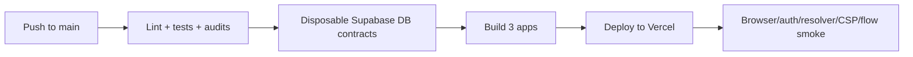
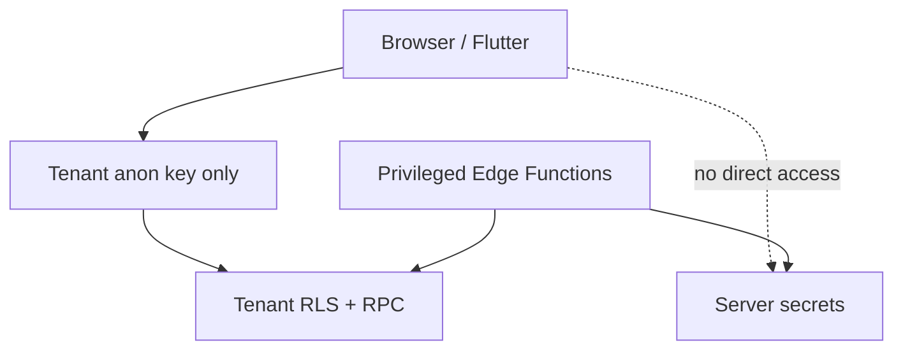

# 05 - Quality, Security, And Deployment

## Deployment Flow
GitHub Actions is the deployment authority. Vercel deploys after checks pass.

## Apps Deployed
| Vercel Project | App | Purpose |
|---|---|---|
| `doctoleb-patient-web` | `apps/patient-web` | Patient portal and doctor public site. |
| `doctoleb-clinic-ops` | `apps/clinic-ops` | Staff operations portal. |
| `doctoleb-control-plane` | `apps/control-plane` | SaaS admin console. |

## Quality Gates
| Gate | Status | Purpose |
|---|---|---|
| `npm run lint` | Current | Static code quality. |
| `npm run build:patient` | Current | Patient app build. |
| `npm run build:ops` | Current | Staff app build. |
| `npm run build:control-plane` | Current | SaaS console build. |
| Unit/contract tests | Current | Business logic and architecture contracts. |
| DB contract tests | Current in CI | RLS, schema, and migration proof on disposable DB. |
| Bundle secret audit | Current | Prevent frontend secret leaks. |
| Browser smoke | Current | Prove deployed apps load and route. |

## Security Boundaries

| Risk | Control |
|---|---|
| Cross-tenant PHI leak | Database-per-tenant Supabase projects. |
| Service-role key leak | Never returned to browser; bundle audit checks this. |
| Wrong user role | Supabase Auth, role checks, RLS, ProtectedRoute. |
| Feature bypass | Backend/RPC entitlement enforcement. |
| Unsafe deletion | Archive, disable, cancel, compensate. |
| PHI in logs | Safe logger tags only non-PHI metadata. |
| Public resolver abuse | Rate limiting with hashed actor/host keys. |

## Operations Readiness
| Area | Status | Notes |
|---|---|---|
| Vercel alias smoke | Current | Confirms no-domain deployments work. |
| Auth smoke | Current | Proves login routes after deploy. |
| CSP report-only | Current | Header exists; strict enforcement comes after full browser proof. |
| Observability | Current foundation | Safe logging exists; telemetry provider config is later. |
| Backup/restore drill | Planned | Depends on provider plan and launch runbook. |
| Performance proof | Planned | Lighthouse, Core Web Vitals, resolver load, DB query plans. |

## Manual Provider Items
| Item | Needed When |
|---|---|
| Real `doctoleb.com` domain | Before production custom domain launch. |
| Firebase project | Before mobile push notifications. |
| LiveKit project/API keys | Before video-call implementation. |
| Gemini API key | Before AI agent implementation. |
| Supabase paid-plan controls | Before paid-plan-only hardening features. |
| External auto-project creation tokens | Before fully automatic provider provisioning. |

## Graduation Acceptance View
The project is ready to present when:

| Requirement | Proof |
|---|---|
| Three web apps deploy from one repo. | CI and Vercel deployments are green. |
| First tenant works without buying a domain. | Vercel aliases resolve through control plane. |
| Tenant creation is guided and separate. | `+ New tenant` wizard is not mixed with selected tenant editing. |
| Runtime branding works. | Tenant config changes app name/colors/logo without redeploy. |
| Control plane is zero-PHI. | Schema, docs, and audits show no clinical data there. |
| Main flows are tested. | Browser, auth, resolver, DB, and flow smoke checks pass. |
