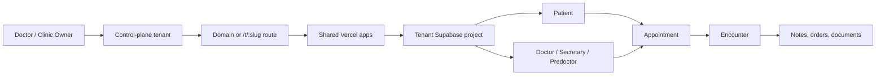

# 06 - ERD And Data Model

## Goal
This section should prove the data design, not list every table. The report uses
focused feature ERDs that follow product actions: create a tenant, configure runtime
branding, manage doctors and patients, book a visit, and record clinical work.

## Final Report Path
Use this order in the graduation document.

| Order | Figure | Put in | Why it matters |
|---:|---|---|---|
| 1 | `19-saas-tenant-provisioning-process.svg` | Main chapter | Shows how a new clinic becomes a tenant without storing PHI in the SaaS admin. |
| 2 | `18-runtime-branding-consent-feature-process.svg` | Main chapter | Shows how branding, consent, and feature gates affect both apps at runtime. |
| 3 | `10-doctor-provider-detail.svg` | Main chapter | Shows the doctor/staff/provider identity model. |
| 4 | `11-patient-record-detail.svg` | Main chapter | Shows the patient record and why PHI belongs in tenant Supabase only. |
| 5 | `12-appointment-booking-detail.svg` | Main chapter | Shows the core booking loop from slot to appointment. |
| 6 | `13-clinical-actions-detail.svg` | Main chapter | Shows how an appointment becomes a clinical record. |
| 7 | `14-predoctor-precheck-process.svg` | Appendix | Supports the assistant/pre-doctor workflow. |
| 8 | `15-messaging-notification-process.svg` | Appendix | Supports chat, reminders, and delivery tracking. |
| 9 | `17-staff-lifecycle-process.svg` | Appendix | Supports invite, disable, and reactivate operations. |
| 10 | `16-billing-insurance-process.svg` | Appendix | Supports billing/insurance, especially because parts are future-gated. |

Recommended size: 6 main ERD pages plus 4 appendix pages. Do not add old full-schema ERDs unless the examiner specifically asks for a database inventory.

## Section Skeleton
Copy this structure into the report.

1. **Data model overview**: one short paragraph explaining control-plane data vs tenant clinical data.
2. **SaaS tenant provisioning ERD**: explain tenant setup, domains, secret references, migration ledger, and audit.
3. **Runtime configuration ERD**: explain branding, feature flags, consent, and shared Vercel app routing.
4. **Doctor and patient ERDs**: explain the two main people records and how auth links to profiles.
5. **Appointment ERD**: explain the booking loop.
6. **Clinical actions ERD**: explain encounter, notes, documents, messages, and follow-up work.
7. **Appendix ERDs**: include predoctor, messaging, staff lifecycle, and billing only as supporting figures.

## One-Page Writing Template
Use this exact pattern under each figure.

```text
Figure 6.x shows [workflow name]. The central table is [main table].
It reads from [support tables] and writes to [result tables].
This matters because [business value or safety boundary].
```

Example:

```text
Figure 6.5 shows appointment booking. The central table is appointments.
It reads from doctors, clinics, visit_types, and schedule_slots, then writes the
appointment, encounter, payment, task, and notification records. This matters
because booking is the bridge between the patient portal and the clinic workflow.
```

## Data Ownership Paragraph
Use this paragraph before the ERDs.

DoctoLeb separates SaaS administration data from clinical data. The control-plane
Supabase project stores tenant status, routing, plan, domains, provisioning
ledger, and secret references. It does not store PHI. Each clinic tenant has its
own Supabase project where patients, appointments, encounters, messages,
documents, and clinical workflow data are stored under tenant RLS and auth rules.

## Main Relationship Story


## Figure Captions
| Figure | Caption |
|---|---|
| 6.1 SaaS tenant provisioning | Control-plane tables create and activate a tenant through registry, routing, secrets, migrations, entitlements, and audit records. |
| 6.2 Runtime configuration | Runtime branding, feature flags, pages, consent, and entitlements are loaded by the shared patient and ops apps. |
| 6.3 Doctor/provider detail | Doctor identity connects auth users, provider profile, clinics, specialties, staff roles, availability, and contracts. |
| 6.4 Patient record detail | Patient identity connects auth users, profile, consent, history, devices, insurance, and clinical ownership. |
| 6.5 Appointment booking | Booking connects doctor availability, patient, slot, appointment, encounter, payment, task, and notification records. |
| 6.6 Clinical actions | Clinical work connects appointments and encounters to notes, diagnoses, orders, documents, tasks, messages, and billing. |
| A.1 Predoctor precheck | Predoctor workflow reads appointment context and writes precheck, vitals, task, and notification records. |
| A.2 Messaging and notification | Messaging writes conversations, participants, messages, attachments, receipts, notification events, devices, and delivery records. |
| A.3 Staff lifecycle | Staff lifecycle writes invite, resend, reissue, disable, reactivate, staff state, and audit records. |
| A.4 Billing and insurance | Billing reads appointment, encounter, provider, contract, policy, and template data, then writes payment and claim records. |

## Source Files
| Purpose | Path |
|---|---|
| DBML source ERDs | `docs/erd/views/*.dbml` |
| Rendered SVGs | `docs/erd/rendered/*.svg` |
| Renderer | `scripts/render-erd-view-svgs.mjs` |

## Render
```bash
npm run render:erd-views
```

When migrations change a workflow, update only the matching curated DBML and rerender.
