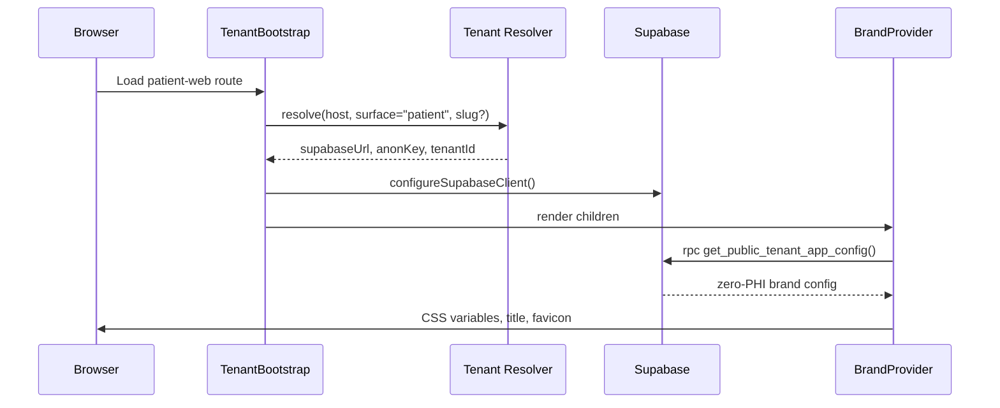
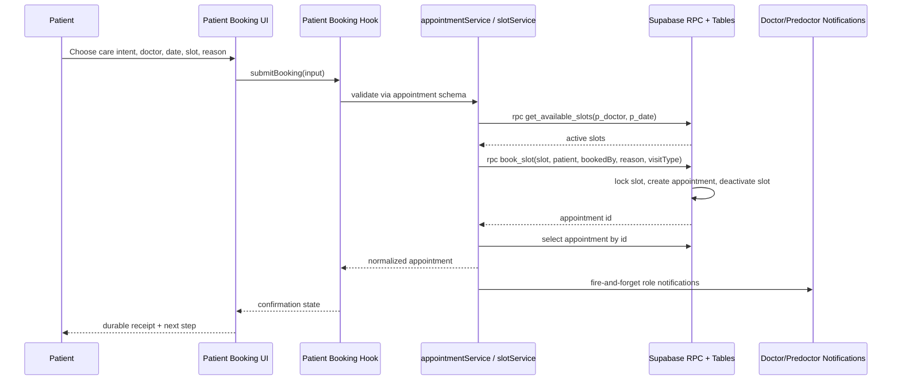
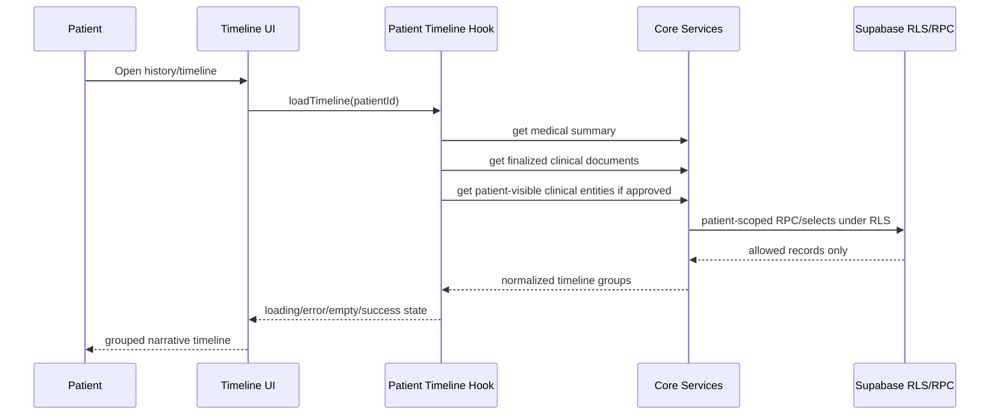
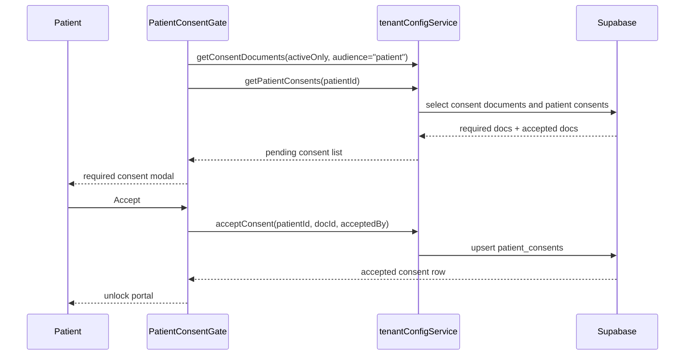

# Patient Web Functional Audit And Redesign Plan

Date: 2026-05-18
Scope: `apps/patient-web` only
Status: Planning and discovery, not implementation

## Implementation Update: Configurable Intake Foundation

Date: 2026-05-18
Status: V1 foundation implemented for patient onboarding only

The patient onboarding slice now has a config-ready architecture without adding a doctor/admin form builder yet. The current patient UI still renders the V1 first-visit essentials, but it no longer depends on a hardcoded page-local field list.

Implemented boundaries:

- `packages/core/lib/patientOnboarding.js` owns the canonical field registry, locked required fields, section definitions, definition resolver, progress calculation, initial-form hydration, and guided-intake payload creation.
- Tenant/doctor overrides are resolved through a closed allowlist: base fields can adjust visibility, required state, section, order, and copy; locked clinical identity fields cannot be hidden or made optional.
- Future custom fields must use the `custom.*` namespace and are rendered/submitted only when present in the resolved definition.
- `packages/core/services/patientOnboarding.js` owns definition loading, readiness loading, profile save, and self-intake submission through `{ data, error }` envelopes.
- `apps/patient-web/src/pages/PatientOnboardingPage.jsx` renders from the resolved definition and coordinates route UX only.
- `supabase/migrations/20260518120000_patient_self_intake_rpc.sql` adds the config table/RPC contract and stores patient custom answers only through `submit_patient_self_intake(...)` after ownership and allowlist checks.

Important non-goals for this slice:

- No doctor/admin configuration UI is included yet.
- No arbitrary database columns or arbitrary JSON writes are exposed to the browser.
- Appointment booking configurability is prepared at the config-table context level (`appointment_booking`) but does not yet have patient UI or answer persistence.
- Deep structured history, vaccinations, surgeries, diseases, and family history remain staff-managed for V1.

Future doctor/admin configuration must reuse the same registry and renderer. It should write active/draft/archived rows in `patient_form_field_config`, not generate new patient page code.

## Executive Intent

Before redesigning the patient app, we will audit the current patient web experience as a senior product analyst, frontend designer, and software engineer. The redesign must be driven by real business workflows, live Supabase contracts, existing core services, doctor/staff operational logic, and tenant branding. Stitch is a visual reference for the patient experience only; it is not production code and does not change the backend/API plan.

This plan protects four boundaries:

- Business process belongs in documented workflows and service contracts.
- Data integrity and authorization belong in Supabase schema, RLS, RPCs, and Edge/server-side contracts where needed.
- Client logic belongs in `packages/core` services/hooks and narrow app containers.
- UI and style belong in reusable `packages/ui` primitives, patient-web compositions, and design tokens.

## Evidence Gathered

- Patient routes: `apps/patient-web/src/App.jsx`
- Patient pages: landing, login, signup, forgot/reset password, dashboard, appointments, profile, medical history, messages
- Shared patient UI: `PatientPageHeader`, `PatientConsentGate`, `MessagingPage`
- Core services: `auth`, `patients`, `appointments`, `slots`, `documents`, `messaging`, `notificationCore`, `tenantConfig`
- Core schemas: auth, patient, appointment, messaging, tenant consent
- Live Supabase MCP metadata: public tables, RLS policies, patient RPCs, security/performance advisors
- Stitch reference archive: `docs/stitch-analysis/9966518933119406027`

No PHI rows were inspected. Supabase usage was limited to metadata, counts, policies, functions, and advisor output.

## Current Patient App Inventory

| Route | File | Current Role |
|---|---|---|
| `/` and `/marketing` | `LandingPage.jsx` | Tenant-branded clinic landing page |
| `/login` | `LoginPage.jsx` | Password login, staff redirect hint |
| `/signup` | `SignUpPage.jsx` | Patient account creation |
| `/forgot-password` | `ForgotPasswordPage.jsx` | Password recovery |
| `/reset-password` | `ResetPasswordPage.jsx` | Password reset |
| `/patient-dashboard` | `PatientDashboardPage.jsx` | Dashboard, quick actions, appointments, unread notifications |
| `/patient-appointments` | `PatientAppointmentsPage.jsx` | Appointment list, booking, cancellation |
| `/patient-profile` | `PatientOwnProfilePage.jsx` | Patient profile edit |
| `/patient-history` | `PatientMedicalHistoryPage.jsx` | Finalized clinical documents |
| `/patient-messages` | `PatientMessagesPage.jsx` | Feature-gated shared messaging surface |

## Live Supabase Patient Contracts

### Important Tables

| Table | Purpose | Current Count |
|---|---:|---:|
| `patients` | Patient identity/profile rows | 19 |
| `appointments` | Booked visits and lifecycle state | 38 |
| `secretary_slots` | Schedulable doctor/clinic windows | 39 |
| `clinical_documents` | Finalized/voided patient-visible docs | 30 |
| `conversations` | Patient/staff message threads | 6 |
| `messages` | Conversation messages | 21 |
| `notification_events` | Notification source events | 84 |
| `notification_deliveries` | User/device delivery/read state | 84 |
| `consent_documents` | Required patient consent content | 0 |
| `patient_consents` | Patient consent acceptances | 0 |
| `feature_flags` | Public/patient/staff/admin capabilities | 8 |
| `tenant_profile` | Tenant identity and status | 1 |
| `tenant_app_config` | Tenant branding/app config | 1 |

### Important RPCs

| RPC | Current Role In Patient App |
|---|---|
| `get_public_tenant_app_config()` | Public zero-PHI branding and tenant app config |
| `book_slot(p_slot, p_patient, p_booked_by, ...)` | Atomic booking, slot consumption, appointment creation |
| `cancel_appointment(appointment_id, cancellation_reason)` | Patient/staff-safe cancellation with slot reopening rules |
| `get_available_slots(p_doctor, p_date)` | Available patient booking windows |
| `update_patient_profile(...)` | Atomic user + patient profile update |
| `get_my_appointments(...)` | Patient-owned appointment list RPC, not currently used by patient web |
| `get_my_notifications(...)` | Patient-owned notification list RPC, not currently used by patient web |
| `get_my_medical_summary()` | Patient summary counts, not currently used by patient web |

### RLS Summary

- Patient rows are protected by self-or-staff policies.
- Appointments are selectable by staff or the owning patient.
- Direct appointment insert/update is staff-only; patient booking is intended to go through `book_slot`.
- Clinical documents, encounters, diagnoses, prescriptions, lab orders, imaging orders, and attachments are selectable by staff or the owning patient.
- Messaging uses conversation access policies and messaging feature flags.
- Tenant branding/config is exposed through a public zero-PHI RPC.
- Consent acceptances are own-patient insert/update/select or admin-scoped.

## Patient-To-Clinic-Ops Dependency Map

The patient app cannot be redesigned as an isolated portal. Every patient action must be checked against the operational state that doctors, predoctors, secretaries, and billing staff rely on.

| Patient Action | Clinic-Ops Effect | Contract To Verify | Weaknesses To Find |
|---|---|---|---|
| Self-register | Patient should appear as a valid patient record for staff workflows | Supabase Auth, `patients`, profile provisioning, patient role guard | duplicate user/patient rows, missing clinical identity, staff account leakage into patient app |
| Complete or edit profile | Staff sees accurate demographics, allergies, emergency data, and intake state | `update_patient_profile`, `patients` RLS, patient schemas | duplicated validation, incomplete required fields, unsafe fallback writes, no durable confirmation |
| Accept consent | Portal unlocks only after active patient consent requirements are met | `consent_documents`, `patient_consents`, `PatientConsentGate` | no active consent documents, stale consent version handling, weak audit trail |
| Book appointment | Slot is consumed, appointment appears in doctor agenda and predoctor queue | `get_available_slots`, `book_slot`, appointment state machine, notifications | hardcoded duration, missing visit type, intake failure discovered too late, toast-only confirmation |
| Cancel appointment | Appointment leaves active workflow and slot rules are applied | `cancel_appointment`, appointment state machine, staff views | cancellation reason quality, terminal-state handling, unclear patient policy, weak staff notification |
| View dashboard | Patient sees next step without disrupting staff workflows | dashboard service/view model, `get_my_medical_summary`, appointment/messages/notifications | generic card grid, no patient journey synthesis, missing actionable notification routing |
| View medical history | Patient sees only finalized/allowed clinical records | `clinical_documents`, clinical entity RLS, document status machine | document dump instead of timeline, draft/private leakage risk to verify, no prescriptions/labs/orders synthesis |
| Message clinic | Staff receives a scoped conversation with enough context to respond | `conversations`, `messages`, messaging feature flag, notification routes | contextless threads, weak failure receipts, unclear attachment policy |
| View billing | Patient sees safe billing state without exposing PHI or staff-only financial logic | `payments`, billing services, payment state machine | no patient route/contract yet, payment rows exist but patient-facing rules are not approved |

## Weakness Audit Method

The audit must produce findings that are specific enough to implement without guessing. Each finding should include severity, route/file reference, affected business use case, current behavior, expected behavior, owner layer, and verification method.

Finding categories:

- Functional correctness: broken or incomplete user journeys, missing states, wrong action availability, race conditions, and post-mutation refresh gaps.
- Business process fit: mismatches between patient actions and doctor/predoctor/secretary workflows.
- Data/RLS contract: missing RPC usage, unsafe direct table access, insufficient RLS/policy review, advisor warnings, and missing seed/config data.
- Service/API shape: fragmented service calls, duplicated validation, inconsistent `{ data, error }` handling, and missing view models.
- UI architecture: long page components, repeated headers/cards, mixed fetching/rendering logic, and components that cannot be reused.
- Accessibility and safety: keyboard traps, unlabeled controls, weak focus, missing `aria-live`, reduced-motion gaps, contrast risk, and unsafe confirmation patterns.
- Visual/design quality: generic AI-card layouts, weak hierarchy, low tenant-brand integration, Stitch mismatch, and non-production copy.

Owner layer rules:

- `Supabase`: schema, RLS, grants, constraints, triggers, indexes, atomic RPCs, and privileged data rules.
- `packages/core`: schemas, normalized services, state machines, selectors, feature hooks, and view models.
- `packages/ui`: reusable accessible primitives, patient shell, shared empty/error/loading states, typography and tokenized style utilities.
- `apps/patient-web`: route composition, page choreography, patient-specific containers, and patient-only visual treatment.
- `docs`: business process decisions, public contracts, sequence diagrams, and implementation handoffs.

## Page-By-Page Audit Checklist

| Patient Surface | Audit Questions | Downstream Contract |
|---|---|---|
| Landing / marketing | Does it resolve tenant brand correctly, avoid false claims, and direct staff/patients to the right surface? | `TenantBootstrap`, `BrandProvider`, `get_public_tenant_app_config` |
| Login | Should the patient flow be OTP-first, password-first, or hybrid? Does it eject staff safely? | `authService`, role guard, app-boundary routing |
| Signup | Does it collect the minimum patient identity needed before clinical workflows? Are terms/privacy/consent real? | Auth signup, patient provisioning, `patients`, consent docs |
| Forgot/reset password | Are error states safe and non-enumerating? Does copy match patient trust needs? | Supabase Auth recovery |
| Consent gate | Are active consent documents present and versioned? Is the gate accessible and auditable? | `consent_documents`, `patient_consents` |
| Dashboard | Does it answer "what should I do next?" using real data and doctor workflow state? | appointments, notifications, messages, `get_my_medical_summary` |
| Appointments | Does booking select intent/visit type/duration/date/slot, prevent invalid actions, and confirm durably? | `visit_types`, `secretary_slots`, `book_slot`, `cancel_appointment` |
| Medical history | Does it show patient-safe timeline data, not just documents? Are drafts/voided/superseded states handled? | clinical RLS, documents, encounters, prescriptions, orders, diagnoses |
| Messages | Does each thread preserve care context and failure/read states? | conversations/messages policies, messaging feature flag |
| Profile | Is identity/intake/profile editing split correctly and validated once? | `update_patient_profile`, patient schemas |
| Billing future route | Is the V1 patient billing contract approved before any UI exists? | `payments`, payment state machine, billing services |

## Supabase Triage Points From MCP

These are not implementation instructions yet; they are audit inputs that must be reviewed before redesign code depends on them.

- The patient-facing RPCs are `SECURITY DEFINER` and mostly granted to `authenticated`; `get_public_tenant_app_config` is also granted to `anon`. This may be correct, but each function needs a grant/search-path/input-validation review before treating it as production-safe.
- `book_slot`, `cancel_appointment`, and `get_available_slots` already have explicit `search_path=public, pg_temp`. Some `get_my_*` functions use `search_path=public`; audit whether that is intentionally sufficient.
- `consent_documents` and `patient_consents` currently have zero rows. A consent UI redesign cannot prove real consent behavior until active consent documents exist.
- `payments` has live rows and RLS policies, but the patient app has no billing route or approved patient payment view contract. Billing UI must stay out of implementation until that contract is defined.
- `visit_types` has live rows and `book_slot` accepts `p_visit_type`, but the current patient booking UI does not expose visit type selection.
- The live schema contains encounters, diagnoses, prescriptions, lab orders, imaging orders, and care tasks. The patient history redesign must decide which of these are patient-visible, not assume all clinical entities are safe to show.
- Active Supabase Edge Functions are staff-account management functions only. Patient portal work should not depend on an Edge Function unless a new server-side contract is explicitly designed.

## Current Weakness Themes To Audit

These are initial findings from inspection. The next implementation phase should confirm them with tests and browser verification before changing code.

### 1. Patient Web Is Visually Behind The Stitch Direction

The app still looks like a conventional card-based portal: slate/white surfaces, rounded card grids, icon tiles, glow panels, generic headings, and repeated dashboard blocks. It is serviceable but not yet the modern, tactile patient experience requested.

Risk: redesigning visually without fixing flow will produce attractive but shallow UI.

Plan: redesign only after functional contracts and workflows are mapped. Use Stitch for patient mood, timeline, booking, registration, and billing patterns, but translate to DoctoLeb copy and tenant colors.

### 2. Patient Pages Mix Fetching, UI State, Layout, And Presentation

Pages call services directly and own local fetch state. That is acceptable for small pages, but the patient redesign will become too complex if every page manually coordinates loading, errors, service calls, filters, and layout.

Examples:

- Dashboard manually fetches profile, appointments, and notifications.
- Appointments manually handles doctors, dates, slots, booking, cancellation, tabs, and rendering.
- Profile manually validates some fields while service schemas also validate.
- Medical history owns tab logic, document visibility rules, modal state, and rendering.

Plan: add patient-specific feature hooks/containers in `packages/core/hooks/features` or `apps/patient-web/src/features` depending on reuse needs. Keep visual components presentational.

### 3. Patient Dashboard Is Not A Real Care Overview Yet

The dashboard shows quick actions, upcoming appointments, and profile facts, but it does not synthesize the patient journey. It does not use `get_my_medical_summary()`, does not route notification clicks, and the notification quick-action card has no action.

Plan: replace the generic quick-action grid with a patient care overview:

- next appointment / current visit state
- unread notifications and messages
- intake/consent completion
- recent finalized documents
- billing or payment state if the patient payments contract is approved
- clear "what should I do next?" action

### 4. Auth And Signup Do Not Match The Desired Patient Flow

Core auth supports email OTP request/verify, but the login page currently presents password-first login. Signup collects first name, last name, email, and password only. It does not collect the minimum clinical identity mentioned in the patient specification: date of birth and biological sex/sex at birth where clinically required.

The signup terms/privacy links are placeholders. Consent documents currently have zero live rows, so `PatientConsentGate` cannot yet enforce meaningful consent.

Plan: define the patient identity flow before redesign:

- password vs OTP vs hybrid login
- minimum profile fields before portal access
- required consent documents and active versions
- exact staff-account ejection copy and target

### 5. Booking Flow Needs Business Process Hardening

The current flow books a selected doctor/date/slot/reason through the atomic `book_slot` RPC, which is good. But the UX and data flow are still too thin:

- duration is hardcoded to 30 minutes
- visit type is not selected despite `visit_types` and `book_slot` support
- intake-required failure is handled only after the user attempts booking
- available slot context is minimal
- booking confirmation is only a toast
- patient cancellation reason exists, but the UI needs clearer policy and accessible confirmation
- doctor/predoctor queue impact is hidden from the patient

Plan: treat booking as a guided care request:

- choose care intent or visit type
- show doctor/clinic/date availability
- explain why intake may be required before booking
- create booking through `appointmentService.bookFromSlot`
- show a durable confirmation receipt, not only a toast
- refresh appointments and notifications after mutation

### 6. Medical History Is Document-Centric, Not Timeline-Centric

`PatientMedicalHistoryPage` only reads `clinical_documents`. The DB and services expose richer clinical entities: encounters, prescriptions, diagnoses, lab orders, imaging orders, documents, and summary counts.

Plan: design a patient timeline data contract before UI work:

- finalized clinical documents remain patient-visible
- prescriptions/lab/imaging/diagnosis visibility must follow doctor/staff policy
- drafts/private notes stay hidden
- voided/superseded documents remain explainable and safe
- patient-readable summary uses safe labels, not raw clinical jargon

### 7. Messaging Is Functional But Not Yet A Care Timeline

The shared `MessagingPage` is a useful base, but the patient app should connect messages to care context: appointment, lab result, document, prescription, or billing question when available.

Plan: keep messaging service contracts centralized, then improve patient composition:

- patient message entry points from dashboard/timeline/document cards
- clear thread subject and status
- read receipts and failure receipts
- attachment affordances only if storage policy and service path are verified

### 8. Billing Is Missing From Patient Web

Supabase has `payments`, and Stitch includes a strong payment/billing concept. The current patient app has no route for billing.

Plan: do not add billing UI until the business contract is explicit:

- What can a patient see: invoices, payments, outstanding balance, receipts?
- What can a patient do: pay online, download receipt, contact clinic?
- Which service owns patient-scoped payment reads?
- Which payments are zero-PHI enough for notification/summary display?

### 9. Tenant Branding Exists But Is Not Deeply Integrated

`BrandProvider` applies tenant colors and page metadata from `get_public_tenant_app_config()`. Current pages use `displayName` and CSS variables in some places, but many layouts still feel generic and not tenant-owned.

Plan: make the patient redesign brand-adaptive:

- use tenant primary/secondary color variables
- test contrast for aggressive tenant colors
- use clinic logo/name/contact consistently
- do not hardcode DoctoLeb where the tenant clinic should appear
- reserve DoctoLeb/control-plane branding for SaaS/control-plane surfaces, not patient portal chrome

### 10. Accessibility And Interaction Debt

Common issues to verify:

- overuse of `transition-all`
- repeated hover scale patterns
- emoji as meaningful icons in clinical views
- duplicated sticky headers
- insufficient `aria-live` for async booking/message actions
- modals and confirmation flows need focus testing
- mobile lacks a patient-specific bottom navigation model
- loading states are mostly text/spinners, not structured skeletons

Plan: audit with keyboard, screen-size, and reduced-motion checks before each vertical redesign slice is accepted.

## Target System Hierarchy

```txt
Supabase tenant DB
  tables, RLS, constraints, triggers, RPCs
  |
packages/core
  schemas, selectors, services, state machines, feature hooks
  |
packages/ui
  shared primitives, patient shell, accessible components, brand-aware tokens
  |
apps/patient-web
  route-level composition, patient-specific containers, page choreography
  |
Stitch-inspired visual layer
  patient-only art direction, narrative layout, motion, warmth
```

Rules:

- UI calls hooks/services, never raw Supabase.
- Backend/RPC owns atomic booking, cancellation, consent persistence, protected reads, and privileged mutations.
- Page files stay small. Large flows are split into feature hooks and presentational components.
- Shared patterns are extracted once and reused.
- No mock data in production paths.

## Business Use Cases To Validate

| Use Case | Actor | System Contract |
|---|---|---|
| Resolve clinic portal | Visitor/patient | `TenantBootstrap` -> tenant resolver -> Supabase config |
| Load tenant brand | Visitor/patient | `tenantConfigService.getPublicConfig()` -> `get_public_tenant_app_config()` |
| Register patient | Patient | Supabase Auth signup -> domain user/patient provisioning |
| Sign in patient | Patient | Auth service -> profile lookup -> patient role guard |
| Eject staff from patient app | Staff user | app-boundary guard -> ops login URL |
| Accept required consent | Patient | consent docs + patient consent upsert |
| Complete profile | Patient | `patientService.updateOwnProfile()` -> `update_patient_profile()` |
| Book appointment | Patient | slots -> `book_slot()` -> appointment -> notifications |
| Cancel appointment | Patient | `cancel_appointment()` -> slot reopen rules -> notification |
| View appointments | Patient | patient-scoped appointment service or `get_my_appointments()` |
| View care timeline | Patient | summary + finalized documents + allowed clinical entities |
| Message clinic | Patient | conversations/messages RLS + messaging feature flag |
| View notifications | Patient | notification deliveries or `get_my_notifications()` |
| View billing | Patient | pending contract: patient-scoped payment reads and receipts |

## Sequence Diagrams

### Tenant Boot And Branding



### Patient Booking



### Patient Care Timeline



### Consent Gate



## Audit And Redesign Work Plan

### Phase 1: Functional Weakness Audit

Goal: produce a page-by-page, contract-by-contract weakness report before any redesign code.

Tasks:

- Map every patient page to its data sources, mutations, loading states, error states, and route guards.
- Compare patient actions with doctor/staff operational effects: booking, cancellation, precheck, encounter lifecycle, documents, notifications, messages.
- Confirm whether patient app should use existing direct service selects or patient-owned RPCs like `get_my_appointments`, `get_my_notifications`, and `get_my_medical_summary`.
- Verify current live RLS, RPC grants, Supabase advisor warnings, and missing consent/billing content.
- Browser-test current patient pages at mobile, tablet, and desktop to capture real UX/accessibility weaknesses.

Acceptance criteria:

- A written audit exists with severity, file references, and recommended owner layer.
- No implementation starts until the audit distinguishes UI-only fixes from backend/service contract changes.
- Every patient action is checked against doctor, predoctor, secretary, notification, and billing consequences where applicable.

### Phase 2: Patient Data Contract Design

Goal: define the frontend data contracts that the redesign can depend on.

Tasks:

- Design `patientPortalService` or patient feature hooks if existing services are too fragmented.
- Define dashboard view model: brand, patient, next appointment, alerts, messages, care summary, billing summary if approved.
- Define booking view model: doctors, visit types, available slots, intake-required state, confirmation receipt.
- Define timeline view model: documents plus approved clinical entities grouped by date/encounter.
- Define message/notification view models with navigation targets.

Acceptance criteria:

- View models are documented and testable.
- Business logic is in core services/hooks, not page JSX.
- Any new RPC or DB work is separately documented before migration.

### Phase 3: Patient UI Shell And Design System

Goal: create the reusable foundation before redesigning pages.

Tasks:

- Create a patient app shell with tenant-aware brand lockup, desktop side rail or top nav, mobile bottom nav, and safe-area handling.
- Replace duplicated headers with one patient shell/header pattern.
- Add patient-specific primitives: care receipt, narrative block, timeline item, appointment window picker, patient status pill, empty/error/loading states.
- Ensure every primitive supports keyboard access, visible focus, `className`, loading/disabled states, and reduced motion.

Acceptance criteria:

- Shared patient primitives are reusable across dashboard, booking, history, profile, messages, and billing.
- No component is copied into multiple pages.

### Phase 4: Vertical Slice Redesign

Implementation order should be vertical and reversible:

1. Tenant-branded patient shell and navigation.
2. Login/signup/consent flow.
3. Dashboard as "care overview".
4. Appointment booking/cancellation.
5. Care timeline/medical history.
6. Messages and notifications.
7. Profile/intake.
8. Billing only after patient billing contract approval.

Acceptance criteria for each slice:

- Uses existing API/service layer or approved new contract.
- No mock production data.
- Page file remains small by extracting hooks/components.
- Works on mobile and desktop.
- Has loading, empty, error, and success states.
- Passes targeted unit/browser verification.

### Phase 5: Verification And Hardening

Tasks:

- Run targeted unit tests after service/hook changes.
- Run `npm run build:patient` after patient-web changes.
- Run `npm run lint` before merging.
- Run browser verification for 375px, 768px, 1024px, and 1440px.
- Keyboard-test login, signup, consent, booking, cancellation, document modal, message send, and notification actions.
- Confirm no direct Supabase calls were added to page/UI components.
- Confirm no PHI is logged or exposed in browser telemetry.

Acceptance criteria:

- The redesigned patient app is visually modern, functionally correct, tenant-branded, and accessible.
- The doctor/staff operational logic still receives correct appointment/message/document/notification state.

## Stitch-Inspired Patient Design Direction

Only after Phases 1 and 2 are complete, use this direction:

Visual thesis: a tactile clinical sanctuary, where warm paper surfaces and tenant-branded teal guide anxious patients through clear next steps.

Interaction thesis:

- One calm dashboard narrative instead of a grid of generic cards.
- Appointment booking as guided care intent and available windows.
- Medical history as a dated care timeline, not a document dump.
- Durable process receipts for booking, consent, profile updates, messages, and downloads.

Rules:

- Patient pages may become warmer and more editorial.
- Clinic-ops pages stay operational and dense.
- Use tenant branding from `tenant_app_config`; never hardcode `Aetheris Health`.
- Translate Stitch vocabulary into clear DoctoLeb healthcare copy.
- Do not import Stitch HTML.

## Open Decisions Before Implementation

- Should patient login become OTP-first, password-first, or hybrid?
- Should signup collect date of birth and sex immediately, or as a post-auth clinical identity step?
- What required consent documents should be seeded and active?
- Should patient dashboard use `get_my_medical_summary()` now?
- Should patient appointments switch to `get_my_appointments()` for safer patient-owned reads?
- What patient billing actions are in V1: view-only, receipt download, online payment, or none?
- Are message attachments enabled for patients now, or later?
- Which visit types should patients select, and which require intake first?

## Immediate Next Step

Produce the full weakness audit report with file references and layer ownership. After that, implement the redesign one vertical slice at a time, starting with the patient shell and auth/consent flow.

## Redesign Gate

Do not start patient UI implementation until the following are true:

- The weakness audit has been written with severity, route/file references, business impact, and owner layer.
- The patient dashboard, booking, timeline, messaging, profile, consent, and billing data contracts are either approved or explicitly deferred.
- Any required Supabase/RPC/RLS changes are separated from frontend work and documented before migration.
- The Stitch direction is translated into DoctoLeb patient language and tenant-aware tokens.
- The implementation slice has a small verification path: targeted tests if services/hooks change, `npm run build:patient`, browser checks at mobile/tablet/desktop, and keyboard/reduced-motion review.
