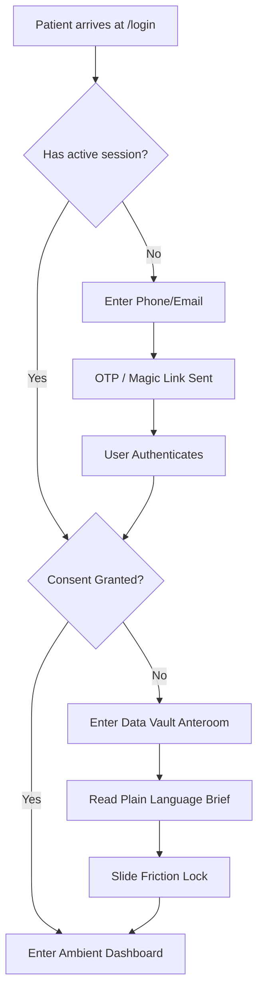
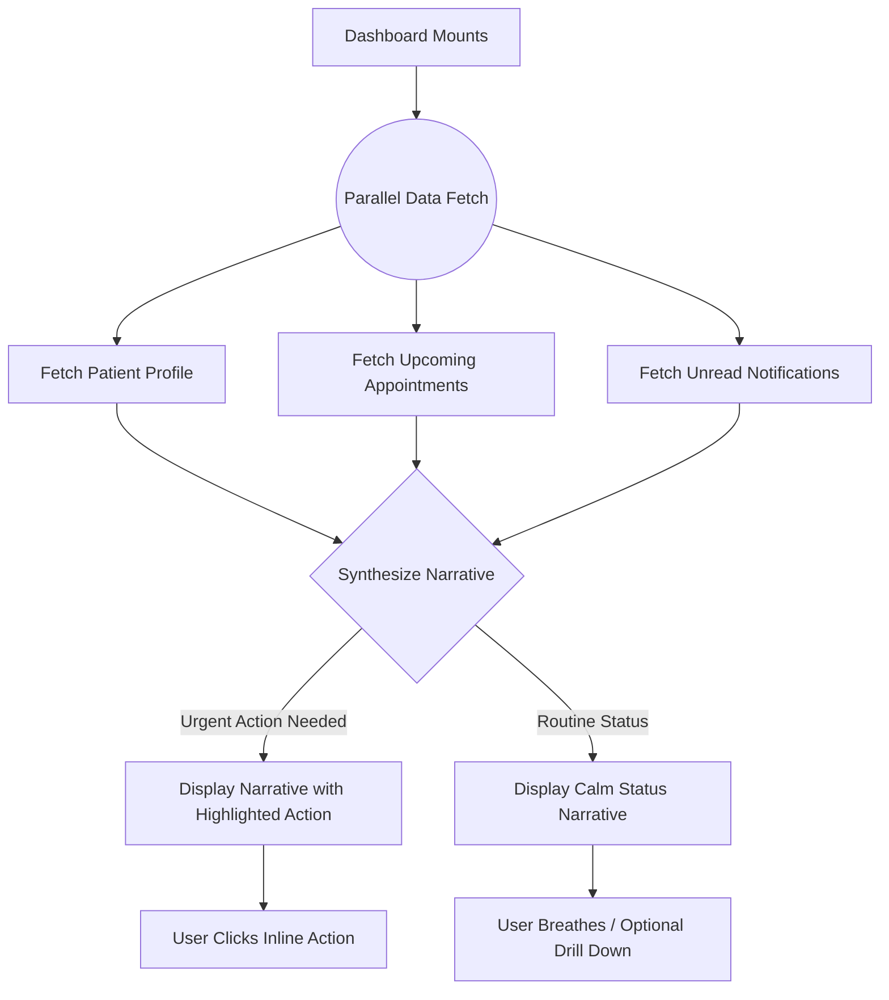
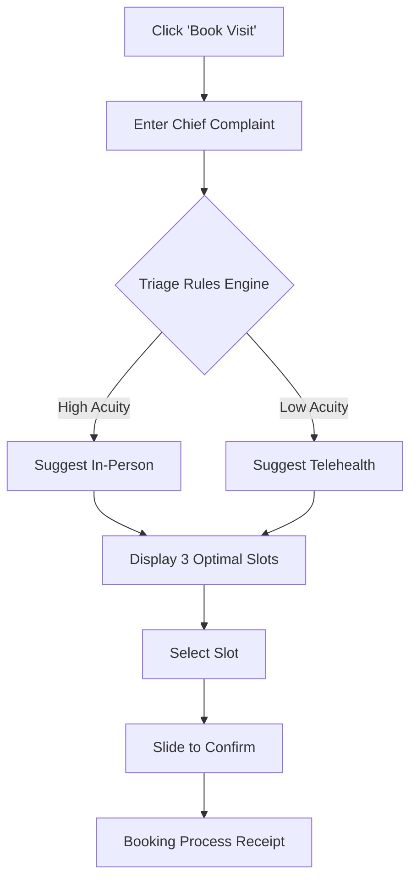
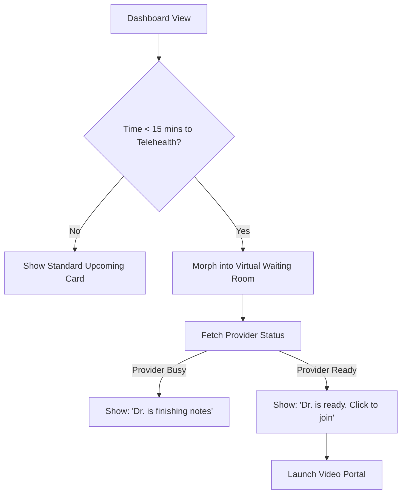
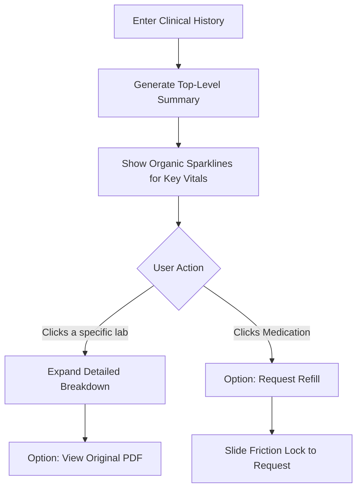
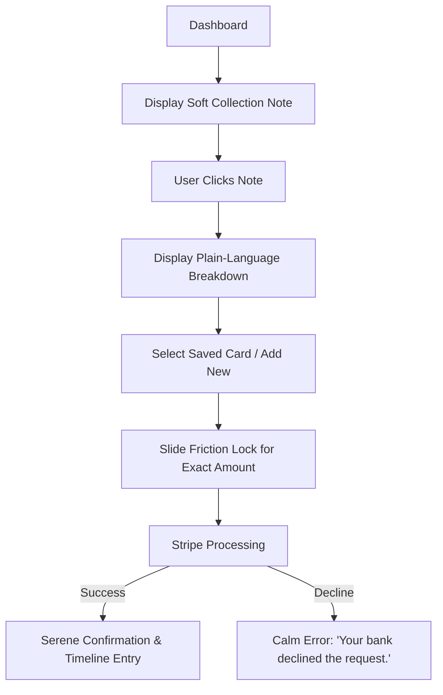
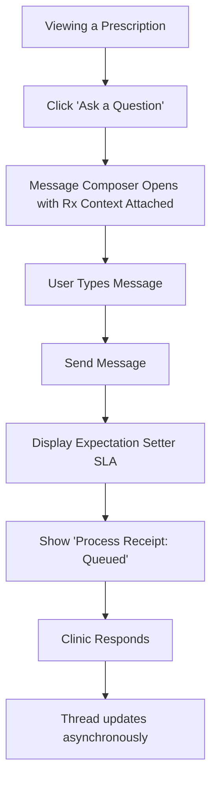

# DoctoLeb Patient Web 2026: Master Specification, Feature Blueprint & Flow Architecture

## 1. Executive Summary & Designer Mandate

This document serves as the master specification for the ultimate 2026 DoctoLeb Patient Web Application. You are stepping into the role of lead UI/UX visionary. Our goal is not just to build another healthcare portal, but to define the next era of digital health interaction.

### 1.1 The Mandate
This specification outlines the *what* and the *why*—the strict functional requirements, exact feature sets, data flows, and required capabilities derived directly from DoctoLeb's `packages/core` and Phase 3 Multi-Tenant architecture. However, you have absolute creative autonomy over the *how*. We intentionally avoid prescribing specific UI components or grid structures. You are encouraged to break conventions and exercise your artistic vision. If a functional requirement feels at odds with a superior user experience, you are empowered to propose a paradigm shift.

### 1.2 System Architecture Context
Before designing, you must understand the architectural boundaries:
- **`apps/patient-web/`**: This is where your UI lives. It contains the React pages, routing, and specific views for the patient.
- **`packages/core/`**: This contains all business logic (`patientService`, `appointmentService`). Your UI **must not** contain direct database calls. It must consume these services.
- **`packages/ui/`**: The shared component library. Your new "Tactile Primitives" will eventually be codified here.
- **The Golden Rule**: The UI must be a pure presentation layer. It takes data from `@core` and renders it beautifully. It takes user interactions and passes them back to `@core`.

### 1.3 The Psychological Baseline
Patients interacting with healthcare applications are rarely in a state of baseline calm. They are often anxious about test results, stressed about upcoming procedures, or confused by billing complexities. The 2026 application must assume a starting psychological state of high cognitive load and anxiety. Every pixel, every animation, and every word of microcopy must be engineered to de-escalate anxiety and restore sovereign control to the user.

---

## 2. The 2026 UX Paradigm: The "Anti-AI" Design Movement & Calm Tech

In an era saturated with sterile, flawless, and instantly generated AI content, the ultimate luxury is **verifiable human intentionality**. The 2026 DoctoLeb Patient Web App must actively reject the homogenization of "smooth," generic corporate interfaces.

### 2.1 Tactile Rebellion & "Wabi-Sabi"
Embrace intentional imperfection.
- **Sensory Design:** Use elements—grain, noise, textures that evoke paper, parchment, or fabric—to trigger a phantom sensation of touch.
- **Asymmetry:** Break the rigid CSS grid with asymmetrical layouts and organic shapes that signal a human hand.
- **Color Palette:** Move away from clinical `#FFFFFF` backgrounds and stark, overly saturated primary colors. Favor muted, earthy tones that ground the user.

### 2.2 Verifiable Human Presence
When a patient is interacting with a doctor or human staff, the interface must make this explicitly clear.
- Reject "chatbot" aesthetics and generic avatars.
- Use design cues that feel handcrafted and empathetic. If a doctor has reviewed a file, show a stylized digital "signature" or an organic highlight rather than a system-generated timestamp.

### 2.3 Invisible & Ambient UX ("Zero-UI")
Technology should fade into the background.
- Move away from dashboards that look like spreadsheets or data dumps.
- Synthesize information into unified, ambient narratives that prioritize cognitive accessibility. The interface should speak to the user in complete sentences, not discrete data points.

### 2.4 Calm Tech in High-Stress Flows
Healthcare billing and clinical results are high-stress. Design for intention, not just attention.
- **Predictable Feedback Loops:** Never leave the user wondering if a button click worked.
- **Progressive Disclosure:** Only show the user the information they need *right now*. Hide the complexity until it is explicitly requested.
- **Plain Language:** Ban medical jargon from the top-level UI. Translate clinical terms into accessible language.

### 2.5 Multi-Tenant Architecture & Branding Fences
**Runtime Branding Constraint:** DoctoLeb is a multi-tenant SaaS. The Patient Web App resolves tenants dynamically at runtime via `/t/<slug>` or custom domains.
- Your designs must be adaptable.
- **Required CSS Variables:** Your design must utilize the following core variables for theming:
  - `--tenant-primary` (The clinic's main brand color)
  - `--tenant-primary-foreground` (Text on top of primary)
  - `--tenant-surface` (Card/ambient backgrounds)
  - `--tenant-border` (Subtle dividers)
- A neon green brand color must look as integrated and intentional as a deep navy brand color. Contrast ratios must algorithmically adjust to maintain WCAG 2.1 AA accessibility.

### 2.6 Motion & Physics
Animations must feel physical, heavy, and intentional.
- **Spring Physics:** Avoid linear transitions. Use spring physics to give elements mass and inertia. (e.g., in Framer Motion: `transition={{ type: "spring", stiffness: 100, damping: 20, mass: 1.5 }}`).
- **Absence of Motion:** Do not use motion for decoration. If an element moves, it must be because the user physically moved it, or to draw attention to a critical shift in state.

---

## 3. Component Library Blueprint

Before designing the pages, the following "Tactile Primitives" must be established in the design system. For every component, you must design the following exact states: **Idle, Hover, Focus, Active/Dragging, Disabled, Loading, Error/Rejected**.

### 3.1 The "Friction Lock"
Used for destructive or critical actions (canceling an appointment, sharing a medical record, authorizing a payment).
- **Exact Feature:** A physical-feeling "slide-to-unlock" mechanism rather than a standard click button.
- **Mechanics:** Requires an unbroken horizontal drag event of at least 80% width to trigger. If released early, it snaps back with spring physics.
- **Aesthetic:** Should feel "heavy." Provide visual resistance (color shift, slight border expansion) as the user pulls it.

### 3.2 The "Narrative Block"
Used to replace standard data grids and charts.
- **Exact Feature:** A beautifully typographed, dynamic text block that reads like a paragraph but contains interactive, inline elements.
- **Mechanics:** Inline elements are `<a>` or `<button>` tags styled as natural text.
- **Aesthetic:** Large serif or humanist sans-serif typography. Inline actions are indicated by hand-drawn-style underlines or subtle, organic highlights rather than standard button bounding boxes.

### 3.3 The "Organic Chart"
Used for visualizing clinical trends over time.
- **Exact Feature:** Data visualization that rejects harsh, straight vectors.
- **Mechanics:** Relies on SVG path manipulation to create slightly erratic, organic lines. Hovering over a data point reveals a soft, non-intrusive tooltip.
- **Aesthetic:** Lines should have slight imperfections, mimicking a stroke of a pen. Data points should feel like ink blots or watercolor dabs.

### 3.4 The "Process Receipt"
Used to replace standard "Toast" notifications or "Read Receipts".
- **Exact Feature:** A subtle, anchored notification indicating that an asynchronous process has begun or completed.
- **Mechanics:** Slides in softly and remains anchored to the relevant content (not the global corner of the screen).
- **Aesthetic:** Muted colors, quiet typography. Example text: *"Added to queue,"* *"Safely stored."*

---

## 4. Exhaustive Workflow, Exact Features, & Flow Specifications

The following sections map directly to the React codebase (`apps/patient-web/src/pages`). For each flow, we outline the current state, the exact features required, and the definitive user flow diagram.

### 4.1 Identity & Sovereign Consent

**Target Files:** `LandingPage.jsx`, `LoginPage.jsx`, `SignUpPage.jsx`, `PatientConsentGate.jsx`

**Current State Analysis:**
Both Login and Sign-Up use a rigid 50/50 split layout relying on standard animated glowing orbs and generic feature lists. Forms use standard inputs with high cognitive friction. Consent is a harsh, blocking modal preventing all access.

**Exact Feature Set Required (Progressive Profiling):**
1.  **Single-Column Focus View:** Serene, distraction-free login area.
2.  **Tactile Inputs:** Heavyweight underlined inputs with weight-shifting typography on focus.
3.  **Passwordless First Flow:** Phone Number (Primary) or Email entry triggers a Magic Link or OTP. Passwords are removed.
4.  **Role Redirector:** Silent, polite ejection of `@clinic-ops` users.
5.  **Minimum Viable Clinical Identity:** After OTP, collect *only* Legal First/Last Name, Date of Birth (DOB), and Biological Sex at birth (required for EMR matching and lab reference ranges). Do *not* ask for insurance or medical history here.
6.  **The "Data Vault" Anteroom:** A dedicated onboarding step explaining data usage in plain language.
7.  **Sovereign Consent Lock:** A "Friction Lock" required to grant initial data access, replacing the standard checkbox.

**Detailed Flow Architecture:**

**State & Error Handling:**
- **OTP Failed:** "That code didn't quite match. Let's try again." (No harsh red boxes, gentle inline text).
- **Magic Link Expired:** "This link has faded. Click here for a fresh one."
- **Network Failure during Consent:** The friction lock slides back to zero, and a soft process receipt states: "Connection lost. Your consent was not recorded yet."

---

### 4.2 The Ambient Dashboard

**Target Files:** `PatientDashboardPage.jsx`

**Current State Analysis:**
A highly utilitarian grid layout with siloed "Quick Actions", separate appointment cards, and static medical summaries. Fetches three distinct datasets independently but fails to synthesize them.

**Exact Feature Set Required:**
1.  **Contextual Greeting Engine:** Logic that generates a greeting based on time of day, upcoming urgency, and unread alerts.
2.  **The Ambient Narrative Component:** A singular, beautifully formatted text block synthesizing the three data streams (Profile, Appointments, Notifications).
3.  **Inline Action Links:** Interactive text segments within the narrative that trigger modals or navigation.
4.  **Quiet History Access:** A subtle, secondary menu indicating "Drill Down" capabilities (History, Labs, Docs) without cluttering the primary view.

**Detailed Flow Architecture:**

**State & Error Handling:**
- **Partial Data Load:** If appointments load but notifications fail, the narrative degrades gracefully: *"Good morning. You have a visit tomorrow. We're currently retrieving your latest alerts."*
- **Loading State:** Do not use spinning circles. Use a slow, rhythmic pulsing of the background texture to indicate processing (mimicking a slow breath).

---

### 4.3 Hybrid Care Navigation

**Target Files:** `PatientAppointmentsPage.jsx`, `AppointmentCancelInlineConfirm.jsx`

**Current State Analysis:**
A complex, tabbed interface using standard dropdowns and date grids for booking. Cancellation is a simple button click.

**Exact Feature Set Required:**
1.  **Conversational Triage Entry:** A prompt asking "What is the reason for your visit?"
2.  **Modality Suggester Engine:** Recommends "In-Person" or "Telehealth" based on the chief complaint.
3.  **Curated Slot Presentation:** Shows exactly 3 optimal time slots, hiding the 30-day calendar unless explicitly requested ("See more dates").
4.  **The Virtual Waiting Room:** A dedicated state for telehealth appointments within 15 minutes of start time, replacing the standard "Upcoming" card.
5.  **Friction Lock Cancellation:** A high-resistance slide component to cancel a visit.

**Detailed Flow Architecture (Booking):**

**Detailed Flow Architecture (The Virtual Waiting Room):**

**State & Error Handling:**
- **No Available Slots:** Empathetic fallback: *"Dr. Smith's calendar is full this week. Would you like to be added to the waitlist, or see the Nurse Practitioner?"*
- **Cancellation Lock Released Early:** Snaps back. Microcopy updates: *"Slide completely to the right to confirm cancellation."*

---

### 4.4 Clinical Synthesis & Progressive Disclosure

**Target Files:** `PatientMedicalHistoryPage.jsx`, `PatientOwnProfilePage.jsx`

**Current State Analysis:**
A digital filing cabinet with rigid tabs (All, Prescriptions, Labs). High cognitive load. Transactional interaction model.

**Exact Feature Set Required:**
1.  **Trend Sparklines (Organic Charts):** Visual summaries of numeric labs (e.g., Blood Pressure, Glucose) over time, drawn with wabi-sabi SVG logic.
2.  **Narrative Lab Summaries:** Plain-text translation of lab results (e.g., *"All panels normal"* vs showing a grid of reference ranges).
3.  **One-Click Prescription Refill:** An inline action tied directly to a medication card.
4.  **Secure PDF Export:** The ability to download the raw, canonical document only when requested.
5.  **Conversational Profile Verification:** Ambient prompts to update data (e.g., *"Is your emergency contact still valid?"*) instead of an "Edit Profile" wall of inputs.

**Detailed Flow Architecture:**

**State & Error Handling:**
- **PDF Generation Failed:** *"We couldn't retrieve the original document right now. The summary above is accurate. Try downloading again in a few minutes."*
- **Abnormal Lab Result:** Never use pure red. Use muted orange/purple. Accompany with context: *"Slightly elevated. Dr. Smith has reviewed this and noted no immediate action is required."*

---

### 4.5 Calm Financial Flows (Future Extension)

**Target Integration:** Stripe / Billing Services module

**Current State Analysis:**
Not yet implemented in Phase 3. Typically handled via harsh, anxiety-inducing invoices.

**Exact Feature Set Required:**
1.  **Plain-Language Estimates:** Pre-appointment cost breakdowns with zero medical billing codes visible to the patient.
2.  **The "Soft Collection" Notification:** An empathetic, asynchronous note on the dashboard regarding balances.
3.  **Saved Payment Vault:** Integration with Stripe Elements for secure tokenization.
4.  **Payment Friction Lock:** Authorization slider for paying a balance.
5.  **Digital Receipt Timeline:** Payments are logged as calm entries in the history timeline.

**Detailed Flow Architecture:**

---

### 4.6 Asynchronous Communication (Care Timeline)

**Target Files:** `PatientMessagesPage.jsx`, `@ui/components/messaging/MessagingPage`

**Current State Analysis:**
A standalone, WhatsApp-style chat interface isolated from clinical context. Features read receipts and artificial urgency.

**Exact Feature Set Required:**
1.  **Contextual Threading:** Messages must carry a `contextId` linking them to a specific lab, appointment, or medication.
2.  **Algorithmic Triage Transparency Badge:** A visual indicator when a message is automatically routed or when an AI suggests a draft.
3.  **Process Receipts:** Removal of "Read" indicators. Replaced with "Queued," "Under Review," or "Answered."
4.  **Expectation Setter:** Clear display of clinic SLA (e.g., *"Typically replies in 4 hours"*).

**Detailed Flow Architecture:**

---

## 5. Implementation Roadmap & Next Steps for the Designer

This specification is comprehensive, but it is not a constraint on your creativity. It is the foundation upon which you will build the next generation of healthcare UX.

### Phase 1: Conceptualization & Prototyping (Weeks 1-2)
1.  **Concept Exploration:** Begin by sketching the "Ambient Dashboard". Focus entirely on the tactile, wabi-sabi aesthetic, the anti-AI typography, and how it feels to read a proactive narrative rather than a grid of buttons.
2.  **Component Library Blueprinting:** Draft the core interactive elements (buttons, friction locks, narrative text blocks, organic charts). Define all 7 states for each primitive.
3.  **Runtime Branding Audit:** Test your core primitives against extreme color palettes (e.g., a clinic with a harsh yellow primary color vs a clinic with a deep black primary color) to ensure the CSS Variables scale gracefully.

### Phase 2: High-Fidelity Flow Mapping (Weeks 3-4)
4.  **Flow Implementation:** Attack the "Identity & Sovereign Consent" and "Clinical Synthesis" flows. Follow the Mermaid diagrams strictly for logic, but innovate wildly on the presentation.
5.  **Motion Studies:** Create high-fidelity motion prototypes in Framer or AfterEffects demonstrating the "mass" of the Friction Lock and the subtle breathing animations of the ambient textures. Document the exact spring physics values.

### Phase 3: Developer Handoff (Week 5)
6.  **Review Checkpoint:** We will reconvene to review the initial conceptual direction and validate against the `@core` service data models.
7.  **Asset Generation:** Export the organic textures, SVG filters for noise, and CSS animation curves.
8.  **Final Routing Architecture:** We will finalize the React routing structure based on the approved flows, ensuring seamless transitions between the Ambient Dashboard and the progressively disclosed drill-down pages.

*This document is your playground. The rules of what the app must do are set by the API and database; the rules of how it looks and feels are yours to invent. Reject the sterile. Build for the human.*
